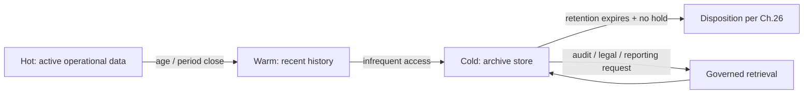

# Volume 09 - Archival Strategy

| Field | Value |
|---|---|
| Document ID | WORLD-VOL09-025 |
| Title | Archival Strategy |
| Version | 1.0 |
| Status | Approved |
| Classification | Internal |
| Founder | Mahesh Choudhary |

## Purpose

This chapter defines how WORLD preserves aged data that is no longer operationally active but still holds legal, analytical, or historical value. Its purpose is to establish, from first principles, the distinction between backup and archive, the criteria that move data out of the hot operational tier, and the storage and retrieval model that keeps archived data durable, discoverable, and compliant for years or decades. Archival keeps the operational database fast and lean while ensuring no valuable record is ever irretrievably lost.

## Scope

Covered: the archival concept, tiering criteria, storage classes, archive metadata and retrieval, and the boundary with retention policy. Excluded: short-term survivability copies (Chapter 23), the mechanics of restoring live service (Chapter 24), and the policy that ultimately authorizes deletion, which is defined in the Data Retention chapter (Chapter 26). Archival executes what retention policy decides.

## Concept

An archive is a long-lived, low-cost, read-optimized copy of data that has left active use but must be preserved. From first principles, backup and archive answer different questions: a backup answers "can I recover if the primary fails?" and is transient, superseded as newer copies arrive; an archive answers "can I retrieve this old record when required?" and is durable, kept intentionally for its full retention period. Archival is driven by data temperature. Hot data is queried constantly and lives on fast storage; warm data is accessed occasionally; cold data is rarely touched but must be kept. Moving cold data to cheaper, slower storage reduces the operational footprint and cost while preserving the record. The trade is retrieval latency: archived data is optimized for durability and cost, not for millisecond access.

## Application in WORLD

WORLD archives on defined triggers - age, closure of a business period, or lifecycle state - rather than on capacity pressure. When a fiscal year closes, its posted transactions transition from the hot transactional store to an immutable, compressed archive; the operational tables keep only the active window. Archived data carries rich metadata (source domain, business date, retention class, and legal hold flag) so it remains discoverable without scanning. Archives are encrypted under Chapter 21, checksum-verified, and stored immutably so they cannot be altered. Retrieval is a deliberate, audited operation: an archived record can be read back for reporting, audit, or legal request, but it never silently re-enters the live operational path.

### Enterprise Example

WORLD's Sales module accumulates millions of closed orders. After an order has been closed and settled for two years, it is archived: moved out of the live `ORDER` tables into a compressed, immutable cold store tagged with its business date and a seven-year retention class. Operational queries stay fast because they scan only recent, active orders. When an auditor later requests all orders from a prior year, WORLD retrieves them from the archive by metadata lookup - no full-table scan, no impact on live workloads - and every retrieval is logged in the audit trail.

## Key Components

| Component | Role | WORLD Practice |
|---|---|---|
| Tiering trigger | Decides when data is archived | Age, period close, or lifecycle state |
| Storage class | Where archived data lives | Compressed, immutable cold object store |
| Archive metadata | Makes archives discoverable | Domain, business date, retention class, legal hold |
| Retrieval path | Governed read-back of archives | Metadata lookup, audited, read-only |
| Integrity control | Guarantees archives are unaltered | Encryption + checksums + immutability |

## Trade-offs & Considerations

Archival trades access speed for cost and durability: cold storage is far cheaper and keeps the operational tier lean, but retrieval is slower and must be planned, not assumed to be instant. Aggressive archival maximizes operational performance but risks moving data that is still needed, so triggers must reflect true business inactivity. Compression and immutability protect integrity and cost but make in-place edits impossible by design - correct for records that must never change, but unsuitable for anything still mutable. WORLD resolves these tensions by archiving only genuinely inactive data, preserving complete metadata so archives stay usable, and never treating an archive as a backup: an archive preserves value, it does not guarantee recoverability of live service.

## Relationship to Other Layers

Archival sits downstream of the active data categories in Section B and upstream of disposition. It is distinct from backup and restore (Chapters 23-24), which exist for survivability, whereas archival exists for long-term value and compliance. It is governed by the Data Retention policy of Chapter 26, which sets how long each archive class is kept and when it may be disposed of, and it depends on the encryption and audit controls of Section E to keep archived records confidential and tamper-evident.

## Cross-References

- [Data Retention](/docs/blueprint/volume-09-database/section-f-data-lifecycle/26-data-retention.md)
- [Backup Strategy](/docs/blueprint/volume-09-database/section-f-data-lifecycle/23-backup-strategy.md)
- [Data Encryption](/docs/blueprint/volume-09-database/section-e-security-and-audit/21-data-encryption.md)
- [Volume 05 - ERP Foundation](/docs/blueprint/volume-05-erp-foundation/README.md)

## References

- [Volume 01 - Vision and Philosophy](/docs/blueprint/volume-01-vision-and-philosophy/README.md)
- [Document Standards](/docs/governance/document-standards.md)

## Change Log

| Version | Date | Author | Notes |
|---|---|---|---|
| 1.0 | 2026-07-12 | Lead Software Engineer | Initial approved version. |
