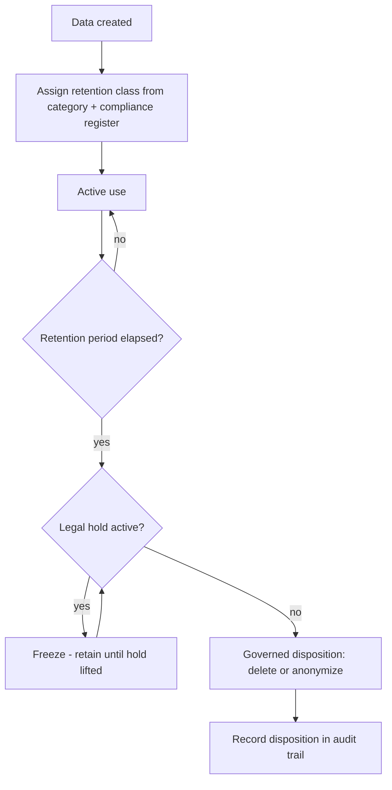

# Volume 09 - Data Retention

| Field | Value |
|---|---|
| Document ID | WORLD-VOL09-026 |
| Title | Data Retention |
| Version | 1.0 |
| Status | Approved |
| Classification | Internal |
| Founder | Mahesh Choudhary |

## Purpose

This chapter defines the policy that governs how long WORLD keeps each kind of data and how it is disposed of when that period ends. Its purpose is to establish, from first principles, that retention is a governed business and compliance decision - not an accident of storage - and to give every data category an explicit, auditable lifespan. Retention policy is the authority that backup, archival, and deletion all obey; it closes the data lifecycle that Chapters 23 through 25 open.

## Scope

Covered: the retention concept, policy-driven retention classes, legal holds, disposition, and the auditability of the whole lifecycle. Excluded: the specific statutory periods of any single jurisdiction, which are maintained in the compliance register of Volume 05 rather than invented here, and the storage mechanics of archival (Chapter 25). This chapter defines the policy framework; the compliance layer supplies the concrete durations it enforces.

## Concept

Data retention is the rule set that determines, for every category of data, how long it must be kept, why, and what happens when the period expires. From first principles, keeping data forever is neither free nor safe: unnecessary data raises storage cost, widens the attack surface, and increases exposure under data-protection obligations, while premature deletion can breach legal duties or destroy business value. Retention resolves this tension by assigning each data category a retention class defined by the longer of its business need and its compliance obligation. Two forces bound the lifespan: a minimum, set by law and business requirement, below which data must not be deleted; and a maximum, set by data-minimization principles, beyond which data should not be kept. A legal hold overrides both, freezing disposition for data subject to litigation or investigation until the hold is lifted.

## Application in WORLD

WORLD encodes retention as policy metadata attached to data, so retention is enforced by the platform rather than left to individual judgment. Every record inherits a retention class from its category and business context; the class determines its archival trigger (Chapter 25) and its disposition date. When the period elapses and no legal hold applies, WORLD disposes of the data through a governed, audited action - either secure deletion or irreversible anonymization where a residual analytical value must survive without personal identifiers. Because retention is policy-driven, changing a rule updates behavior everywhere the class is used, without hand-editing records. Every disposition is written to the audit trail of Chapter 22, so the organization can always prove what it kept, why, and when it was removed.

### Enterprise Example

WORLD's HR module stores employee records that carry statutory minimum retention after employment ends, while personal contact details fall under data-minimization pressure to be removed sooner. Each field group is tagged with its retention class. When an employee leaves, the platform schedules disposition per class: contact details are anonymized once their shorter period lapses, while payroll records are retained for their full statutory term drawn from the Volume 05 compliance register. If litigation arises, a legal hold freezes all disposition for the affected records until counsel releases it - and every step is logged, so the company can demonstrate compliance on demand.

## Key Components

| Retention Element | Definition | WORLD Practice |
|---|---|---|
| Retention class | Named policy binding a period to a data category | Assigned from category + compliance register |
| Minimum period | Shortest lawful/business lifespan | Deletion blocked before it elapses |
| Maximum period | Data-minimization ceiling | Disposition triggered when reached |
| Legal hold | Override that freezes disposition | Suspends deletion until lifted |
| Disposition | Action at end of life | Secure deletion or anonymization, audited |

## Trade-offs & Considerations

Retention balances competing risks: keeping too much data raises cost and exposure and can violate minimization duties, while keeping too little can breach legal obligations or erase irreplaceable history. Anonymization preserves analytical value at the end of life but must be irreversible to count as disposition, which limits the granularity that survives. Policy-driven enforcement scales and stays consistent, but it depends on accurate classification - a mis-tagged record inherits the wrong lifespan. WORLD mitigates these by deriving durations from the authoritative compliance register rather than inventing them, defaulting to the longer of business and legal need, honoring legal holds unconditionally, and auditing every disposition so the lifecycle is always provable.

## Relationship to Other Layers

Data retention is the governing authority for the entire data lifecycle: it tells archival (Chapter 25) when to move data cold and when it may be disposed of, and it defines the windows that backup and restore (Chapters 23-24) protect. It draws its concrete periods from the compliance framework of Volume 05 and its enforcement evidence from the audit data of Chapter 22. In this way retention closes the loop opened by backup, ensuring data is protected while needed and responsibly removed when it is not.

## Cross-References

- [Archival Strategy](/docs/blueprint/volume-09-database/section-f-data-lifecycle/25-archival-strategy.md)
- [Backup Strategy](/docs/blueprint/volume-09-database/section-f-data-lifecycle/23-backup-strategy.md)
- [Audit Data](/docs/blueprint/volume-09-database/section-e-security-and-audit/22-audit-data.md)
- [Volume 05 - ERP Foundation](/docs/blueprint/volume-05-erp-foundation/README.md)

## References

- [Volume 01 - Vision and Philosophy](/docs/blueprint/volume-01-vision-and-philosophy/README.md)
- [Document Standards](/docs/governance/document-standards.md)

## Change Log

| Version | Date | Author | Notes |
|---|---|---|---|
| 1.0 | 2026-07-12 | Lead Software Engineer | Initial approved version. |
