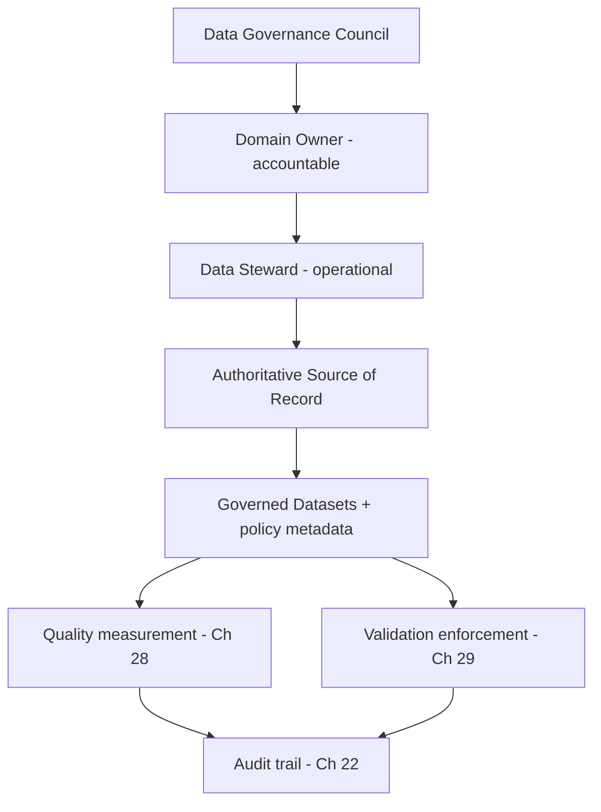

# Volume 09 - Data Governance

| Field | Value |
|---|---|
| Document ID | WORLD-VOL09-027 |
| Title | Data Governance |
| Version | 1.0 |
| Status | Approved |
| Classification | Internal |
| Founder | Mahesh Choudhary |

## Purpose

This chapter defines how WORLD governs data as a managed enterprise asset at the database tier. Its purpose is to establish, from first principles, that data must have owners, rules, and accountability - not merely storage - so that every dataset has a known steward, an authoritative definition, and an enforceable policy. Governance is the authority under which quality (Chapter 28) and validation (Chapter 29) operate; it converts the technical capabilities of Volume 09 into a trustworthy, auditable system of record.

## Scope

Covered: the governance concept, ownership and stewardship roles, data domains and authoritative sources, policy and standards, and the operating model that makes governance enforceable rather than aspirational. Excluded: the security controls of Section E (access, encryption, audit), the concrete measurement of quality (Chapter 28), and the mechanics of validation rules (Chapter 29). This chapter defines who decides and by what authority; the following chapters define how quality is measured and enforced.

## Concept

Data governance is the framework of ownership, policy, and accountability that determines who may define, change, and rely on each category of data. From first principles, data without an owner drifts: definitions diverge, duplicates multiply, and no one can say which value is correct. Governance resolves this by assigning every data domain an accountable owner and a hands-on steward, by naming a single authoritative source for each concept, and by binding data to explicit standards for definition, classification, and permitted use. The governing principle is that authority and accountability must be explicit and traceable - every dataset answers the questions "who owns this, what does it mean, and what rules apply" before it is trusted for decisions.

## Application in WORLD

WORLD encodes governance as first-class metadata rather than as documentation that ages on a wiki. Each data domain - customer, product, finance, employee - has a designated owner accountable for its policy and a steward responsible for its day-to-day correctness. Every concept resolves to one authoritative source, so consuming modules read the system of record rather than a private copy. Governance policy is attached to data as machine-readable metadata: classification, ownership, retention class (Chapter 26), and permitted-use rules travel with the data and are enforced by the platform. A change to a governed definition flows through a review by its owner, is versioned, and is recorded in the audit trail (Chapter 22), so the organization can always prove who changed what and under whose authority.

### Enterprise Example

WORLD's customer domain is owned by the Head of Revenue Operations, with a data steward responsible for daily correctness. The customer master in the ERP core is declared the authoritative source; marketing, billing, and support modules read from it rather than maintaining rival lists. When Sales proposes adding a new customer-status value, the change is routed to the domain owner for approval, versioned in the definition catalog, and published so every consumer inherits it at once. The audit trail records the approval, giving the enterprise a defensible account of who authorized the change and when.

## Key Components

| Governance Element | Definition | WORLD Practice |
|---|---|---|
| Governance council | Cross-domain body setting policy | Approves standards and resolves domain conflicts |
| Domain owner | Accountable executive for a data domain | Approves definitions, classification, permitted use |
| Data steward | Operational custodian of a domain | Maintains correctness, triages quality issues |
| Authoritative source | Single system of record per concept | Consumers read it; no rival masters |
| Policy metadata | Machine-readable governance attached to data | Classification, ownership, retention, permitted use |
| Definition catalog | Versioned business glossary | One meaning per term, change-controlled |

## Trade-offs & Considerations

Governance balances control against velocity. Too little produces silos, duplicate masters, and untrustworthy reporting; too much bureaucracy slows legitimate change and pushes teams toward shadow data. WORLD favors federated governance - central standards with domain-level ownership - so decisions sit with the people closest to the data while remaining consistent enterprise-wide. Encoding policy as metadata makes governance enforceable and scalable, but it depends on accurate classification; a mislabeled dataset inherits the wrong rules. The platform mitigates this by defaulting to the authoritative source, versioning every definition, and auditing every change, so governance stays both agile and provable.

## Relationship to Other Layers

Data governance is the authority layer beneath data quality and validation: it names the owners and standards that quality is measured against (Chapter 28) and that validation enforces (Chapter 29). It draws its compliance obligations and business definitions from Volume 02's data and knowledge model and Volume 05's ERP foundation, its enforcement evidence from the audit data of Chapter 22, and its lifespans from data retention (Chapter 26). Governance turns the storage and security capabilities of Volume 09 into a trustworthy, accountable system of record.

## Cross-References

- [Data Quality](/docs/blueprint/volume-09-database/section-g-governance-and-quality/28-data-quality.md)
- [Data Validation](/docs/blueprint/volume-09-database/section-g-governance-and-quality/29-data-validation.md)
- [Audit Data](/docs/blueprint/volume-09-database/section-e-security-and-audit/22-audit-data.md)
- [Volume 02 - Data and Knowledge](/docs/blueprint/volume-02-data-and-knowledge/README.md)

## References

- [Volume 01 - Vision and Philosophy](/docs/blueprint/volume-01-vision-and-philosophy/README.md)
- [Document Standards](/docs/governance/document-standards.md)

## Change Log

| Version | Date | Author | Notes |
|---|---|---|---|
| 1.0 | 2026-07-12 | Lead Software Engineer | Initial approved version. |
