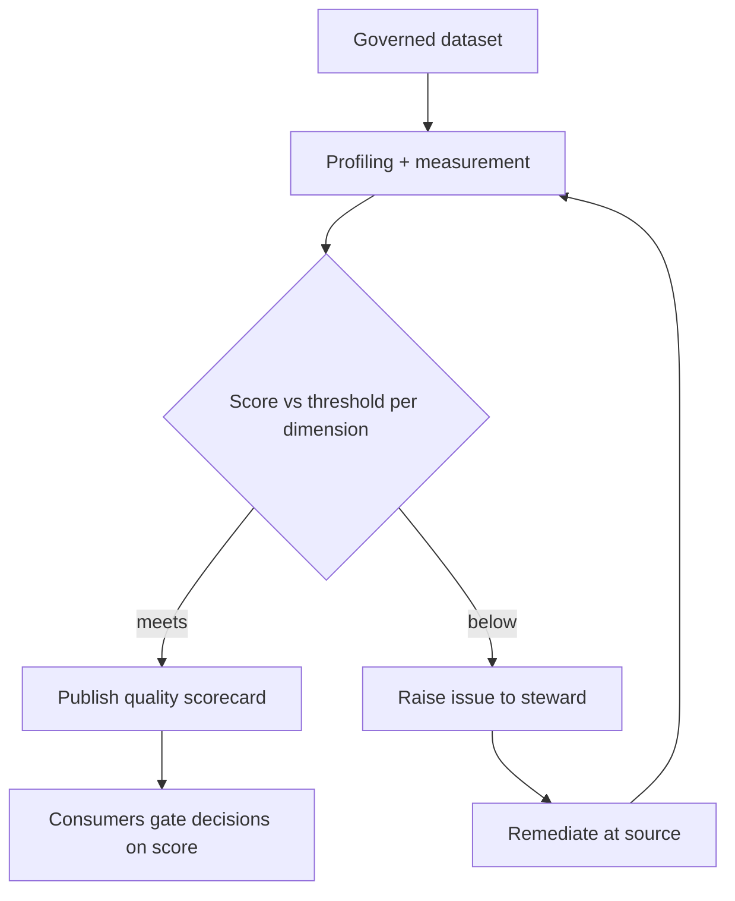

# Volume 09 - Data Quality

| Field | Value |
|---|---|
| Document ID | WORLD-VOL09-028 |
| Title | Data Quality |
| Version | 1.0 |
| Status | Approved |
| Classification | Internal |
| Founder | Mahesh Choudhary |

## Purpose

This chapter defines how WORLD measures and sustains the fitness of data for its intended use at the database tier. Its purpose is to establish, from first principles, that quality is a measurable property of data - expressed through named dimensions and monitored continuously - rather than an assumption. Where governance (Chapter 27) assigns owners and standards, data quality gives those standards concrete metrics, so the organization can state, with evidence, how trustworthy each dataset is.

## Scope

Covered: the quality concept, the standard quality dimensions, how they are measured and scored, quality monitoring, and remediation. Excluded: the point-of-entry enforcement of rules (Chapter 29), which prevents bad data, and the accountability model (Chapter 27), which assigns who fixes it. This chapter defines how quality is measured and reported; validation defines how defects are prevented, and governance defines who is accountable for the result.

## Concept

Data quality is the degree to which data is fit for the decisions and processes that rely on it. From first principles, fitness is not a single number but a set of independent properties, each of which can fail on its own: a value can be present but wrong, correct but stale, or accurate but duplicated. Quality is therefore expressed through named dimensions, each measurable against the authoritative standard set by governance. The governing principle is that quality must be quantified, not assumed - every critical dataset carries a measured score per dimension, monitored over time, so degradation is detected before it corrupts a decision. Quality is fitness for purpose, and purpose defines which dimensions matter most.

## Application in WORLD

WORLD treats each quality dimension as a monitored metric attached to governed datasets. Profiling jobs sample data continuously, compute a score per dimension against the domain's standard, and compare it to an agreed threshold. When a score falls below threshold, the platform raises an issue to the responsible steward (Chapter 27) and records the event. Quality is expressed as a scorecard per domain, so owners see trends rather than isolated incidents, and downstream consumers can gate a decision on a dataset meeting its quality bar. Because the standards come from governance and the evidence is logged to the audit trail (Chapter 22), quality is both authoritative and provable.

### Standard Quality Dimensions

| Dimension | Question it answers | WORLD Measurement |
|---|---|---|
| Accuracy | Does the value reflect reality? | Compare against authoritative source or verified reference |
| Completeness | Are required values present? | Percentage of non-null required fields |
| Consistency | Do related values agree across systems? | Cross-check master vs consuming copies |
| Timeliness | Is the data current enough for its use? | Age of data against freshness threshold |
| Uniqueness | Is each real entity represented once? | Duplicate rate after entity resolution |
| Validity | Does the value conform to its rules? | Conformance to format, range, and domain constraints |

### Enterprise Example

WORLD's customer domain runs a nightly quality scorecard. Completeness measures the share of accounts with a required billing country; uniqueness measures duplicate customers surviving entity resolution; timeliness flags records not refreshed within their freshness window. When a marketing import drops the billing country on a batch of records, completeness falls below its 98 percent threshold; the platform opens an issue for the customer steward, who traces it to the import mapping and remediates at source. The scorecard trend shows the dip and its recovery, giving the domain owner evidence that the system of record remains fit for revenue reporting.

## Key Components

| Quality Element | Definition | WORLD Practice |
|---|---|---|
| Quality dimension | A measurable property of fitness | Six standard dimensions scored per dataset |
| Threshold | Minimum acceptable score | Agreed per domain with the owner |
| Profiling | Automated measurement of data | Continuous sampling and scoring |
| Scorecard | Reported quality per domain | Trends by dimension over time |
| Remediation | Correcting defects at source | Steward-owned, tracked to closure |

## Trade-offs & Considerations

Quality balances rigor against cost. Measuring every field on every row continuously is expensive, so WORLD prioritizes critical data elements - those that drive money, compliance, or customer trust - and profiles them most intensively. Thresholds set too high generate noise and alert fatigue; set too low they let defects through, so thresholds are agreed with domain owners against real business tolerance. Dimensions can conflict: enforcing strict validity at import may reduce completeness by rejecting salvageable records. WORLD resolves this by measuring dimensions independently, remediating at the source rather than masking symptoms downstream, and auditing every issue so quality management is evidence-based.

## Relationship to Other Layers

Data quality sits between governance and validation. It measures data against the standards governance defines (Chapter 27) and it justifies where validation rules (Chapter 29) must be tightened when a dimension repeatedly fails. It draws its business definitions from Volume 02's data and knowledge model, aligns with the process-level data quality discipline of Volume 04, and logs its evidence to the audit data of Chapter 22. Quality converts governance intent into measured, monitored trust.

## Cross-References

- [Data Governance](/docs/blueprint/volume-09-database/section-g-governance-and-quality/27-data-governance.md)
- [Data Validation](/docs/blueprint/volume-09-database/section-g-governance-and-quality/29-data-validation.md)
- [Volume 04 - Operating System](/docs/blueprint/volume-04-operating-system/README.md)
- [Volume 02 - Data and Knowledge](/docs/blueprint/volume-02-data-and-knowledge/README.md)

## References

- [Volume 01 - Vision and Philosophy](/docs/blueprint/volume-01-vision-and-philosophy/README.md)
- [Document Standards](/docs/governance/document-standards.md)

## Change Log

| Version | Date | Author | Notes |
|---|---|---|---|
| 1.0 | 2026-07-12 | Lead Software Engineer | Initial approved version. |
