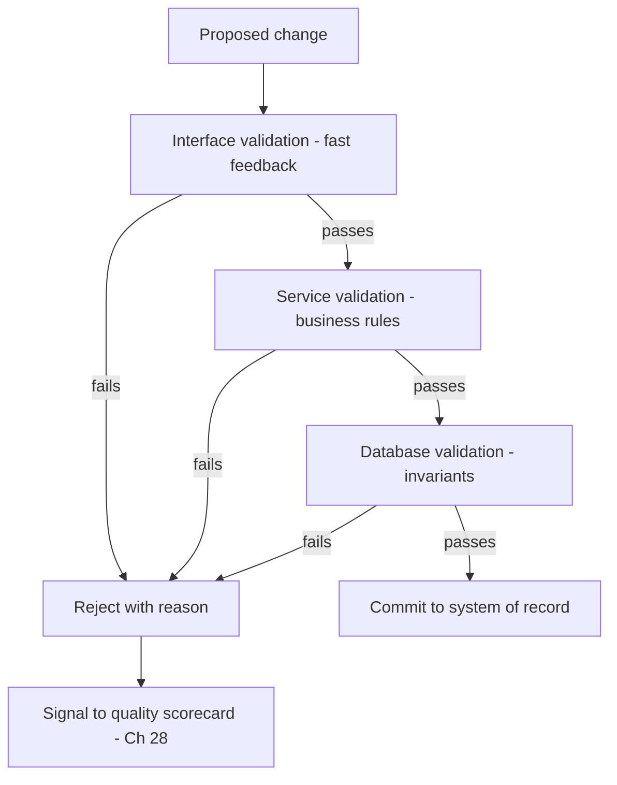

# Volume 09 - Data Validation

| Field | Value |
|---|---|
| Document ID | WORLD-VOL09-029 |
| Title | Data Validation |
| Version | 1.0 |
| Status | Approved |
| Classification | Internal |
| Founder | Mahesh Choudhary |

## Purpose

This chapter defines how WORLD prevents invalid data from entering and persisting in the system of record. Its purpose is to establish, from first principles, that correctness must be enforced by explicit, layered rules at the point of change - not left to hope or to downstream cleanup. Where quality (Chapter 28) measures fitness after the fact, validation stops defects before they land, and does so under the standards that governance (Chapter 27) defines. Validation is how the database keeps its promises about what a valid record is.

## Scope

Covered: the validation concept, the layers at which validation runs, the standard rule types, failure handling, and the relationship between preventive validation and measured quality. Excluded: the after-the-fact measurement of quality (Chapter 28), the authorization and ownership of standards (Chapter 27), and the referential-integrity mechanics detailed in Volume 05, which this chapter references rather than repeats. This chapter defines how correctness is enforced at the point of entry and change.

## Concept

Data validation is the enforcement of rules that decide whether a proposed value or record is acceptable before it is committed. From first principles, it is far cheaper to reject a bad value at the door than to detect and repair it after it has propagated through reports, integrations, and decisions. Validation therefore runs at the point of change and is layered: the closer to the data a rule sits, the harder it is to bypass. The governing principle is defense in depth - the same invariant may be checked at the interface for fast feedback and at the database for guaranteed enforcement, so no path can write data that violates the rule. A rule that only the application enforces is a rule that a rogue integration can break; the authoritative invariant lives with the data.

## Application in WORLD

WORLD enforces validation at every layer a change can travel. The interface gives users immediate, human-readable feedback; the service layer applies business rules that span multiple fields or records; and the database enforces the non-negotiable invariants - types, constraints, uniqueness, and referential integrity - so that even a direct write cannot corrupt the record. Validation rules are derived from governed definitions (Chapter 27), so a change to a standard updates the rules that enforce it. When validation fails, WORLD rejects the change with a precise reason, and repeated failures feed the quality scorecard (Chapter 28) as a signal that a rule or an upstream source needs attention. Every rejection at the trusted boundary is auditable (Chapter 22).

### Validation Rule Types

| Rule Type | What it checks | Example |
|---|---|---|
| Type & format | Value matches expected shape | Email pattern, ISO date, decimal precision |
| Range & domain | Value within allowed bounds or set | Quantity > 0, status in permitted set |
| Required | Mandatory fields are present | Billing country must be supplied |
| Uniqueness | No duplicate of a business key | One account per tax identifier |
| Referential | Referenced entity exists | Order must reference a valid customer |
| Cross-field | Rule spans multiple fields | End date not before start date |
| Business rule | Domain-specific policy | Credit limit not exceeded on new order |

### Enterprise Example

WORLD's order-entry flow validates a new sales order at three layers. The interface immediately flags a missing ship-to address and a quantity of zero. The service layer checks a cross-field rule - the requested delivery date must not precede the order date - and a business rule that the order stays within the customer's credit limit. The database guarantees the invariants: the order line must reference an existing product and customer, and the order number is unique. A batch integration that attempts to import an order for a deleted customer is rejected at the database layer by the referential rule, so no orphaned order ever reaches reporting, and the rejection is logged for the steward to review.

## Key Components

| Validation Element | Definition | WORLD Practice |
|---|---|---|
| Validation layer | Where a rule is enforced | Interface, service, and database in depth |
| Rule catalog | Governed set of validation rules | Derived from governed definitions (Ch 27) |
| Invariant | Non-negotiable constraint at the data | Enforced by the database, cannot be bypassed |
| Failure handling | Response to an invalid change | Reject with precise, actionable reason |
| Quality feedback | Link from failures to measurement | Repeated failures feed the scorecard (Ch 28) |

## Trade-offs & Considerations

Validation balances strictness against usability and throughput. Rules that are too strict reject salvageable data and frustrate users; rules that are too loose let defects through and erode trust. Enforcing an invariant at every layer costs duplication but buys guaranteed correctness - the deliberate trade of defense in depth. Heavy validation on high-volume writes can add latency, so WORLD keeps expensive cross-entity checks in the service layer and reserves the database for fast, essential invariants. Because rules derive from governed definitions, they stay consistent with meaning rather than drifting into private interpretations, and every rejection at the trusted boundary is audited so the enforcement itself is provable.

## Relationship to Other Layers

Data validation is the preventive counterpart to data quality: validation stops defects at the point of change (this chapter), while quality measures the fitness that survives (Chapter 28), and governance defines the standards both enforce (Chapter 27). Its database invariants extend the data-integrity discipline of Volume 05 (Chapter 51) into the WORLD database tier, and its rejections are recorded in the audit data of Chapter 22. Validation is how governance and quality intentions become enforced reality at the moment data is written.

## Cross-References

- [Data Quality](/docs/blueprint/volume-09-database/section-g-governance-and-quality/28-data-quality.md)
- [Data Governance](/docs/blueprint/volume-09-database/section-g-governance-and-quality/27-data-governance.md)
- [Audit Data](/docs/blueprint/volume-09-database/section-e-security-and-audit/22-audit-data.md)
- [Volume 05 - ERP Foundation](/docs/blueprint/volume-05-erp-foundation/README.md)

## References

- [Volume 01 - Vision and Philosophy](/docs/blueprint/volume-01-vision-and-philosophy/README.md)
- [Document Standards](/docs/governance/document-standards.md)

## Change Log

| Version | Date | Author | Notes |
|---|---|---|---|
| 1.0 | 2026-07-12 | Lead Software Engineer | Initial approved version. |
