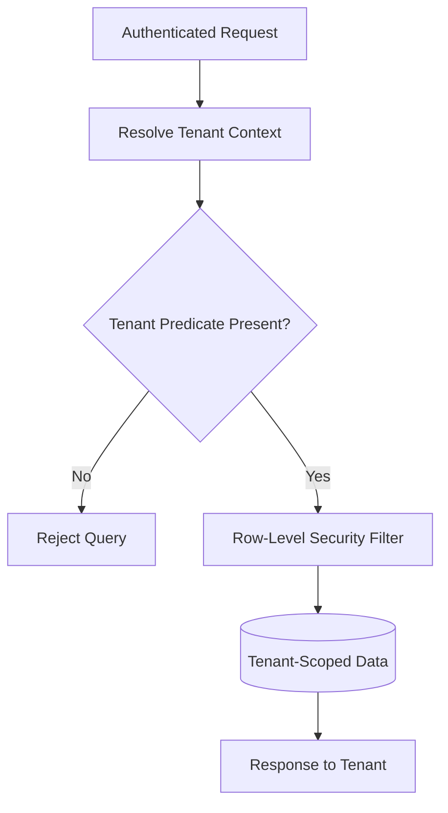

# Volume 09 - Multi-Tenant Database

| Field | Value |
|---|---|
| Document ID | WORLD-VOL09-030 |
| Title | Multi-Tenant Database |
| Version | 1.0 |
| Status | Approved |
| Classification | Internal |
| Founder | Mahesh Choudhary |

## Purpose

This chapter defines how WORLD serves many independent customers - tenants - from a shared data platform while guaranteeing that no tenant can ever see, alter, or infer another tenant's data. Its purpose is to establish the isolation model on which every higher layer of WORLD depends, so that a single logical operating system can be offered to thousands of organizations at once without compromising security, compliance, or performance, and without duplicating the platform per customer.

## Scope

Covered: the multi-tenancy concept, WORLD's default isolation model, the comparison of separate-database, separate-schema, and shared-schema-with-tenant-key approaches, and the mechanics of tenant routing and enforcement. Excluded: the intra-tenant separation of legal entities, which is Multi-Company Data Isolation (Chapter 31), and the physical distribution of tenants across instances, which is Sharding Strategy (Chapter 17). Multi-tenancy here means the boundary between distinct paying customers of WORLD.

## Concept

Multi-tenancy is the practice of running one software instance that securely partitions data and behaviour across many independent tenants. From first principles, the economic case is efficiency: shared infrastructure, one codebase, and one operational surface serve everyone, so the marginal cost of each new tenant approaches zero. The engineering case is uniformity: every tenant receives the same features, upgrades, and fixes simultaneously. The non-negotiable constraint is isolation - a tenant's data must be invisible and inaccessible to every other tenant, enforced not by convention but by the data platform itself. The design question is therefore where the tenant boundary is drawn: at the database, at the schema, or at the row.

## Application in WORLD

WORLD adopts a shared-schema model with a mandatory tenant key on every tenant-owned table, enforced at the data-access layer and reinforced by row-level security in the engine. Every query is automatically scoped to the caller's tenant; a query without a tenant predicate is rejected rather than run. This maximizes density and keeps one uniform schema for all tenants, which is what allows WORLD to ship a single, continuously improving operating system. Where a tenant's size, regulatory posture, or contract demands stronger physical separation, WORLD promotes that tenant to a dedicated schema or a dedicated database on the same platform without changing application code, because the tenant boundary is expressed once and honoured everywhere.

### Enterprise Example

A global manufacturer and a regional retailer are both WORLD customers on the same shared-schema platform. Both issue identical product-lookup requests at the same moment. Each request carries a verified tenant context; the access layer injects the tenant predicate, and row-level security ensures the manufacturer sees only its catalogue and the retailer only its own, even though their rows sit in the same physical tables. When the manufacturer later signs a contract requiring data residency in a specific jurisdiction, WORLD promotes it to a dedicated database in that region. The manufacturer's application behaviour is unchanged - the same tenant boundary now simply resolves to a separate physical database.

## Key Components

| Component | Role | Notes |
|---|---|---|
| Tenant Context | Identifies the caller's tenant | Derived from authenticated identity, never client-supplied |
| Tenant Key | Scopes every tenant-owned row | Mandatory column, indexed, non-nullable |
| Access-Layer Guard | Injects and validates tenant predicate | Rejects unscoped queries by default |
| Row-Level Security | Engine-enforced final barrier | Defence in depth beneath the application |
| Isolation Directory | Maps tenant to its isolation model | Enables promotion to schema or database |

### Isolation Model Comparison

| Model | Isolation Strength | Density / Cost Efficiency | Operational Overhead | WORLD Usage |
|---|---|---|---|---|
| Separate Database | Strongest - physical separation | Lowest - one database per tenant | Highest - many databases to operate | High-assurance or residency-bound tenants |
| Separate Schema | Strong - logical separation | Moderate | Moderate - schema per tenant | Large or regulated tenants |
| Shared Schema with Tenant Key | Enforced logically per row | Highest - full sharing | Lowest - one schema for all | Default for the majority of tenants |

## Trade-offs & Considerations

The shared-schema default gives WORLD maximum density and uniform upgrades, but it places the entire weight of isolation on disciplined enforcement, so the tenant predicate is mandatory and defence-in-depth row-level security backs it in the engine. Separate database and separate schema offer stronger physical guarantees at the cost of density and operational effort, so WORLD reserves them for tenants whose regulatory or contractual requirements justify it. A noisy tenant can affect neighbours under shared schema, which is why resource governance and, where needed, promotion to a dedicated instance exist. Choosing tenant as the primary boundary keeps isolation on a single, well-understood axis that every other layer can rely on.

## Relationship to Other Layers

Multi-tenancy is the foundational boundary of WORLD's data tier; every table, index, and policy is defined relative to it. It sits directly beneath Multi-Company Data Isolation (Chapter 31), which subdivides a single tenant into legal entities, and it shares its axis with Sharding Strategy (Chapter 17), where the tenant boundary also governs physical placement. It realizes at the data tier the tenancy and isolation principles established in Volume 05, and it inherits the horizontal-scaling posture of Volume 08 so that adding tenants never requires re-architecting the platform.

## Cross-References

- [Multi-Company Data Isolation](/docs/blueprint/volume-09-database/section-h-enterprise-scale-and-evolution/31-multi-company-data-isolation.md)
- [Sharding Strategy](/docs/blueprint/volume-09-database/section-d-performance-and-distribution/17-sharding-strategy.md)
- [Volume 05 - Multi-Company](/docs/blueprint/volume-05-erp-foundation/section-g-enterprise-capabilities/52-multi-company.md)
- [Volume 08 - Scalability](/docs/blueprint/volume-08-architecture/section-f-operations-and-scale/24-scalability.md)

## References

- [Volume 01 - Vision and Philosophy](/docs/blueprint/volume-01-vision-and-philosophy/README.md)
- [Document Standards](/docs/governance/document-standards.md)

## Change Log

| Version | Date | Author | Notes |
|---|---|---|---|
| 1.0 | 2026-07-12 | Lead Software Engineer | Initial approved version. |
