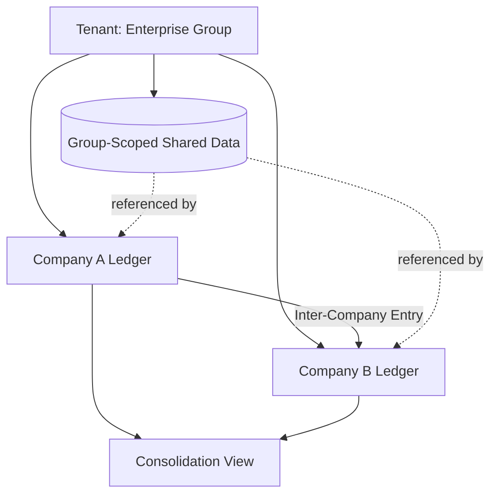

# Volume 09 - Multi-Company Data Isolation

| Field | Value |
|---|---|
| Document ID | WORLD-VOL09-031 |
| Title | Multi-Company Data Isolation |
| Version | 1.0 |
| Status | Approved |
| Classification | Internal |
| Founder | Mahesh Choudhary |

## Purpose

This chapter defines how WORLD isolates the data of distinct legal companies that operate inside a single tenant, so that each company's books, transactions, and master data remain separate for statutory and audit purposes while the group can still consolidate, share, and transact across companies under explicit control. Its purpose is to render at the data tier the Multi-Company capability of Volume 05 (Chapter 52), giving enterprise groups one platform with many companies and none of the leakage.

## Scope

Covered: the multi-company concept, WORLD's company-scoping model within a tenant, the mechanics of enforced isolation and controlled inter-company sharing, and consolidation. Excluded: the boundary between different paying customers, which is Multi-Tenant Database (Chapter 30), and finer organizational units such as plant, branch, and warehouse, which Volume 05 addresses separately. Multi-company isolation here operates strictly beneath the tenant boundary and above operational sub-units.

## Concept

A large enterprise is rarely one legal entity. It is a group of companies, each with its own statutory identity, chart of accounts, fiscal calendar, and reporting obligations, yet under common ownership and shared administration. From first principles, the data platform must therefore support a second isolation boundary nested inside the tenant: the company. Records must be attributable to exactly one owning company, cross-company visibility must be denied by default, and any sharing - shared master data, inter-company transactions, group consolidation - must be an explicit, auditable exception rather than an accident of a flat schema. Isolation is the default; sharing is deliberate.

## Application in WORLD

Within a tenant, WORLD attaches a company key to every company-owned record, nested beneath the tenant key. Access is scoped first to the tenant and then to the set of companies a user is authorized for, so a user of Company A cannot read Company B's ledgers unless explicitly granted. This mirrors the Volume 05 Multi-Company model exactly: the same logical company entities that the ERP defines are the isolation units the database enforces. Shared reference data is held at group scope and referenced by companies without copying, while inter-company transactions post matched, reconcilable entries in both companies. Consolidation reads across authorized companies to produce group statements without ever dissolving the per-company boundary.

### Enterprise Example

A holding group runs three subsidiaries as three companies inside one WORLD tenant: a manufacturing entity, a distribution entity, and a services entity. Each keeps its own statutory ledger and files its own returns. When the manufacturing company sells goods to the distribution company, WORLD posts a matched inter-company transaction - a payable in one, a receivable in the other - fully reconcilable at period close. Group finance runs a consolidation that reads all three companies' authorized data, eliminates the inter-company balances, and produces consolidated statements. A distribution-company clerk, meanwhile, has no visibility into the manufacturing ledger, because the company boundary denies it by default.

## Key Components

| Component | Role | Notes |
|---|---|---|
| Company Key | Scopes each company-owned record | Nested beneath the tenant key |
| Company Authorization | Grants users access to specific companies | Default-deny across companies |
| Group-Scoped Data | Holds shared master data once | Referenced, not copied, by companies |
| Inter-Company Poster | Writes matched, reconcilable entries | Enables auditable cross-company flow |
| Consolidation Engine | Aggregates across authorized companies | Preserves per-company boundary |

### Isolation and Sharing Matrix

| Interaction | Default Behaviour | Controlled Exception |
|---|---|---|
| Company A reads Company B ledger | Denied | Explicit cross-company authorization |
| Shared master data (e.g. group vendors) | Referenced from group scope | Company-specific overrides |
| Inter-company transaction | Not implicit | Matched entries via inter-company poster |
| Group consolidation | Not visible to single company | Read across authorized companies only |

## Trade-offs & Considerations

Nesting company inside tenant adds a second scoping dimension to every query and policy, which increases model complexity, but it is essential because statutory separation cannot be optional for regulated groups. Default-deny across companies is safer than default-share, so sharing is always an explicit grant or an explicit inter-company posting that leaves an audit trail. Holding shared reference data once at group scope avoids divergence but requires clear ownership of that data. Consolidation must read across companies efficiently without weakening the boundary, so it is a controlled read path rather than a relaxation of isolation. Aligning exactly with the Volume 05 company definitions avoids a second, conflicting notion of a company.

## Relationship to Other Layers

Multi-company isolation is the second isolation boundary of WORLD's data tier, nested directly beneath Multi-Tenant Database (Chapter 30): tenant separates customers, company separates legal entities within a customer. It is the data-tier realization of Volume 05 Multi-Company (Chapter 52) and connects to the broader multi-* capabilities - plant, branch, warehouse, currency - that refine organization within a company. It relies on the same enforcement discipline as the tenant boundary and feeds group-level reporting that the analytics and lifecycle layers of this volume consume.

## Cross-References

- [Multi-Tenant Database](/docs/blueprint/volume-09-database/section-h-enterprise-scale-and-evolution/30-multi-tenant-database.md)
- [Future Database Evolution](/docs/blueprint/volume-09-database/section-h-enterprise-scale-and-evolution/32-future-database-evolution.md)
- [Volume 05 - Multi-Company](/docs/blueprint/volume-05-erp-foundation/section-g-enterprise-capabilities/52-multi-company.md)
- [Volume 08 - Scalability](/docs/blueprint/volume-08-architecture/section-f-operations-and-scale/24-scalability.md)

## References

- [Volume 01 - Vision and Philosophy](/docs/blueprint/volume-01-vision-and-philosophy/README.md)
- [Document Standards](/docs/governance/document-standards.md)

## Change Log

| Version | Date | Author | Notes |
|---|---|---|---|
| 1.0 | 2026-07-12 | Lead Software Engineer | Initial approved version. |
