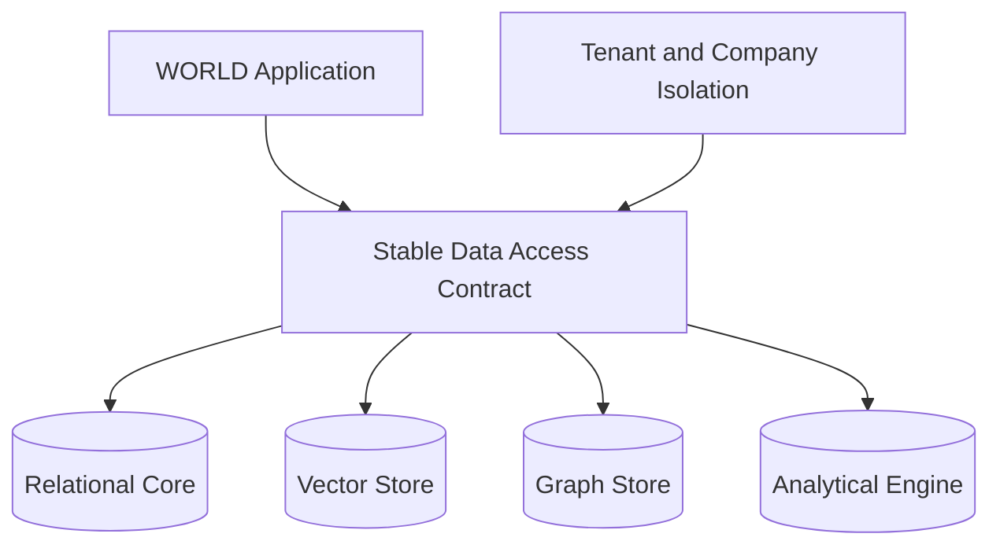

# Volume 09 - Future Database Evolution

| Field | Value |
|---|---|
| Document ID | WORLD-VOL09-032 |
| Title | Future Database Evolution |
| Version | 1.0 |
| Status | Approved |
| Classification | Internal |
| Founder | Mahesh Choudhary |

## Purpose

This chapter defines the evolutionary direction of WORLD's data tier: how the database architecture is expected to grow as workloads, engines, and AI-native demands change, without committing the platform to specific dates or products. Its purpose is to give WORLD a durable stance - a set of principles for adopting new storage engines and data paradigms - so that evolution is deliberate and reversible rather than reactive, and so that the isolation and integrity guarantees established earlier in this volume are never sacrificed for novelty.

## Scope

Covered: the concept of evolutionary data-tier design, the direction of travel toward polyglot and AI-native storage, the criteria for adopting new engines such as vector and graph stores, and the governance of change. Excluded: fixed timelines, vendor selections, and migration runbooks, which are operational artefacts. This chapter sets direction and principle; it does not schedule work or endorse a product.

## Concept

A database architecture that cannot evolve becomes a liability, because workloads and the surrounding technology landscape change faster than any single design anticipates. From first principles, durability comes not from freezing the design but from separating stable contracts from replaceable implementations. WORLD treats the data model, the isolation boundaries, and the access contracts as stable, and the underlying engines as replaceable behind those contracts. Evolution then means adopting a new engine where it demonstrably serves a workload better - richer relationships, similarity search, real-time analytics - while the application continues to see the same guarantees. Change is admitted through evidence and abstraction, never through fashion.

## Application in WORLD

WORLD's data tier is designed to become increasingly polyglot: a relational core for transactional integrity, complemented by purpose-built engines introduced behind stable access contracts as workloads justify them. Vector stores serve semantic and similarity search over embeddings so that AI features retrieve by meaning, not just by key. Graph stores serve deeply connected data - organizational hierarchies, supply networks, entitlement chains - where relationship traversal dominates. Analytical engines serve large-scale aggregation without burdening the transactional core. Every such engine inherits the same tenant and company isolation boundaries defined in Chapters 30 and 31, so AI-native data never becomes a back door around the platform's core guarantees.

### Enterprise Example

An enterprise group asks WORLD to surface similar historical purchase orders when a buyer drafts a new one. The relational core alone answers this poorly, because relevance is semantic, not exact. WORLD introduces a vector store that holds embeddings of past orders behind the same access contract; a similarity query returns the closest historical orders, scoped strictly to the buyer's tenant and company. The buyer sees intelligent suggestions, the transactional core is untouched, and isolation is preserved because the new engine sits behind the identical boundary. Should a superior engine emerge later, it replaces the vector store behind the unchanged contract, with no change to the application.

## Key Components

| Component | Role | Notes |
|---|---|---|
| Stable Access Contract | Insulates applications from engines | The durable interface across evolution |
| Relational Core | Transactional integrity and system of record | Remains the authoritative store |
| Vector Store | Semantic and similarity retrieval | Powers AI-native, meaning-based search |
| Graph Store | Relationship-heavy traversal | Hierarchies, networks, entitlement chains |
| Analytical Engine | Large-scale aggregation | Offloads reporting from the core |
| Adoption Criteria | Governs when to add an engine | Evidence-based, reversible, isolation-preserving |

### Evolutionary Direction

| Dimension | Present Posture | Direction of Travel |
|---|---|---|
| Engine variety | Relational core | Polyglot, purpose-built engines behind contracts |
| AI-native data | Structured records | Embeddings and vector retrieval as first-class |
| Connected data | Relational joins | Graph traversal where relationships dominate |
| Analytics | Core-side queries | Dedicated analytical engines |
| Change model | Stable schema | Stable contracts, replaceable implementations |

## Trade-offs & Considerations

Adopting more engines increases operational surface and the risk of inconsistency, so WORLD admits a new engine only when evidence shows a workload is served materially better and the addition can honour existing isolation. Stable access contracts add a layer of indirection but are what make engines replaceable and evolution reversible, which is worth the cost. Purpose-built stores must never become isolation loopholes, so tenant and company boundaries are enforced uniformly across every engine. Committing to dates or products would ossify the design; committing to principles keeps it adaptable. The relational core remains authoritative so that new engines augment rather than fragment the system of record.

## Relationship to Other Layers

Future evolution is the forward-looking capstone of Volume 09: it presumes and protects the isolation boundaries of Multi-Tenant Database (Chapter 30) and Multi-Company Data Isolation (Chapter 31), and it extends the scaling posture of Sharding Strategy (Chapter 17) to a polyglot topology. It realizes at the data tier the adaptability and AI-native ambition set out in Volume 08, ensuring the platform can absorb new paradigms without abandoning the guarantees that the rest of WORLD is built upon.

## Cross-References

- [Multi-Tenant Database](/docs/blueprint/volume-09-database/section-h-enterprise-scale-and-evolution/30-multi-tenant-database.md)
- [Multi-Company Data Isolation](/docs/blueprint/volume-09-database/section-h-enterprise-scale-and-evolution/31-multi-company-data-isolation.md)
- [Sharding Strategy](/docs/blueprint/volume-09-database/section-d-performance-and-distribution/17-sharding-strategy.md)
- [Volume 08 - Scalability](/docs/blueprint/volume-08-architecture/section-f-operations-and-scale/24-scalability.md)

## References

- [Volume 01 - Vision and Philosophy](/docs/blueprint/volume-01-vision-and-philosophy/README.md)
- [Document Standards](/docs/governance/document-standards.md)

## Change Log

| Version | Date | Author | Notes |
|---|---|---|---|
| 1.0 | 2026-07-12 | Lead Software Engineer | Initial approved version. |
