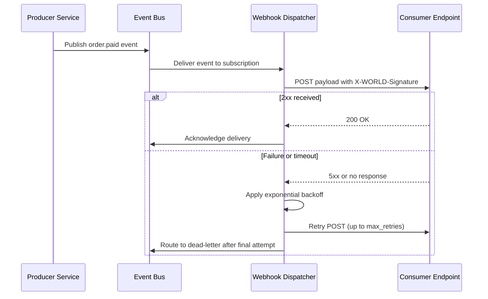

# Volume 10 - Integration Templates

| Field | Value |
|---|---|
| Document ID | WORLD-VOL10-A6 |
| Title | Integration Templates |
| Version | 1.0 |
| Status | Approved |
| Classification | Internal |
| Founder | Mahesh Choudhary |

## Purpose

This appendix provides reusable, copy-ready templates for the most common integration tasks in Project WORLD: subscribing to webhooks, configuring an API client, defining a retry and backoff policy, and declaring an event contract. Its purpose is to shorten the path from intent to a correct integration, so that partners and internal teams start from proven, consistent structures rather than reinventing them. Standard templates reduce integration defects and support load.

## Scope

The templates cover four recurring integration artifacts and one reference sequence for webhook delivery. They align with the REST Conventions (Appendix A3), the Error Catalog (Appendix A5), and the messaging chapters of Section E. The templates are illustrative and are adapted to each domain; concrete endpoints, scopes, and event names are supplied by the owning team. Transport provisioning and network policy are governed by Volume 11 and are out of scope.

## Webhook Subscription Template

```json
{
  "subscription": {
    "name": "order-events-to-fulfilment",
    "target_url": "https://fulfilment.partner.example/hooks/world",
    "events": ["order.created", "order.paid", "order.cancelled"],
    "secret": "whsec_9c1a7e644c3a9b21",
    "active": true,
    "delivery": {
      "content_type": "application/json",
      "signature_header": "X-WORLD-Signature",
      "max_retries": 6
    }
  }
}
```

## API Client Configuration Template

```yaml
world_api_client:
  base_url: https://api.world.example/v1
  auth:
    type: oauth2_client_credentials
    token_url: https://auth.world.example/oauth/token
    client_id: ${WORLD_CLIENT_ID}
    client_secret: ${WORLD_CLIENT_SECRET}
    scopes: [orders.read, orders.write]
  timeouts:
    connect_ms: 2000
    read_ms: 10000
  retry:
    policy: exponential_backoff
    idempotency: enabled
  headers:
    User-Agent: fulfilment-service/2.4
    Accept: application/json
```

## Retry and Backoff Policy Template

```yaml
retry_policy:
  max_attempts: 6
  base_delay_ms: 500
  multiplier: 2.0
  max_delay_ms: 30000
  jitter: full
  retry_on:
    http_status: [429, 500, 502, 503, 504]
    error_codes: [RATE_LIMITED, INTERNAL_ERROR, UPSTREAM_ERROR, SERVICE_UNAVAILABLE, UPSTREAM_TIMEOUT]
  respect_retry_after: true
  give_up_action: dead_letter
```

| Attempt | Base Delay | With Multiplier | Capped at max_delay_ms |
|---|---|---|---|
| 1 | 500 ms | 500 ms | 500 ms |
| 2 | 500 ms | 1000 ms | 1000 ms |
| 3 | 500 ms | 2000 ms | 2000 ms |
| 4 | 500 ms | 4000 ms | 4000 ms |
| 5 | 500 ms | 8000 ms | 8000 ms |
| 6 | 500 ms | 16000 ms | 16000 ms |

## Event Contract Template

```json
{
  "event": {
    "name": "order.paid",
    "version": "1.0",
    "id": "evt_7f3a9c21",
    "occurred_at": "2026-07-12T09:41:22Z",
    "correlation_id": "c-9a3f21b7e0",
    "producer": "orders-service",
    "data": {
      "order_id": "ord_10293",
      "customer_id": "cus_5521",
      "total": 4200,
      "currency": "USD"
    }
  }
}
```

| Field | Requirement | Notes |
|---|---|---|
| name | Required | Dotted, past-tense event name; stable within a major version. |
| version | Required | Semantic version of the event schema. |
| id | Required | Globally unique event identifier for de-duplication. |
| occurred_at | Required | RFC 3339 timestamp of the business event. |
| correlation_id | Required | Links the event to the originating request chain. |
| data | Required | Domain payload; additive changes only within a major version. |

## Webhook Delivery Sequence



## Cross-References

- [Webhook Framework](/docs/blueprint/volume-10-api/section-e-integration-and-messaging/16-webhook-framework.md)
- [Integration Framework](/docs/blueprint/volume-10-api/section-e-integration-and-messaging/17-integration-framework.md)
- [Event Bus](/docs/blueprint/volume-10-api/section-e-integration-and-messaging/19-event-bus.md)
- [Error Catalog](/docs/blueprint/volume-10-api/appendices/error-catalog.md)

## References

- [Volume 01 - Vision and Philosophy](/docs/blueprint/volume-01-vision-and-philosophy/README.md)
- [Document Standards](/docs/governance/document-standards.md)

## Change Log

| Version | Date | Author | Notes |
|---|---|---|---|
| 1.0 | 2026-07-12 | Lead Software Engineer | Initial approved version. |
