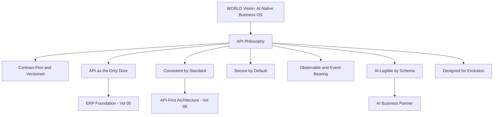

# Volume 10 - API Philosophy

| Field | Value |
|---|---|
| Document ID | WORLD-VOL10-001 |
| Title | API Philosophy |
| Version | 1.0 |
| Status | Approved |
| Classification | Internal |
| Founder | Mahesh Choudhary |

## Purpose

This chapter establishes the enduring beliefs that govern how Project WORLD exposes its capabilities through interfaces. In an AI-native business operating system the API is not an afterthought bolted onto a finished application; it is the primary surface through which humans, partner systems, and the AI Business Partner observe and act upon the enterprise. This philosophy fixes the durable commitments that every later chapter of Volume 10 - REST and GraphQL standards, API types, security, tooling, integration, operations, and lifecycle - must honor. Where a downstream interface choice conflicts with a belief stated here, the belief prevails unless a recorded Architecture Decision Record supersedes it.

## Scope

The chapter defines WORLD's API philosophy: what the API tier is for, the first-principles beliefs that constrain its design, and how those beliefs are applied and traded off. It is protocol-independent and does not mandate a specific framework, gateway, or vendor. It governs every interface WORLD publishes - internal service calls, partner integrations, and public developer endpoints alike - and realizes the API-first architecture of Volume 08 (Chapter 10) over the ERP Foundation (Volume 05), Business Modules (Volume 06), and Database (Volume 09).

## Concept

An API philosophy is a small set of first-principles beliefs, each paired with a rationale, that constrains interface design without dictating implementation. It answers a question prior to any endpoint: what does the enterprise choose to expose, to whom, under what contract, and for how long. WORLD treats the API as a durable, versioned product rather than a byproduct of a service. Three convictions follow. First, **the contract is the product**: consumers depend on the published interface, not the code behind it, so the contract must be explicit, stable, and independently evolvable. Second, **the API is the only door**: no consumer reaches business logic or data by any path other than a governed interface, which makes the boundary the single place to enforce security, validation, and observability. Third, **the API is AI-legible**: every interface is described by machine-readable schema so the AI Business Partner can discover, reason about, and safely invoke capabilities without bespoke wiring.

## Application in WORLD

WORLD adopts seven API beliefs, each serving the AI Business Partner and the platform boundary directly.

Each belief is operationalized. *Contract-first and versioned* means the interface is designed and published before implementation and never broken silently. *API as the only door* means Business Modules expose no side channels; all access flows through the gateway. *Consistent by standard* means every REST and GraphQL surface obeys the shared conventions of Chapters 02 and 03. *Secure by default* means deny-by-default authorization, authenticated identity, and validated input on every call. *Observable and event-bearing* means each material interaction is logged and, where it changes state, emits a domain event onto the event bus (Chapter 19). *AI-legible by schema* means every endpoint carries an OpenAPI or GraphQL description the AI Business Partner can consume.

## Key Components

| # | Belief | Statement | Primary Beneficiary |
|---|---|---|---|
| 1 | Contract-First and Versioned | The published contract is the product; it evolves without breaking consumers | Partner and public developers |
| 2 | API as the Only Door | All access to logic and data flows through a governed interface | Security and governance |
| 3 | Consistent by Standard | Every surface obeys shared REST and GraphQL conventions | Developer experience |
| 4 | Secure by Default | Deny by default; authenticate identity; validate every input | Multi-tenant trust |
| 5 | Observable and Event-Bearing | Interactions are logged; state changes emit domain events | Operations, BI (Vol 04), AI |
| 6 | AI-Legible by Schema | Every endpoint is described by machine-readable schema | AI Business Partner |
| 7 | Designed for Evolution | Prefer additive, backward-compatible change over rewrites | Longevity |

**Enterprise example:** A logistics partner integrates with WORLD to submit shipment confirmations. Because the API is *contract-first*, the partner builds against a published OpenAPI specification months before go-live and is insulated from internal refactoring. Because the API is *the only door*, the confirmation passes through the gateway where identity, rate limits, and input validation are enforced once. Because the API is *event-bearing*, the confirmation emits a `shipment.confirmed` event the AI Business Partner observes to update delivery forecasts - all without the partner touching a database or a module internal.

## Trade-offs & Considerations

These beliefs impose real costs. Contract-first design slows the first delivery because the interface must be agreed before code; the return is stability across dozens of consumers over years. Routing every call through a single governed door adds a network hop and a potential bottleneck, mitigated by the gateway and caching strategy of Section C. Strict versioning constrains how freely teams may change shapes, so WORLD favors additive evolution and reserves breaking change for explicit major versions (Chapter 11). Universal schema description adds authoring effort, repaid by generated SDKs, generated documentation, and AI legibility. The governing rule is that these beliefs may be balanced against one another only through a recorded decision, never silently violated.

## Relationship to Other Layers

This philosophy is the contract between the API tier and the rest of WORLD. The AI Business Partner depends on the AI-legible and event-bearing beliefs to discover and safely invoke capabilities. The ERP Foundation (Volume 05) and Business Modules (Volume 06) are reached only through interfaces that honor the only-door belief. The Database (Volume 09) is never touched directly by a consumer; the API is its guardian. The API-first architecture of Volume 08 supplies the boundary this philosophy fills with concrete standards, realized by the REST and GraphQL chapters that follow.

## Cross-References

- [REST Standards](/docs/blueprint/volume-10-api/section-a-api-foundations/02-rest-standards.md)
- [GraphQL Strategy](/docs/blueprint/volume-10-api/section-a-api-foundations/03-graphql-strategy.md)
- [Volume 05 - ERP Foundation](/docs/blueprint/volume-05-erp-foundation/README.md)
- [Volume 08 - Architecture](/docs/blueprint/volume-08-architecture/README.md)

## References

- [Volume 01 - Vision and Philosophy](/docs/blueprint/volume-01-vision-and-philosophy/README.md)
- [Document Standards](/docs/governance/document-standards.md)

## Change Log

| Version | Date | Author | Notes |
|---|---|---|---|
| 1.0 | 2026-07-12 | Lead Software Engineer | Initial approved version. |
