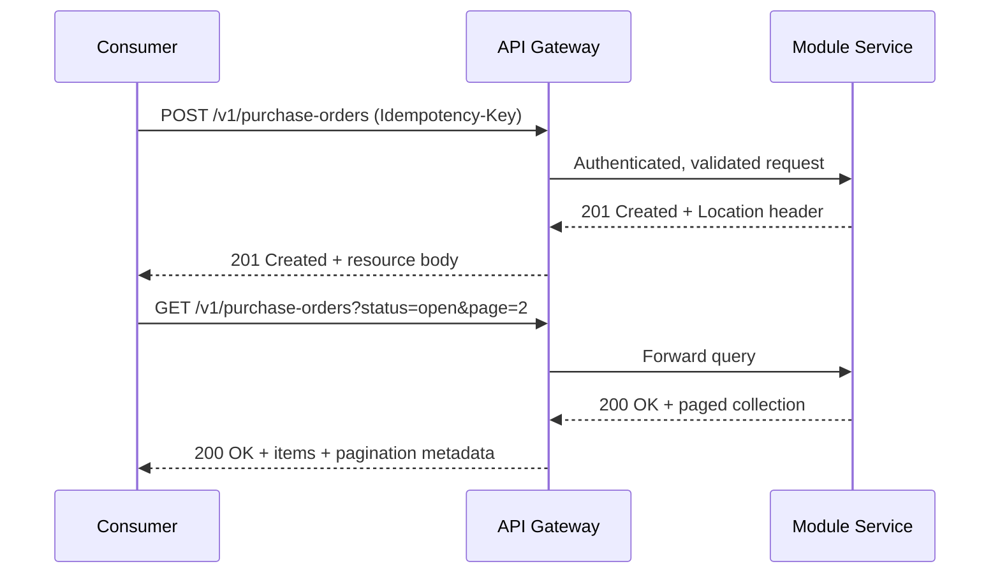

# Volume 10 - REST Standards

| Field | Value |
|---|---|
| Document ID | WORLD-VOL10-002 |
| Title | REST Standards |
| Version | 1.0 |
| Status | Approved |
| Classification | Internal |
| Founder | Mahesh Choudhary |

## Purpose

This chapter translates the API philosophy (Chapter 01) into the concrete, mandatory conventions that every RESTful interface in Project WORLD must obey. Consistency is not cosmetic: when every resource, verb, status code, and error shape follows one predictable pattern, human developers, partner systems, and the AI Business Partner can consume any WORLD endpoint without relearning it. This chapter fixes those rules so that the platform presents a single coherent REST surface rather than a patchwork of module-specific dialects.

## Scope

The chapter defines WORLD's REST standards: resource naming, HTTP verb semantics, status-code usage, pagination, filtering and sorting, idempotency, and the canonical error contract. It applies to all synchronous request-response HTTP interfaces across internal, external, and public API types (Section B). It does not cover GraphQL, addressed in Chapter 03, nor event and streaming interfaces, addressed in Sections B and E.

## Concept

REST is an architectural style in which the enterprise is modeled as a set of named resources, each addressed by a stable URI and manipulated through a uniform set of verbs with well-defined semantics. The power of the style is uniformity: the same small vocabulary of methods and status codes applies to every resource, so a consumer that understands one endpoint understands them all. WORLD treats resources as nouns drawn from the domain model of Volume 08, never as remote procedure calls. The interface expresses *what* is being acted upon and *how*, and the meaning of each verb and code is invariant across the platform.

## Application in WORLD

Every REST resource is plural, lowercase, and hyphenated, nested only to express genuine ownership. The following diagram traces a representative create-and-read exchange through the gateway.

Verbs carry fixed meaning. `GET` reads and never mutates; `POST` creates a subordinate resource or triggers a non-idempotent action; `PUT` replaces a resource in full and is idempotent; `PATCH` applies a partial update; `DELETE` removes a resource and is idempotent. Collections support cursor-based pagination with `page` and `page_size` parameters and a metadata block carrying `total`, `next_cursor`, and `prev_cursor`. Filtering uses explicit query parameters (`?status=open&created_after=2026-01-01`); sorting uses `?sort=-created_at`. Mutating requests that create resources accept an `Idempotency-Key` header so a retried call after a network failure produces the same result exactly once.

## Key Components

| Concern | WORLD Standard | Example |
|---|---|---|
| Resource naming | Plural, lowercase, hyphenated nouns | `/v1/purchase-orders` |
| Nesting | Only for true ownership, one level preferred | `/v1/customers/{id}/addresses` |
| Read | `GET`, safe and idempotent | `GET /v1/invoices/{id}` |
| Create | `POST`, returns `201` and `Location` | `POST /v1/invoices` |
| Full replace | `PUT`, idempotent | `PUT /v1/invoices/{id}` |
| Partial update | `PATCH`, targeted fields | `PATCH /v1/invoices/{id}` |
| Remove | `DELETE`, idempotent | `DELETE /v1/invoices/{id}` |
| Pagination | Cursor-based, `page` and `page_size` | `?page_size=50&page=3` |
| Filtering / sorting | Explicit query parameters | `?status=open&sort=-created_at` |
| Idempotency | `Idempotency-Key` on creates | `Idempotency-Key: 9f3c...` |

HTTP status codes are used with strict discipline:

| Code | Meaning in WORLD | Typical Cause |
|---|---|---|
| 200 OK | Successful read or update | `GET`, `PUT`, `PATCH` |
| 201 Created | Resource created | `POST` create |
| 202 Accepted | Async work accepted | Long-running job queued |
| 204 No Content | Success with no body | `DELETE` |
| 400 Bad Request | Malformed or invalid input | Schema violation |
| 401 Unauthorized | Missing or invalid identity | Absent token |
| 403 Forbidden | Authenticated but not permitted | Policy denial |
| 404 Not Found | Resource does not exist | Bad identifier |
| 409 Conflict | State conflict | Duplicate or version clash |
| 422 Unprocessable | Semantically invalid | Business-rule failure |
| 429 Too Many Requests | Rate limit exceeded | Throttling (Chapter 12) |
| 500 Internal Error | Unexpected server fault | Unhandled exception |

**Enterprise example:** A Procurement client issues `POST /v1/purchase-orders` with an `Idempotency-Key`. The service persists the order, emits a `purchase_order.created` event, and returns `201 Created` with a `Location: /v1/purchase-orders/PO-10482` header. A duplicate retry with the same key returns the identical `201` and body rather than creating a second order. A later `GET /v1/purchase-orders?status=open&page=2&page_size=50` returns `200 OK` with a page of orders and pagination metadata. Every error returns the canonical envelope `{ "error": { "code": "...", "message": "...", "trace_id": "..." } }` defined in the Error Catalog (Appendix E).

## Trade-offs & Considerations

REST's uniformity is also its constraint. Modeling every capability as a resource can feel awkward for action-oriented operations such as "approve" or "cancel"; WORLD resolves this by exposing state transitions as sub-resources (`POST /v1/purchase-orders/{id}/approvals`) rather than inventing RPC verbs. Cursor pagination is more robust than offset pagination under concurrent writes but complicates arbitrary page jumps, an acceptable trade for correctness. Idempotency keys add storage and lookup cost, justified by exactly-once safety for financial operations. Over-fetching and under-fetching, inherent to fixed REST payloads, are the primary reason WORLD also offers GraphQL (Chapter 03) for consumer-shaped reads.

## Relationship to Other Layers

These standards realize the contract-first and consistency beliefs of Chapter 01 across the synchronous surface. They are enforced at the API Gateway (Chapter 10), which validates identity, shape, and rate limits before a request reaches a Business Module (Volume 06). Resources map to the domain entities of Volume 08 and are ultimately persisted in the Database (Volume 09) through the module service, never directly. Versioning of these resources follows Chapter 11, and their error and event contracts feed the operations tier of Section F.

## Cross-References

- [API Philosophy](/docs/blueprint/volume-10-api/section-a-api-foundations/01-api-philosophy.md)
- [GraphQL Strategy](/docs/blueprint/volume-10-api/section-a-api-foundations/03-graphql-strategy.md)
- [Volume 08 - Architecture](/docs/blueprint/volume-08-architecture/README.md)
- [Volume 09 - Database](/docs/blueprint/volume-09-database/README.md)

## References

- [Volume 01 - Vision and Philosophy](/docs/blueprint/volume-01-vision-and-philosophy/README.md)
- [Document Standards](/docs/governance/document-standards.md)

## Change Log

| Version | Date | Author | Notes |
|---|---|---|---|
| 1.0 | 2026-07-12 | Lead Software Engineer | Initial approved version. |
