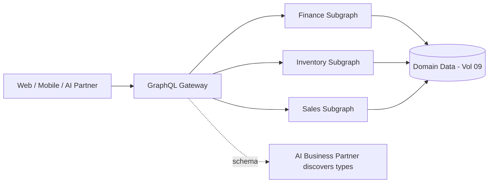

# Volume 10 - GraphQL Strategy

| Field | Value |
|---|---|
| Document ID | WORLD-VOL10-003 |
| Title | GraphQL Strategy |
| Version | 1.0 |
| Status | Approved |
| Classification | Internal |
| Founder | Mahesh Choudhary |

## Purpose

This chapter defines when and how Project WORLD uses GraphQL, and just as importantly, when it does not. REST (Chapter 02) gives the platform a uniform, cacheable, resource-oriented surface; GraphQL complements it with a single, strongly typed graph that lets a consumer fetch exactly the data it needs in one request. The purpose here is to fix a deliberate boundary between the two so that WORLD gains GraphQL's expressiveness without fragmenting its API discipline or undermining the security and caching guarantees that REST provides.

## Scope

The chapter defines WORLD's GraphQL strategy: the decision rule for choosing GraphQL versus REST, the schema and federation model, query and mutation conventions, and the controls that keep a flexible query language safe in a multi-tenant enterprise. It applies to the read-and-mutation graph exposed to first-party experiences, the AI Business Partner, and selected partners. It does not replace REST, which remains the default for resource CRUD, public partner integrations, and event ingestion.

## Concept

GraphQL is a typed query language and runtime in which the entire domain is expressed as one connected schema, and the consumer declares the exact shape of the response it wants. Where REST returns a fixed representation per endpoint, GraphQL lets a single request traverse related entities and return precisely the requested fields, eliminating the over-fetching and under-fetching inherent to fixed payloads. The trade is that this flexibility moves cost and risk to the server: query complexity, depth, and authorization must be governed per field rather than per endpoint. WORLD adopts GraphQL where consumer-shaped, relationship-rich reads dominate, and retains REST where uniformity, cacheability, and simple contracts matter most.

## Application in WORLD

WORLD operates a federated graph: each domain (Finance, Inventory, Sales, and others from Volume 06) owns a subgraph, and a gateway composes them into one schema without a monolithic resolver.



The decision rule is explicit. **Use GraphQL** when a client aggregates data across multiple domains in one view, when consumers need to select variable field sets, when the caller is a first-party experience or the AI Business Partner traversing relationships, or when rapid UI iteration benefits from a stable graph. **Use REST** for straightforward resource CRUD, for public and partner APIs where cacheability and a simple contract are paramount, for file upload and download, and for idempotent financial mutations that map cleanly to resources. Queries are read operations; mutations are namespaced by domain (`finance.postJournalEntry`) and return a typed result with a consistent error union. Every field carries its own authorization check, and the runtime enforces maximum query depth, complexity budgets, and persisted queries to prevent abusive or unbounded requests.

## Key Components

| # | Component | Role | Control |
|---|---|---|---|
| 1 | Federated schema | One typed graph composed from domain subgraphs | Schema registry and checks |
| 2 | Query | Consumer-shaped read across entities | Depth and complexity limits |
| 3 | Mutation | Domain-namespaced write with typed result | Per-field authorization |
| 4 | Resolver | Resolves a field from a domain service | No direct database access |
| 5 | Persisted queries | Pre-registered, hash-referenced operations | Blocks arbitrary queries in public tiers |
| 6 | DataLoader batching | Batches and de-duplicates fetches | Prevents N+1 query load |
| 7 | Schema registry | Versioned, validated evolution of the graph | Backward-compatibility checks |

**Enterprise example:** An account manager opens a customer 360 view. A single GraphQL query requests the customer, their open invoices from Finance, recent orders from Sales, and available stock for reordered items from Inventory:

```
query {
  customer(id: "C-4821") {
    name
    invoices(status: OPEN) { number amountDue dueDate }
    orders(last: 5) { number placedAt total }
  }
}
```

The gateway fans the request out to three subgraphs, each resolver checks field-level authorization for the caller's tenant and role, DataLoader batches the underlying fetches, and one composed response returns exactly the requested fields. The equivalent REST interaction would require several round trips and return more data than the screen needs.

## Trade-offs & Considerations

GraphQL's flexibility carries cost. HTTP caching, trivial in REST, is harder because most operations are `POST` to a single endpoint; WORLD compensates with persisted queries and response-level caching keyed by operation hash. A single expensive query can strain backends, so complexity budgets, depth limits, and query timeouts are mandatory, not optional. Field-level authorization is more granular than REST's endpoint-level checks and therefore easier to get wrong; it is centralized in the graph layer and audited. Finally, running both REST and GraphQL over the same domains risks divergence, mitigated by having both surfaces resolve through the same domain services rather than duplicating logic. GraphQL is not exposed on untrusted public tiers except through persisted queries.

## Relationship to Other Layers

The GraphQL strategy sits beside REST as the second synchronous surface realizing Chapter 01's beliefs, chosen by the decision rule above. Its subgraphs correspond to the bounded contexts of Volume 08 and the Business Modules of Volume 06, and its resolvers reach data only through domain services over the Database of Volume 09. The schema's machine-readable types directly serve the AI-legibility belief: the AI Business Partner introspects the graph to discover and traverse capabilities. Authentication, authorization, and rate limiting for the graph follow Section C, and its operational monitoring follows Section F.

## Cross-References

- [API Philosophy](/docs/blueprint/volume-10-api/section-a-api-foundations/01-api-philosophy.md)
- [REST Standards](/docs/blueprint/volume-10-api/section-a-api-foundations/02-rest-standards.md)
- [Volume 08 - Architecture](/docs/blueprint/volume-08-architecture/README.md)
- [Volume 09 - Database](/docs/blueprint/volume-09-database/README.md)

## References

- [Volume 01 - Vision and Philosophy](/docs/blueprint/volume-01-vision-and-philosophy/README.md)
- [Document Standards](/docs/governance/document-standards.md)

## Change Log

| Version | Date | Author | Notes |
|---|---|---|---|
| 1.0 | 2026-07-12 | Lead Software Engineer | Initial approved version. |
