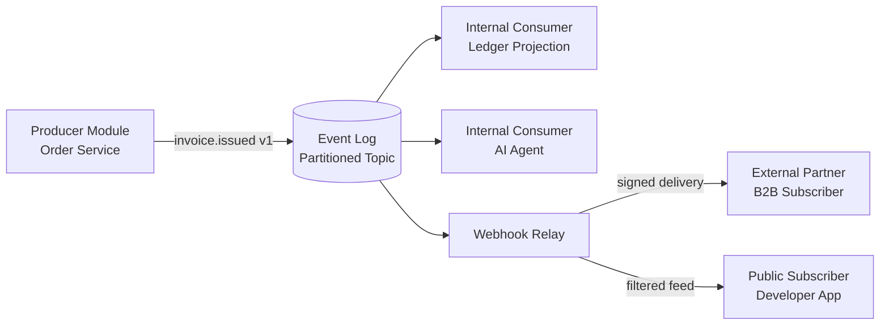

# Volume 10 - Event APIs

| Field | Value |
|---|---|
| Document ID | WORLD-VOL10-004 |
| Title | Event APIs |
| Version | 1.0 |
| Status | Approved |
| Classification | Internal |
| Founder | Mahesh Choudhary |

## Purpose
Define how Project WORLD exposes business facts as first-class Event APIs. Where request/response APIs answer the question "what is true now?", Event APIs answer "what just happened?" and let any interested party react without the producer knowing who is listening. This chapter establishes the contract, delivery, and governance model that turns WORLD's event backbone into a stable, versioned developer surface for internal services, external partners, and public subscribers alike.

## Scope
Event contracts (schemas and semantics), publish and subscribe patterns, delivery guarantees, ordering and idempotency, and the trust boundaries that distinguish internal event streams from partner-facing and public event feeds. Transport mechanics of the event bus itself are covered in chapter 19; the enterprise event-driven architecture is defined in Volume 08 (Event-Driven, chapter 11) and its ERP realization in Volume 05 (Event-Driven ERP, chapter 12). Webhook fan-out to external consumers is detailed in chapter 16.

## Concept
An Event API is a published, versioned contract over a stream of immutable business facts. From first principles, three properties make it an API rather than an implementation detail. First, the event is a **fact**, expressed in the past tense (`invoice.issued`, `shipment.dispatched`) and never a command. Second, the contract is **explicit** - every event carries a stable name, a schema-governed payload, and a semantic meaning that consumers may depend upon. Third, the coupling is **temporal and anonymous**: the producer emits once and moves on, unaware of how many consumers exist or when they process the fact.

This inverts the dependency direction of request/response APIs. A caller of a REST endpoint depends on the callee's availability; a subscriber to an Event API depends only on the durability of the log. WORLD treats the event as the source of business truth and the read model as a projection, which is why Event APIs are the primary integration surface for reactive workflows, AI agents, and cross-module choreography.

## Application in WORLD
Every WORLD module publishes domain events to a partitioned, append-only log. Consumers subscribe by topic and consumer group, each maintaining its own offset so that a slow analytics pipeline never throttles a real-time fraud check. The AI-native fabric is a first-class consumer: agents subscribe to event streams to observe state changes and act autonomously, closing the loop between business fact and machine response.

Internal consumers read the raw stream directly. External and public subscribers never touch the internal bus; they receive events through the webhook relay, which enforces the outer trust boundary, strips internal fields, and applies per-tenant filtering.

### Enterprise example
A distributor issues an invoice in the WORLD ERP. The Order Service appends `invoice.issued` (v1) to the `finance.invoices` topic. Within the same trust zone, the Ledger projection posts the journal entry and an AI collections agent schedules a reminder. Simultaneously, the webhook relay delivers a redacted `invoice.issued` event - customer, amount, and due date only - to the distributor's external accounting partner over a signed HTTPS callback, and publishes a further-reduced record to a public developer app that tracks the customer's own spend. One fact, three audiences, three trust levels, one contract lineage.

## Key Components
| Component | Responsibility | Trust Boundary |
|---|---|---|
| Event Schema Registry | Governs event names, payload schemas, and compatibility rules | Internal (authoritative) |
| Event Envelope | Standard metadata: id, type, version, timestamp, tenant, trace | All tiers |
| Topic / Partition | Ordered, durable stream keyed by aggregate id | Internal |
| Consumer Group | Independent subscriber with its own offset and delivery guarantee | Internal |
| Webhook Relay | Fan-out, redaction, and signing for partner/public delivery | External / Public |
| Dead-Letter Channel | Captures poison messages after retry exhaustion | Internal (per consumer) |

## Trade-offs & Considerations
Event APIs trade immediate consistency for resilience and decoupling. Consumers see facts eventually, so read-after-write expectations must be met by the projection layer, not the stream. WORLD standardizes on **at-least-once** delivery with consumer-side idempotency keyed on event id, because exactly-once across heterogeneous consumers is prohibitively costly. Ordering is guaranteed only within a partition, so aggregates that require strict sequence must share a partition key. Schema evolution is constrained to backward-compatible additive changes within a major version; breaking changes require a new event version published in parallel, governed by chapter 11. Finally, event payloads must be minimized at each boundary - internal events may carry rich context, but partner and public feeds expose only contractually necessary fields to prevent data leakage.

## Relationship to Other Layers
Event APIs sit atop the event bus (chapter 19) and the microservice communication fabric (chapter 18), and are one of four peer API types alongside Internal (chapter 05), External (chapter 06), and Public (chapter 07) APIs. They realize the event-driven principles of Volume 08 chapter 11 and are the ERP-level mechanism described in Volume 05 chapter 12. Downstream, webhooks (chapter 16) are the external transport for the same events, and the API gateway (chapter 10) governs partner and public subscription lifecycle.

## Cross-References
- [Event Bus (ch 19)](/docs/blueprint/volume-10-api/section-e-integration-and-messaging/19-event-bus.md)
- [Webhook Framework (ch 16)](/docs/blueprint/volume-10-api/section-e-integration-and-messaging/16-webhook-framework.md)
- [Volume 08 - Architecture (Event-Driven)](/docs/blueprint/volume-08-architecture/README.md)
- [Volume 05 - ERP Foundation (Event-Driven ERP)](/docs/blueprint/volume-05-erp-foundation/README.md)

## References
- [Volume 01 - Vision and Philosophy](/docs/blueprint/volume-01-vision-and-philosophy/README.md)
- [Document Standards](/docs/governance/document-standards.md)

## Change Log
| Version | Date | Author | Change |
|---|---|---|---|
| 1.0 | 2026-07-12 | Lead Software Engineer | Initial approved version. |
