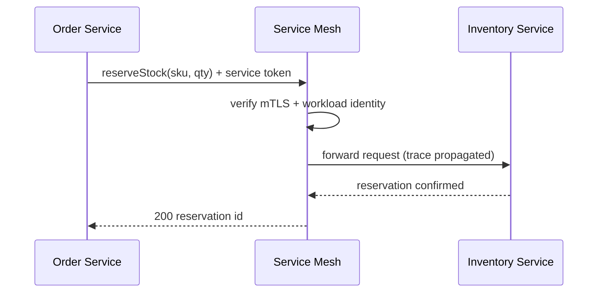

# Volume 10 - Internal APIs

| Field | Value |
|---|---|
| Document ID | WORLD-VOL10-005 |
| Title | Internal APIs |
| Version | 1.0 |
| Status | Approved |
| Classification | Internal |
| Founder | Mahesh Choudhary |

## Purpose
Define the Internal API tier of Project WORLD: the service-to-service contracts that connect modules within the trusted platform boundary. Internal APIs are the private nervous system of WORLD - high-volume, low-latency, and optimized for the platform's own services and AI agents rather than for outside consumption. This chapter establishes their design principles, trust assumptions, and governance so that internal velocity never becomes internal chaos.

## Scope
Synchronous service-to-service contracts, internal authentication and identity propagation, discovery, and the boundary that separates internal APIs from partner-facing (external, chapter 06) and public (chapter 07) surfaces. Asynchronous internal communication is handled by Event APIs (chapter 04); the transport-level mechanics of inter-service calls are in chapter 18.

## Concept
An Internal API is a contract whose only callers are other WORLD services operating inside the same trust zone. From first principles, the defining variable of any API is the trust relationship with its caller, and Internal APIs sit at the highest-trust end of that spectrum. Callers are authenticated as workloads, not as human tenants; identity is established by mutual TLS and short-lived service tokens rather than by user-facing API keys. Because both sides are governed by the same platform team, the contract can be richer, chattier, and evolved faster than any externally exposed surface.

This does not mean Internal APIs are informal. The lesson from first principles is that trust reduces authentication ceremony, not contract discipline. Internal APIs are still versioned, schema-governed, and observable; the difference is that they optimize for throughput and expressiveness rather than for defensive hardening against unknown callers.

## Application in WORLD
Within WORLD, each module exposes a stable internal interface consumed by sibling modules, the orchestration layer, and AI agents. Calls traverse a service mesh that provides mTLS, identity propagation, retries, and circuit breaking transparently. The mesh is the enforcement point of the internal trust boundary: any traffic that has not been authenticated as a known workload identity is refused before it reaches business logic.

Workload identity, not tenant credentials, is the unit of authentication. The tenant context still flows through the call as claims so that downstream authorization (chapter 09) can enforce data scoping, but the *caller* is trusted as a peer service.

### Enterprise example
When a sales order is confirmed, the Order Service calls the Inventory Service's internal `reserveStock` endpoint synchronously to guarantee availability before acknowledging the customer. This call carries the tenant id as a claim, is authorized against the tenant's inventory scope, completes in single-digit milliseconds inside the mesh, and never leaves the platform boundary. The same reservation, once confirmed, is broadcast as an Event API fact for asynchronous consumers - illustrating how internal synchronous and event-driven tiers compose.

## Key Components
| Component | Responsibility | Trust Boundary |
|---|---|---|
| Service Mesh | mTLS, identity propagation, retries, circuit breaking | Internal only |
| Workload Identity | Cryptographic identity per service (SPIFFE-style) | Internal |
| Internal Contract | Versioned, schema-governed service interface | Internal |
| Tenant Claim | Propagated tenant context for downstream authorization | Internal |
| Service Registry | Discovery and health of internal endpoints | Internal |
| Internal Rate Guard | Fairness and back-pressure between services | Internal |

## Trade-offs & Considerations
Internal APIs trade defensive hardening for velocity, which is safe only while the boundary holds. The primary risk is boundary erosion: an internal endpoint accidentally exposed through the gateway becomes an unauthenticated attack surface. WORLD mitigates this by making the gateway the sole ingress and denying it any route to internal-only services by default. A second consideration is coupling - because internal contracts evolve quickly, tight synchronous chains can create latency cascades and cascading failures; the mesh's circuit breakers and the preference for event-driven choreography over long synchronous chains contain this. Finally, internal APIs must still be versioned; "it's only internal" is not a license to break consumers, because the number of internal dependents often exceeds external ones.

## Relationship to Other Layers
Internal APIs are one of four API types, distinguished from Event APIs (chapter 04) by their synchronous request/response nature, and from External (chapter 06) and Public (chapter 07) APIs by their trust boundary - they are never exposed beyond the platform. They depend on microservice communication (chapter 18) for transport and on authentication (chapter 08) and authorization (chapter 09) for identity and scoping. The API gateway (chapter 10) explicitly excludes them from external exposure.

## Cross-References
- [Event APIs (ch 04)](/docs/blueprint/volume-10-api/section-b-api-types/04-event-apis.md)
- [External APIs (ch 06)](/docs/blueprint/volume-10-api/section-b-api-types/06-external-apis.md)
- [Microservice Communication (ch 18)](/docs/blueprint/volume-10-api/section-e-integration-and-messaging/18-microservice-communication.md)
- [Volume 08 - Architecture](/docs/blueprint/volume-08-architecture/README.md)

## References
- [Volume 01 - Vision and Philosophy](/docs/blueprint/volume-01-vision-and-philosophy/README.md)
- [Document Standards](/docs/governance/document-standards.md)

## Change Log
| Version | Date | Author | Change |
|---|---|---|---|
| 1.0 | 2026-07-12 | Lead Software Engineer | Initial approved version. |
