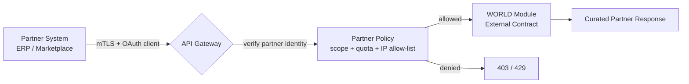

# Volume 10 - External APIs

| Field | Value |
|---|---|
| Document ID | WORLD-VOL10-006 |
| Title | External APIs |
| Version | 1.0 |
| Status | Approved |
| Classification | Internal |
| Founder | Mahesh Choudhary |

## Purpose
Define the External API tier of Project WORLD: the partner-facing, business-to-business contracts through which named, contracted organizations integrate with the platform. External APIs sit between the high-trust internal fabric and the open public surface. They are exposed beyond the platform boundary but only to identified partners under a governing agreement, and this chapter establishes the trust model, contractual controls, and hardening that make that exposure safe.

## Scope
Partner onboarding and identity, contractual rate and scope enforcement, data minimization at the partner boundary, and the distinction between External APIs and both Internal (chapter 05) and Public (chapter 07) tiers. Authentication mechanics are in chapter 08, gateway enforcement in chapter 10, and partner event delivery via webhooks in chapter 16.

## Concept
An External API is a contract with a known counterparty. From first principles, the trust relationship is neither the implicit peer trust of internal services nor the anonymous, self-service trust of public developers - it is **negotiated bilateral trust**. Each partner is a legally and technically identified entity with a signed integration agreement, provisioned credentials, and a scope of data and operations defined by that relationship. This is the trust model of B2B commerce expressed as an API: the counterparty is accountable, so the platform can grant broader access than it would to the public, while still assuming the counterparty is outside the platform boundary and therefore untrusted at the network level.

The practical consequence is that External APIs carry stronger contractual controls than public ones - per-partner quotas, IP allow-lists, mutual authentication, and data-sharing terms - but expose narrower, more curated surfaces than the internal tier, shaped to a specific partner use case.

## Application in WORLD
WORLD exposes External APIs exclusively through the API gateway, which terminates the partner's mutually authenticated connection, resolves the partner identity, and applies the contracted scope before any request reaches a module. Partners receive credentials during a governed onboarding process and operate against a stable, versioned contract that changes only under the deprecation policy of chapter 11.

The gateway and partner policy engine together form the external trust boundary. Internal services never see the partner connection directly; they see a request that has already been authenticated, scoped, and shaped on the partner's behalf.

### Enterprise example
A logistics partner integrates with a WORLD manufacturer to receive dispatch instructions and post delivery confirmations. The partner authenticates with mutual TLS and an OAuth client credential, is recognized as `partner:acme-logistics`, and is scoped to the manufacturer's shipping domain only - it can read dispatch orders and write delivery events for that tenant, and nothing else. Its contract permits 200 requests per second; a burst beyond that returns `429` with a `Retry-After` header. Delivery confirmations flow back as partner webhook events. The manufacturer's finance data, other tenants, and internal endpoints remain entirely invisible to the partner.

## Key Components
| Component | Responsibility | Trust Boundary |
|---|---|---|
| API Gateway | Terminate, authenticate, and route partner traffic | External ingress |
| Partner Identity | Named organization credential (mTLS + OAuth client) | External |
| Partner Policy Engine | Scope, quota, and IP allow-list per agreement | External |
| Integration Agreement | Legal and technical contract governing access | Governance |
| Curated Contract | Partner-shaped, minimized data surface | External |
| Audit Trail | Per-partner request and data-access logging | Governance |

## Trade-offs & Considerations
External APIs trade openness for accountability. Because each partner is identified and contracted, WORLD can extend richer access than the public tier - but at the cost of per-partner onboarding, credential lifecycle management, and bespoke scope configuration, which does not scale to thousands of anonymous developers. The central risk is over-scoping: a partner granted broader access than its use case requires becomes a disproportionate breach surface, so scopes are least-privilege by default and audited. Versioning must be conservative, because partners integrate deeply and cannot be forced to migrate quickly; breaking changes follow the formal deprecation windows of chapter 11. Data minimization at the boundary is mandatory - partner responses expose only fields the agreement covers, never the full internal representation.

## Relationship to Other Layers
External APIs are the middle trust tier between Internal APIs (chapter 05), which never cross the boundary, and Public APIs (chapter 07), which cross it to anonymous developers. They rely on the API gateway (chapter 10) for ingress, authentication (chapter 08) for partner identity, authorization (chapter 09) for scoping, rate limiting (chapter 12) for quota enforcement, and the webhook framework (chapter 16) for outbound partner events.

## Cross-References
- [Internal APIs (ch 05)](/docs/blueprint/volume-10-api/section-b-api-types/05-internal-apis.md)
- [Public APIs (ch 07)](/docs/blueprint/volume-10-api/section-b-api-types/07-public-apis.md)
- [API Gateway (ch 10)](/docs/blueprint/volume-10-api/section-c-api-security-and-access/10-api-gateway.md)
- [Volume 08 - Architecture](/docs/blueprint/volume-08-architecture/README.md)

## References
- [Volume 01 - Vision and Philosophy](/docs/blueprint/volume-01-vision-and-philosophy/README.md)
- [Document Standards](/docs/governance/document-standards.md)

## Change Log
| Version | Date | Author | Change |
|---|---|---|---|
| 1.0 | 2026-07-12 | Lead Software Engineer | Initial approved version. |
