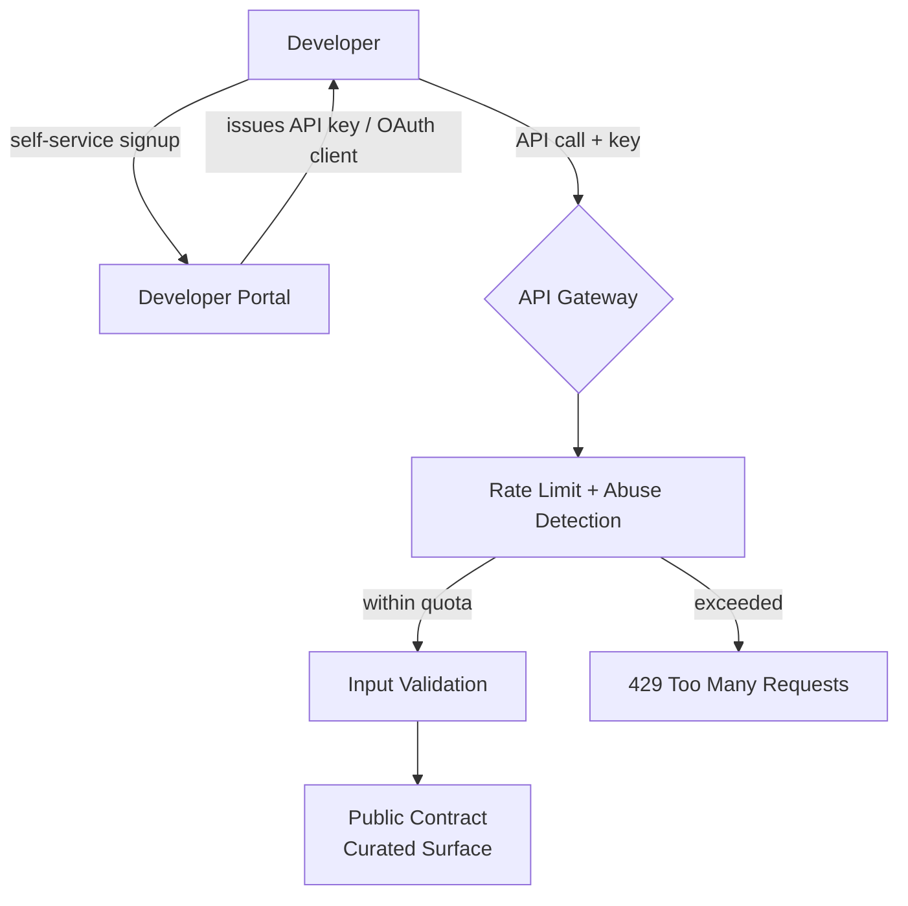

# Volume 10 - Public APIs

| Field | Value |
|---|---|
| Document ID | WORLD-VOL10-007 |
| Title | Public APIs |
| Version | 1.0 |
| Status | Approved |
| Classification | Internal |
| Founder | Mahesh Choudhary |

## Purpose
Define the Public API tier of Project WORLD: the open, self-service developer surface available to any registered developer without a prior business relationship. Public APIs are how WORLD becomes a platform rather than a product - the surface on which an ecosystem of third-party applications is built. This chapter establishes the trust model, self-service lifecycle, and hardening required to expose capability safely to an unknown, anonymous-at-scale audience.

## Scope
Self-service registration and credentialing, stability and versioning guarantees, quota and abuse controls, and the distinction between Public APIs and the Internal (chapter 05) and External (chapter 06) tiers. Authentication is in chapter 08, rate limiting in chapter 12, documentation and SDKs in chapters 13-15, and the gateway that fronts all public traffic in chapter 10.

## Concept
A Public API is a contract with a caller the platform has never met. From first principles, this is the lowest-trust and highest-scale point on the trust spectrum: the developer self-registers, receives credentials automatically, and integrates without any human negotiation. Because the caller is anonymous-at-scale and potentially adversarial, the platform assumes zero trust and compensates with three disciplines - **maximal hardening** (strict authentication, aggressive rate limiting, input validation, and abuse detection), **maximal stability** (a small, curated, rigorously versioned surface that thousands of unknown consumers can depend on), and **maximal clarity** (self-service documentation, because there is no account manager to explain the contract).

The defining constraint is reach. A public contract, once published, may have tens of thousands of dependents whose identities are unknown, so it can never be broken casually. This makes Public APIs the most conservative and most curated of all four tiers.

## Application in WORLD
WORLD publishes a deliberately narrow Public API - the subset of capability appropriate for an open ecosystem - fronted entirely by the API gateway. Developers register through a self-service portal, obtain an API key or OAuth client, and begin on a free tier governed by strict default quotas. As with the external tier, no public request ever reaches internal services directly; the gateway authenticates, throttles, and validates every call.

The developer portal and gateway together enforce the public trust boundary: self-service by design, zero-trust by posture, and rate-limited by default.

### Enterprise example
An independent software vendor builds a mobile expense-tracking app on top of WORLD. A developer signs up on the portal, receives an OAuth client within minutes, and integrates the public `/v1/transactions` read endpoint. The app operates on the free tier at 60 requests per minute per key; when it gains traction, the vendor upgrades to a paid plan with higher quotas through the portal, still with no bespoke contract. The public surface exposes only read access to the authenticated end user's own transactions - never another user's data, never write access to core ledgers, and never any internal or partner endpoint.

## Key Components
| Component | Responsibility | Trust Boundary |
|---|---|---|
| Developer Portal | Self-service registration, keys, plans, docs | Public ingress |
| API Key / OAuth Client | Anonymous-at-scale developer credential | Public |
| API Gateway | Authenticate, throttle, validate every request | Public ingress |
| Abuse Detection | Anomaly and bot mitigation | Public |
| Curated Public Contract | Small, stable, heavily versioned surface | Public |
| Usage Metering | Per-key quota, billing, and analytics | Public / Governance |

## Trade-offs & Considerations
Public APIs trade breadth of capability for safety and stability at scale. Exposing a wide surface to anonymous developers multiplies attack surface and support burden, so WORLD publishes only the minimal capability that a healthy ecosystem needs and hardens it aggressively. Rate limiting is a first-class abuse control, not merely fairness (chapter 12). The stability obligation is severe: because dependents are unknown and unreachable, breaking changes demand long deprecation windows, parallel versions, and proactive communication through the portal, per chapter 11. The support and documentation cost is real - self-service success depends entirely on the quality of SDKs and docs (chapters 13-15), since there is no partner relationship to fall back on. Finally, the public surface must be scoped so that even a fully compromised key can reach only its own end user's data.

## Relationship to Other Layers
Public APIs are the outermost, lowest-trust tier, contrasted with Internal APIs (chapter 05, never exposed) and External APIs (chapter 06, exposed to named partners). They share the API gateway (chapter 10) ingress and authentication (chapter 08) machinery with the external tier but layer on self-service registration and the strictest default quotas (chapter 12). Their developer experience depends on documentation and SDK strategy (chapters 13-15), and their evolution is governed by the versioning policy (chapter 11).

## Cross-References
- [External APIs (ch 06)](/docs/blueprint/volume-10-api/section-b-api-types/06-external-apis.md)
- [Internal APIs (ch 05)](/docs/blueprint/volume-10-api/section-b-api-types/05-internal-apis.md)
- [Rate Limiting (ch 12)](/docs/blueprint/volume-10-api/section-c-api-security-and-access/12-rate-limiting.md)
- [Volume 08 - Architecture](/docs/blueprint/volume-08-architecture/README.md)

## References
- [Volume 01 - Vision and Philosophy](/docs/blueprint/volume-01-vision-and-philosophy/README.md)
- [Document Standards](/docs/governance/document-standards.md)

## Change Log
| Version | Date | Author | Change |
|---|---|---|---|
| 1.0 | 2026-07-12 | Lead Software Engineer | Initial approved version. |
