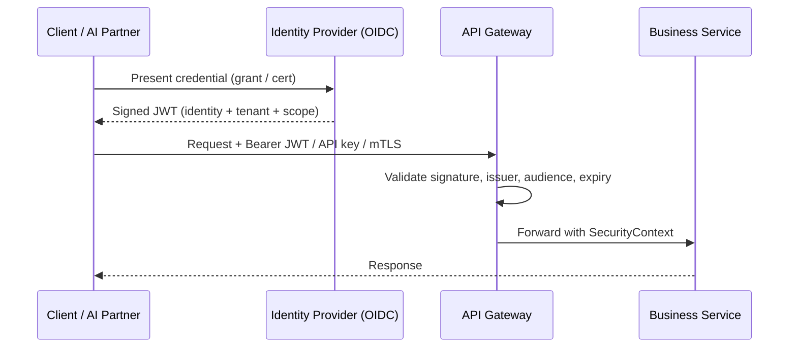

# Volume 10 - Authentication

| Field | Value |
|---|---|
| Document ID | WORLD-VOL10-008 |
| Title | Authentication |
| Version | 1.0 |
| Status | Approved |
| Classification | Internal |
| Founder | Mahesh Choudhary |

## Purpose

This chapter defines how the WORLD API establishes *who* is calling before any request reaches a resource. Its purpose is to give every API surface - internal, external, and public (Chapters 05-07) - a single, uniform way to prove caller identity, so that the gateway, business modules, and the AI Business Partner (Vol 03) all trust one consistent notion of identity. It translates the platform-wide authentication principle of Volume 08 (ch 19) into concrete API-layer mechanisms.

## Scope

Covered: the authentication concept at the API boundary, the credential and token mechanisms WORLD supports (OAuth 2.0, OIDC, JWT, API keys, mutual TLS), and how identity is carried across API calls. Excluded: authorization and permission decisions (Chapter 09), gateway topology (Chapter 10), and cryptographic key management, which is governed by the Security Model (Vol 05, ch 61) and Volume 08 (ch 19).

## Concept

Authentication answers a single question at the API edge: is the caller who they claim to be? From first principles it separates *credential presentation* from *identity proof*. A client presents a long-lived credential - a client secret, a certificate, an API key - which the platform verifies once against a trusted authority and exchanges for a short-lived, verifiable token. That token, not the raw credential, then travels with every subsequent request. This separation keeps durable secrets out of the request path, lets any service validate identity cheaply and statelessly, and confines the blast radius of a leaked token to its short lifetime. Authentication asserts identity only; it deliberately says nothing about what that identity may do.

## Application in WORLD

WORLD centralizes API authentication in an Identity Provider (IdP) implementing OpenID Connect (OIDC) over OAuth 2.0. Interactive users authenticate through the authorization-code flow with PKCE and multi-factor authentication; machine clients and partner integrations use the client-credentials grant. In all cases the IdP issues a signed JSON Web Token (JWT) whose claims carry subject, tenant, audience, scope, and expiry. The API gateway (Chapter 10) validates every token at the edge - signature, issuer, audience, and expiry - and constructs a uniform `SecurityContext` passed to downstream services. Two additional mechanisms serve specific surfaces: **API keys** identify low-sensitivity public API traffic and anchor per-tenant rate limits (Chapter 12), while **mutual TLS (mTLS)** authenticates high-trust service-to-service and partner channels by verifying both endpoints' certificates. The AI Business Partner authenticates as a first-class delegated principal, obtaining its own token that names the originating human subject.

### Enterprise Example

A partner logistics platform integrates with WORLD to submit shipment updates. Its backend authenticates with the client-credentials grant over an mTLS channel, receiving a service-account JWT scoped to the `shipments:write` audience and bound to the partner's tenant. A separate public-facing status widget uses only a rate-limited API key to read non-sensitive tracking data. When a WORLD user later asks the AI Business Partner to reconcile deliveries, the Partner obtains a delegated token naming that user as subject. All three callers are validated identically at the gateway, yielding three distinct but uniform `SecurityContext` objects - so every module sees consistent identity regardless of entry path.

## Key Components

| Component | Responsibility | Mechanism |
|---|---|---|
| Identity Provider (IdP) | Verifies credentials and issues tokens | OIDC / OAuth 2.0 |
| Access Token (JWT) | Short-lived signed proof of identity per request | Bearer token |
| API Key | Identifies public/low-sensitivity clients; anchors quotas | Static key |
| Mutual TLS (mTLS) | Authenticates both endpoints on high-trust channels | X.509 certificates |
| Token Validator | Verifies signature, issuer, audience, expiry at the edge | Gateway plugin |
| SecurityContext | Uniform in-process representation of the principal | Application object |

## Trade-offs & Considerations

Token-based authentication buys statelessness and horizontal scale at the cost of revocation latency: a valid JWT remains usable until it expires. WORLD mitigates this with short lifetimes, refresh flows, and a revocation list for high-risk events. API keys are simple and cache-friendly but are static secrets, so they are restricted to low-sensitivity scopes, rotated on schedule, and never granted write access to regulated data. mTLS provides strong bidirectional assurance but adds certificate lifecycle overhead, so it is reserved for partner and internal service channels. Centralizing identity in one IdP concentrates trust - simplifying rotation and audit - but makes IdP availability a critical dependency, addressed through Volume 11 resilience patterns.

## Relationship to Other Layers

Authentication is the first gate every API request crosses. It produces the `SecurityContext` that Authorization (Chapter 09) consumes to evaluate scopes and permissions, and it is enforced physically by the API Gateway (Chapter 10). It depends on the platform authentication concern (Vol 08, ch 19) and the Security Model (Vol 05, ch 61) for cryptographic foundations, and it underwrites the AI Business Partner's autonomy (Vol 03) by ensuring the Partner always acts as a named, delegated, verifiable identity rather than an anonymous process.

## Cross-References

- [Authorization](/docs/blueprint/volume-10-api/section-c-api-security-and-access/09-authorization.md)
- [API Gateway](/docs/blueprint/volume-10-api/section-c-api-security-and-access/10-api-gateway.md)
- [Volume 08 - Authentication (ch 19)](/docs/blueprint/volume-08-architecture/section-e-cross-cutting-concerns/19-authentication.md)
- [Volume 05 - ERP Foundation (Security Model, ch 61)](/docs/blueprint/volume-05-erp-foundation/README.md)

## References

- [Volume 01 - Vision and Philosophy](/docs/blueprint/volume-01-vision-and-philosophy/README.md)
- [Document Standards](/docs/governance/document-standards.md)

## Change Log

| Version | Date | Author | Notes |
|---|---|---|---|
| 1.0 | 2026-07-12 | Lead Software Engineer | Initial approved version. |
