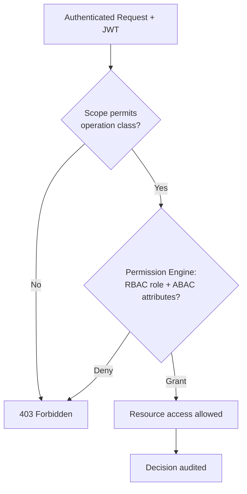

# Volume 10 - Authorization

| Field | Value |
|---|---|
| Document ID | WORLD-VOL10-009 |
| Title | Authorization |
| Version | 1.0 |
| Status | Approved |
| Classification | Internal |
| Founder | Mahesh Choudhary |

## Purpose

This chapter defines how the WORLD API decides *what* an authenticated caller is permitted to do. Its purpose is to layer a consistent, tenant-aware access-control model over every API surface, so that identity established by Authentication (Chapter 08) is translated into precise, auditable decisions that align exactly with the Permission Model of the ERP Foundation (Vol 05, ch 27) and the platform authorization concern (Vol 08, ch 20).

## Scope

Covered: the authorization concept at the API boundary, OAuth 2.0 scopes, role-based access control (RBAC), attribute-based access control (ABAC), and how they combine into a single decision. Excluded: how identity itself is proven (Chapter 08), gateway enforcement mechanics (Chapter 10), and the internal storage of role and permission data (Vol 05, ch 27; Vol 09).

## Concept

Authorization answers the question authentication leaves open: given a verified identity, is this specific action on this specific resource allowed? From first principles it evaluates a *subject*, an *action*, a *resource*, and a *context* against policy. Two forces shape a good model. Coarse-grained **scopes** bound what a token itself is allowed to request, limiting the damage of a leaked credential at the protocol layer. Fine-grained **permissions** - expressed as roles (RBAC) and attributes (ABAC) - decide the actual business outcome per record. Sound authorization applies both: the token's scope must permit the operation category, and the caller's roles and attributes must permit the concrete instance. It is always a positive grant, evaluated deny-by-default, and always tenant-isolated.

## Application in WORLD

WORLD authorizes in two composed stages. First, the API gateway (Chapter 10) checks the JWT's OAuth 2.0 **scopes** - for example `orders:read` or `ledger:write` - to confirm the token may attempt the operation class at all. Second, the receiving service delegates to the WORLD Permission Engine (Vol 05, ch 27), which evaluates **RBAC** roles assigned to the subject and **ABAC** attributes such as tenant, business unit, ownership, record classification, and time. A request succeeds only when both stages grant. Every decision is tenant-scoped: cross-tenant access is impossible even with a valid token, because the tenant claim from Authentication is a mandatory attribute in every policy. The AI Business Partner is authorized under its delegated identity, so it can never exceed the permissions of the human on whose behalf it acts.

### Enterprise Example

A regional sales manager calls `PATCH /v1/orders/{id}` to approve a discount. Their token carries the `orders:write` scope, so the gateway permits the operation class. The Permission Engine then evaluates the concrete instance: the RBAC role `sales_manager` grants order-approval, while ABAC attributes confirm the order belongs to the manager's own region and its value is under their approval ceiling. The action is allowed and logged. When the same manager attempts an order from a different region, the scope check still passes but the ABAC region attribute fails, yielding a deny - demonstrating why scopes alone are insufficient and record-level policy is essential.

## Key Components

| Component | Responsibility | Model |
|---|---|---|
| OAuth 2.0 Scopes | Bound the operation classes a token may attempt | Token-layer |
| Role Assignment (RBAC) | Grants permissions by the subject's role | Role-based |
| Attribute Policy (ABAC) | Refines decisions by tenant, ownership, classification, time | Attribute-based |
| Permission Engine | Evaluates RBAC + ABAC into a single grant/deny | Vol 05, ch 27 |
| Tenant Isolation Rule | Mandatory attribute forcing per-tenant boundaries | Cross-cutting |
| Decision Audit Record | Immutable log of every authorization outcome | Governance |

## Trade-offs & Considerations

Scopes are simple and cache-friendly but too coarse for record-level control, so they must be paired with the Permission Engine rather than trusted alone. RBAC is intuitive and easy to audit but can proliferate roles as the organization grows; ABAC expresses nuanced policy compactly but is harder to reason about and test. WORLD deliberately combines them: RBAC provides the stable backbone, ABAC handles context-sensitive exceptions. Deny-by-default is safer but demands complete policy coverage, since any unmodeled case is refused - accepted as the correct failure mode. Centralizing decisions in one Permission Engine ensures consistency and auditability at the cost of a hot dependency, mitigated by decision caching with short time-to-live.

## Relationship to Other Layers

Authorization consumes the `SecurityContext` produced by Authentication (Chapter 08) and is enforced at the API Gateway (Chapter 10), which rejects out-of-scope calls before they reach services. It is the API-layer projection of the ERP Permission Model (Vol 05, ch 27) and the platform authorization concern (Vol 08, ch 20), and it feeds the governance audit trail (Vol 03). Together with rate limiting (Chapter 12) it forms the full set of guardrails applied to every request after identity is established.

## Cross-References

- [Authentication](/docs/blueprint/volume-10-api/section-c-api-security-and-access/08-authentication.md)
- [API Gateway](/docs/blueprint/volume-10-api/section-c-api-security-and-access/10-api-gateway.md)
- [Volume 05 - Permission Model (ch 27)](/docs/blueprint/volume-05-erp-foundation/README.md)
- [Volume 08 - Authorization (ch 20)](/docs/blueprint/volume-08-architecture/section-e-cross-cutting-concerns/20-authorization.md)

## References

- [Volume 01 - Vision and Philosophy](/docs/blueprint/volume-01-vision-and-philosophy/README.md)
- [Document Standards](/docs/governance/document-standards.md)

## Change Log

| Version | Date | Author | Notes |
|---|---|---|---|
| 1.0 | 2026-07-12 | Lead Software Engineer | Initial approved version. |
