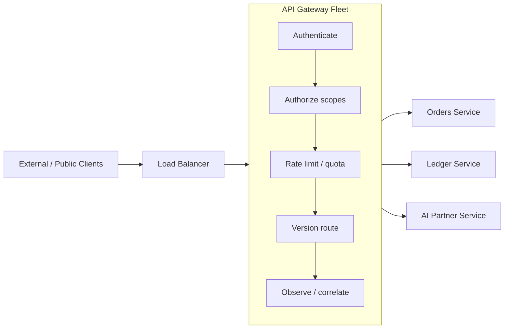

# Volume 10 - API Gateway

| Field | Value |
|---|---|
| Document ID | WORLD-VOL10-010 |
| Title | API Gateway |
| Version | 1.0 |
| Status | Approved |
| Classification | Internal |
| Founder | Mahesh Choudhary |

## Purpose

This chapter defines the API gateway as the single, uniform entry point through which every external and public API call to WORLD passes. Its purpose is to concentrate cross-cutting concerns - authentication, authorization, rate limiting, routing, and observability - at one edge, so that individual business services stay focused on domain logic while the platform enforces consistent security and traffic policy for all callers.

## Scope

Covered: the gateway concept, its position in the request path, the policies it enforces, and its topology in WORLD. Excluded: the internal mechanics of authentication (Chapter 08), the authorization decision model (Chapter 09), rate-limiting algorithms (Chapter 12), and service-mesh communication between internal services (Chapter 18), which the gateway complements rather than replaces.

## Concept

A gateway exists because cross-cutting policy should be enforced once, at a controlled boundary, rather than re-implemented in every service. From first principles it is a reverse proxy that terminates inbound connections and, before forwarding a request, applies a pipeline of edge policies: it authenticates the caller, checks token scopes, enforces quotas, routes to the correct backend by version and path, and records telemetry. This yields three properties: a **uniform trust boundary** where untrusted traffic is normalized into verified requests; **separation of concerns**, freeing services from security boilerplate; and a **single control plane** where platform-wide policy is expressed and changed in one place. The gateway holds no business logic - it decides only whether and where a request may proceed.

## Application in WORLD

Every external and public call enters through the WORLD API gateway, deployed as a horizontally scaled fleet behind a load balancer. Its edge pipeline validates the JWT or mTLS identity (Chapter 08), enforces OAuth 2.0 scopes (Chapter 09), applies per-tenant and per-key quotas (Chapter 12), and resolves the target service by API version (Chapter 11) and route. It attaches a correlation identifier and the uniform `SecurityContext`, then forwards to the backend, which trusts the edge decisions. Internal service-to-service traffic bypasses the public gateway and communicates over the service mesh (Chapter 18), which applies its own mTLS and policy. The gateway also emits the metrics, logs, and traces consumed by API Monitoring (Chapter 21), making it the platform's primary observability vantage point.

### Enterprise Example

During a seasonal peak, a retail tenant's storefront drives a surge of `GET /v1/inventory` calls. The gateway authenticates each request via the tenant's service token, confirms the `inventory:read` scope, and applies the tenant's quota so a single tenant cannot exhaust shared capacity. Requests naming the deprecated `/v0` path are routed to the legacy adapter and tagged with a deprecation warning header (Chapter 11), while `/v1` traffic reaches the current service. All requests carry one correlation identifier end to end, so when latency rises, operators trace the surge through gateway telemetry to a specific backend - without any service having implemented security or throttling itself.

## Key Components

| Component | Responsibility | Concern |
|---|---|---|
| Load Balancer | Distributes inbound traffic across the gateway fleet | Availability |
| Authentication Filter | Validates JWT / mTLS and builds SecurityContext | Identity |
| Authorization Filter | Enforces OAuth 2.0 scopes at the edge | Access |
| Rate Limiter | Applies per-tenant and per-key quotas | Traffic |
| Version Router | Resolves backend by API version and path | Routing |
| Telemetry Emitter | Produces metrics, logs, traces with correlation IDs | Observability |

## Trade-offs & Considerations

A gateway centralizes policy but introduces a shared component on the critical path, so it must be highly available and horizontally scalable to avoid becoming a bottleneck or single point of failure; WORLD addresses this with a stateless, replicated fleet and health-based routing. Concentrating logic at the edge risks a "fat gateway" that absorbs business rules it should not own - avoided by strict scoping to cross-cutting concerns only. The gateway adds a network hop and marginal latency, justified by the consistency and safety it provides. Because it terminates TLS and validates identity, it is a high-value target and is hardened, isolated, and monitored accordingly.

## Relationship to Other Layers

The gateway is where Authentication (Chapter 08), Authorization (Chapter 09), Versioning (Chapter 11), and Rate Limiting (Chapter 12) are physically enforced, turning their principles into runtime behavior. It complements internal Microservice Communication (Chapter 18), which secures east-west traffic the gateway does not see, and it is the primary source for API Monitoring (Chapter 21). Architecturally it realizes the edge-boundary pattern of Volume 08 over the infrastructure of Volume 11.

## Cross-References

- [Authentication](/docs/blueprint/volume-10-api/section-c-api-security-and-access/08-authentication.md)
- [Authorization](/docs/blueprint/volume-10-api/section-c-api-security-and-access/09-authorization.md)
- [Versioning](/docs/blueprint/volume-10-api/section-c-api-security-and-access/11-versioning.md)
- [Rate Limiting](/docs/blueprint/volume-10-api/section-c-api-security-and-access/12-rate-limiting.md)

## References

- [Volume 01 - Vision and Philosophy](/docs/blueprint/volume-01-vision-and-philosophy/README.md)
- [Document Standards](/docs/governance/document-standards.md)

## Change Log

| Version | Date | Author | Notes |
|---|---|---|---|
| 1.0 | 2026-07-12 | Lead Software Engineer | Initial approved version. |
