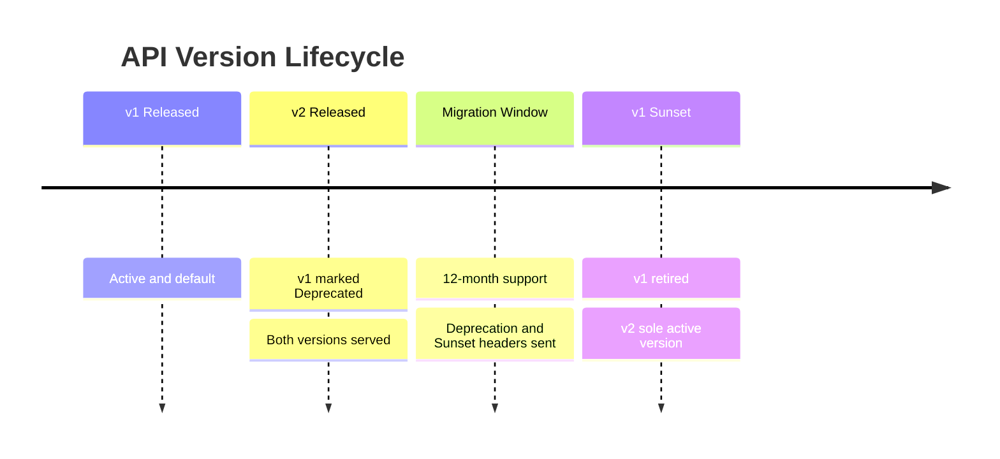

# Volume 10 - Versioning

| Field | Value |
|---|---|
| Document ID | WORLD-VOL10-011 |
| Title | Versioning |
| Version | 1.0 |
| Status | Approved |
| Classification | Internal |
| Founder | Mahesh Choudhary |

## Purpose

This chapter defines how the WORLD API evolves without breaking the clients that depend on it. Its purpose is to establish a single, predictable versioning strategy and deprecation policy across all API surfaces, so that WORLD can ship improvements continuously while honoring an explicit compatibility contract with internal teams, partners, and public consumers.

## Scope

Covered: the versioning concept, the distinction between breaking and non-breaking change, URI versus header versioning, and the deprecation lifecycle. Excluded: how versions are routed at runtime (Chapter 10), the broader API lifecycle governance (Chapter 23), and schema-level compatibility rules for individual payloads (Vol 10 OpenAPI Standards, ch 15).

## Concept

Versioning exists to make change safe. From first principles an API is a contract; consumers build against its shape and behavior, so any incompatible change silently breaks them. The core distinction is between **non-breaking** changes - additive fields, new optional parameters, new endpoints - which existing clients tolerate, and **breaking** changes - removed fields, renamed resources, altered semantics - which do not. Non-breaking changes may ship within a version; breaking changes require a new version so consumers migrate on their own schedule. A version is therefore a stability promise: within one version the contract only grows compatibly, and multiple versions coexist for a defined window so no consumer is forced to migrate instantly.

## Application in WORLD

WORLD uses **URI-path versioning** as its primary scheme - `/v1/orders`, `/v2/orders` - because it is explicit, cache-friendly, and trivial to route at the gateway (Chapter 10). A major version number changes only for breaking changes; compatible evolution ships continuously within the current major. For fine-grained, opt-in behavior WORLD supports a secondary **header** hint (`WORLD-API-Version`) that selects a dated revision within a major version, used sparingly for negotiated partner features. Every response advertises its serving version and, when applicable, `Deprecation` and `Sunset` headers naming the retirement date. Deprecated versions enter a published lifecycle - Active, Deprecated, Sunset - with a minimum support window, migration guides, and telemetry that tracks residual usage so retirement is data-driven rather than arbitrary.

### Enterprise Example

WORLD must change the `orders` resource so a single `customer` object replaces two flat fields - a breaking change. Rather than alter `/v1`, the team ships `/v2/orders` with the new shape and keeps `/v1` fully operational. From release, `/v1` responses carry `Deprecation: true` and a `Sunset` date twelve months out, and the developer portal publishes a migration guide. Gateway telemetry shows a partner still calling `/v1` at 4% of volume nine months in; the partner-success team engages them directly, and only after usage falls to zero is `/v1` retired. No consumer is broken without notice, and migration proceeds on each consumer's own schedule.

## Key Components

| Component | Responsibility | Detail |
|---|---|---|
| Major Version (URI) | Signals a breaking contract boundary | `/v1`, `/v2` |
| Version Header | Opt-in dated revision within a major | `WORLD-API-Version` |
| Deprecation Headers | Announce retirement to callers | `Deprecation`, `Sunset` |
| Compatibility Policy | Classifies changes as breaking or additive | Governance rule |
| Migration Guide | Documents the path between versions | Developer portal |
| Usage Telemetry | Tracks residual version consumption | Monitoring feed |

## Trade-offs & Considerations

URI versioning is explicit and easy to cache and route but exposes the version in every link, which can feel coarse and multiplies visible endpoints. Header versioning keeps URIs clean and enables granular negotiation but is easy to overlook, harder to cache, and less discoverable - so WORLD makes URI the default and headers the exception. Supporting multiple concurrent versions maximizes consumer freedom but multiplies maintenance and test surface, so the number of live majors is deliberately capped and old versions are retired on a firm schedule. Long deprecation windows reduce consumer disruption but slow the platform's ability to remove legacy code; WORLD balances this with a fixed minimum window plus usage-driven retirement.

## Relationship to Other Layers

Versioning is enforced operationally by the API Gateway (Chapter 10), which routes each request to the correct version and injects deprecation headers. It is governed by the broader API Lifecycle (Chapter 23) and constrained by OpenAPI Standards (ch 15), which define payload-level compatibility. By making change safe and predictable, versioning protects the internal, external, and public API contracts (Chapters 05-07) and preserves consumer trust as WORLD evolves.

## Cross-References

- [API Gateway](/docs/blueprint/volume-10-api/section-c-api-security-and-access/10-api-gateway.md)
- [Rate Limiting](/docs/blueprint/volume-10-api/section-c-api-security-and-access/12-rate-limiting.md)
- [API Lifecycle (ch 23)](/docs/blueprint/volume-10-api/section-g-lifecycle-and-evolution/23-api-lifecycle.md)
- [Volume 08 - Architecture](/docs/blueprint/volume-08-architecture/README.md)

## References

- [Volume 01 - Vision and Philosophy](/docs/blueprint/volume-01-vision-and-philosophy/README.md)
- [Document Standards](/docs/governance/document-standards.md)

## Change Log

| Version | Date | Author | Notes |
|---|---|---|---|
| 1.0 | 2026-07-12 | Lead Software Engineer | Initial approved version. |
