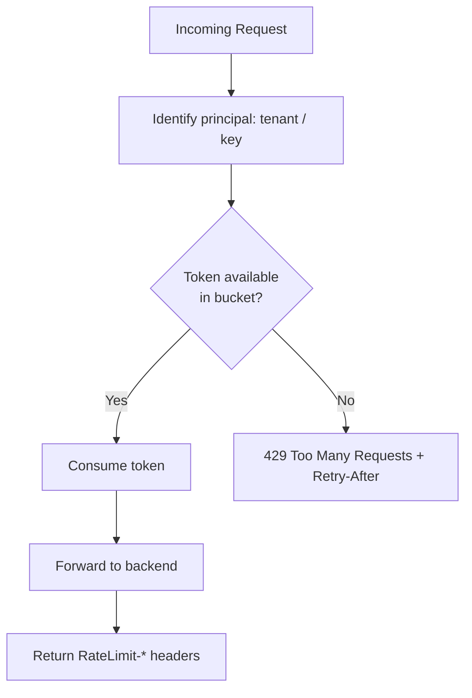

# Volume 10 - Rate Limiting

| Field | Value |
|---|---|
| Document ID | WORLD-VOL10-012 |
| Title | Rate Limiting |
| Version | 1.0 |
| Status | Approved |
| Classification | Internal |
| Founder | Mahesh Choudhary |

## Purpose

This chapter defines how the WORLD API protects shared capacity by bounding how much traffic any caller may send. Its purpose is to guarantee fairness across tenants, preserve availability under load, and provide a predictable, transparent throttling contract - so that no single client, integration, or AI agent can degrade the platform for everyone else.

## Scope

Covered: the rate-limiting concept, the algorithms WORLD uses, per-tenant and per-key quotas, and how limits are communicated to callers. Excluded: the physical enforcement point (Chapter 10), autoscaling of backend capacity (Vol 11), and application-level circuit breaking between internal services (Chapter 18), which addresses failure propagation rather than fairness.

## Concept

Rate limiting exists because capacity is finite and shared. From first principles, a multi-tenant platform must convert unbounded, bursty demand into bounded, predictable load, and must do so fairly so that one caller's behavior cannot starve others. A rate limiter answers, for each request: has this caller exceeded its allotted rate in the current window? The canonical mechanism is the **token bucket** - a bucket refills at a steady rate up to a fixed capacity, and each request consumes one token; requests find tokens when traffic is within budget and are rejected or delayed when the bucket is empty. This elegantly allows short bursts (draining accumulated tokens) while enforcing a sustained average rate, unlike a rigid fixed window that permits edge-of-window spikes.

## Application in WORLD

WORLD enforces limits at the API gateway (Chapter 10) using the token-bucket algorithm, keyed by the authenticated principal (Chapter 08) - tenant, API key, or service account. Limits are tiered: a **per-tenant quota** guarantees fair share of shared capacity, a **per-key quota** bounds individual credentials, and a **per-endpoint quota** protects costly operations such as bulk exports. Because the gateway is a horizontally scaled fleet, counters are maintained in a shared, low-latency store so limits hold globally rather than per instance. Every response returns `RateLimit-Limit`, `RateLimit-Remaining`, and `RateLimit-Reset` headers; an exceeded caller receives `429 Too Many Requests` with a `Retry-After` value. The AI Business Partner is limited under its delegated identity, so autonomous activity is bounded by the same fairness rules as any client.

### Enterprise Example

A data-integration partner runs a nightly sync that briefly bursts to thousands of requests per minute. Its token bucket, sized for a 10,000-request-per-minute sustained rate with burst capacity, absorbs the spike smoothly while the steady refill enforces the average. Midway, a misconfigured client script enters a retry loop and slams `POST /v1/invoices`; that key's bucket empties within seconds and further calls receive `429` with `Retry-After: 30`, while the endpoint quota shields the invoicing service. Crucially, other tenants sharing the platform are unaffected, because each tenant's bucket is independent - fairness is preserved and overall availability holds.

## Key Components

| Component | Responsibility | Detail |
|---|---|---|
| Token Bucket | Allows bursts while enforcing a sustained rate | Core algorithm |
| Per-Tenant Quota | Guarantees fair share across tenants | Isolation |
| Per-Key Quota | Bounds an individual credential | Client control |
| Per-Endpoint Quota | Protects expensive operations | Backend safety |
| Shared Counter Store | Maintains limits globally across the fleet | Low-latency store |
| Response Headers | Communicate remaining budget and reset | `RateLimit-*`, `Retry-After` |

## Trade-offs & Considerations

The token bucket permits bursts, which serves real workloads but means backends must tolerate short spikes; where strict smoothing is required, a leaky-bucket variant is used instead. Enforcing global limits across a gateway fleet demands a shared counter store, adding a dependency and a small latency cost per request - mitigated by in-memory replication with fast synchronization. Limits set too low frustrate legitimate integrations, while limits set too high fail to protect capacity, so WORLD tiers quotas by plan and calibrates them from observed usage. Returning clear `429` responses with `Retry-After` is essential; opaque throttling erodes developer trust and drives inefficient client retry storms.

## Relationship to Other Layers

Rate limiting is enforced at the API Gateway (Chapter 10) using identity from Authentication (Chapter 08), and its per-tenant quotas realize the tenant-isolation principle shared with Authorization (Chapter 09). It works alongside Versioning (Chapter 11) as one of the standing guardrails applied to every request, and it feeds API Monitoring (Chapter 21) with the signals used to detect abuse and tune capacity. Together these controls keep the WORLD API fair, resilient, and predictable under real-world load.

## Cross-References

- [API Gateway](/docs/blueprint/volume-10-api/section-c-api-security-and-access/10-api-gateway.md)
- [Authentication](/docs/blueprint/volume-10-api/section-c-api-security-and-access/08-authentication.md)
- [Authorization](/docs/blueprint/volume-10-api/section-c-api-security-and-access/09-authorization.md)
- [Volume 08 - Architecture](/docs/blueprint/volume-08-architecture/README.md)

## References

- [Volume 01 - Vision and Philosophy](/docs/blueprint/volume-01-vision-and-philosophy/README.md)
- [Document Standards](/docs/governance/document-standards.md)

## Change Log

| Version | Date | Author | Notes |
|---|---|---|---|
| 1.0 | 2026-07-12 | Lead Software Engineer | Initial approved version. |
