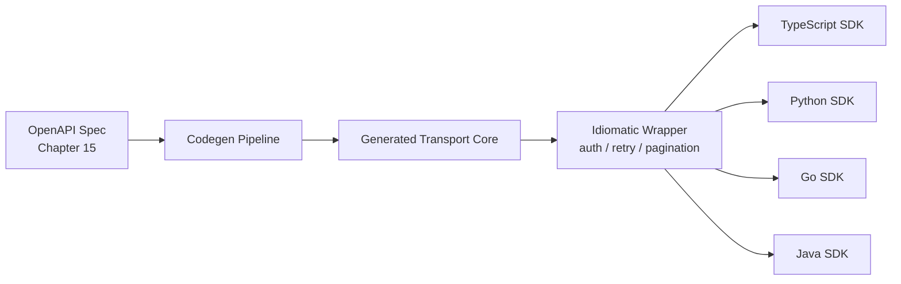

# Volume 10 - SDK Strategy

| Field | Value |
|---|---|
| Document ID | WORLD-VOL10-013 |
| Title | SDK Strategy |
| Version | 1.0 |
| Status | Approved |
| Classification | Internal |
| Founder | Mahesh Choudhary |

## Purpose

This chapter defines how WORLD delivers language-native Software Development Kits (SDKs) that wrap the public API. Its purpose is to reduce the effort, error rate, and time-to-first-call for every developer and AI agent that integrates with WORLD, by turning a raw HTTP contract into idiomatic, typed, well-behaved client libraries that encode the platform's conventions once rather than in every consumer's code.

## Scope

Covered: the rationale for first-party SDKs, the supported languages, the generation model, and the runtime behaviours every SDK guarantees. Excluded: the wire-level API contract itself (Section A), the OpenAPI specification that seeds generation (Chapter 15), the human-readable reference site (Chapter 14), and authentication credential issuance (Chapter 08), which SDKs consume but do not define.

## Concept

An SDK exists to close the gap between a protocol and a programmer. From first principles, every integrator must otherwise re-solve the same problems: constructing signed requests, serializing payloads, paginating collections, decoding errors, and retrying transient failures. Left to each consumer, these are re-implemented inconsistently and often incorrectly. An SDK amortizes that work: the platform solves each concern once, in a tested library, and ships it in the developer's own language with native types, autocompletion, and idiomatic ergonomics. The strategic decision is **spec-driven generation** - the SDK surface is derived mechanically from the API's OpenAPI description (Chapter 15), so the client never drifts from the contract, and a hand-written ergonomic layer wraps the generated core to provide auth, retries, and pagination.

## Application in WORLD

WORLD ships first-party SDKs for TypeScript, Python, Go, and Java, chosen to cover backend services, data/AI workloads, and enterprise integration. Each SDK is layered: a **generated transport core** produced from the OpenAPI spec guarantees every endpoint and model is present and typed, and a **thin idiomatic wrapper** adds authentication, automatic retries with backoff, cursor pagination, and typed error objects. All SDKs share a single semantic version aligned to the API version (Chapter 11), so a developer on `v2` of the API uses `v2.x` of every SDK. The AI Business Partner consumes the same TypeScript and Python SDKs under its delegated identity, meaning autonomous integrations inherit the identical retry, pagination, and error-handling guarantees as human-written code - there is no privileged back channel.

### Enterprise Example

A financial-services customer builds a reconciliation service in Java. Using the WORLD Java SDK, a developer calls `world.invoices().list(filter)` and receives a strongly typed, auto-paginating iterator rather than raw JSON. When the gateway returns `429` (Chapter 12), the SDK transparently honours `Retry-After` and retries with jitter, so the customer's code never hand-rolls backoff. A field added to the invoice model in API `v2.4` appears automatically in the SDK on the next release because it flows from the regenerated spec - the integration picks it up without manual model edits, and a removed field would surface at compile time rather than as a production surprise.

## Key Components

| Component | Responsibility | Detail |
|---|---|---|
| Generated Transport Core | Mirrors every endpoint and model from the spec | Spec-driven, no drift |
| Idiomatic Wrapper | Adds auth, retries, pagination, typed errors | Hand-maintained layer |
| Version Alignment | Ties SDK version to API version | Aligned to Chapter 11 |
| Language Coverage | Serves primary integration ecosystems | TS, Python, Go, Java |
| Release Pipeline | Publishes on spec change | Automated, reproducible |
| Telemetry Hooks | Emit standard client metrics | Feeds monitoring (Ch 21) |

## Trade-offs & Considerations

Generating SDKs from the spec guarantees fidelity but means the spec's quality is the ceiling of SDK quality - a vague schema yields a clumsy client, which is why Chapter 15 mandates rigor. Supporting four languages multiplies release and support cost, so WORLD deliberately limits the set rather than chasing every ecosystem; community SDKs are welcomed but unsupported. A thin idiomatic wrapper improves ergonomics but must be maintained by hand, creating a small surface that can lag the generated core; disciplined versioning keeps them coupled. Finally, SDKs must fail safe: overly aggressive automatic retries can amplify load during an outage, so backoff is bounded and jittered by default.

## Relationship to Other Layers

SDK Strategy sits directly on the OpenAPI Standards (Chapter 15) that seed generation and is documented by the API Documentation site (Chapter 14), which embeds SDK snippets in every reference example. SDKs consume Authentication (Chapter 08) credentials, honour Rate Limiting (Chapter 12) responses, and track API Versioning (Chapter 11). Together with the developer portal they form the developer-tooling surface that makes the WORLD API-first architecture (Volume 08) usable in practice rather than merely reachable.

## Cross-References

- [OpenAPI Standards](/docs/blueprint/volume-10-api/section-d-developer-tooling/15-openapi-standards.md)
- [API Documentation](/docs/blueprint/volume-10-api/section-d-developer-tooling/14-api-documentation.md)
- [Versioning](/docs/blueprint/volume-10-api/section-c-api-security-and-access/11-versioning.md)
- [Volume 08 - Architecture](/docs/blueprint/volume-08-architecture/README.md)

## References

- [Volume 01 - Vision and Philosophy](/docs/blueprint/volume-01-vision-and-philosophy/README.md)
- [Document Standards](/docs/governance/document-standards.md)

## Change Log

| Version | Date | Author | Notes |
|---|---|---|---|
| 1.0 | 2026-07-12 | Lead Software Engineer | Initial approved version. |
