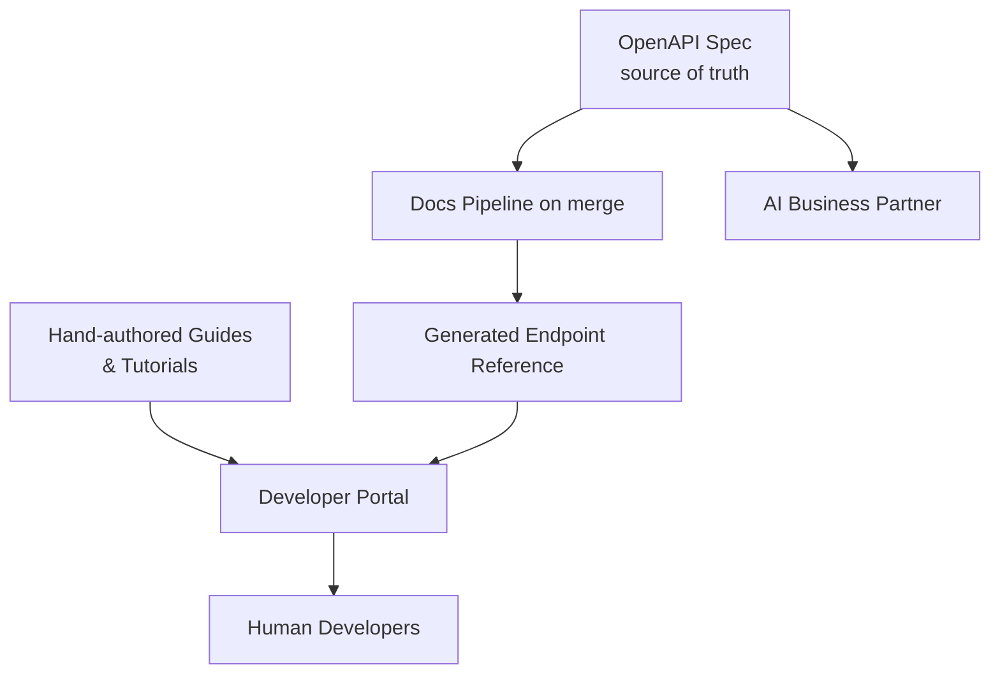

# Volume 10 - API Documentation

| Field | Value |
|---|---|
| Document ID | WORLD-VOL10-014 |
| Title | API Documentation |
| Version | 1.0 |
| Status | Approved |
| Classification | Internal |
| Founder | Mahesh Choudhary |

## Purpose

This chapter defines how WORLD documents its API so that a developer or an AI agent can discover, understand, and correctly call any endpoint without reading source code or contacting support. Its purpose is to make the API self-explanatory - turning the formal contract into accurate, always-current, example-rich reference material that is the single trusted description of platform behaviour.

## Scope

Covered: the documentation philosophy, the spec-as-source-of-truth model, the structure of the reference site, and how examples and SDK snippets are kept correct. Excluded: the SDKs themselves (Chapter 13), the OpenAPI specification's authoring rules (Chapter 15), and internal design records or runbooks (Volume 08), which describe how the platform is built rather than how it is called.

## Concept

Documentation is the interface between the API's authors and everyone who consumes it. From first principles, the greatest risk in any documentation is **drift** - the moment prose diverges from behaviour, the document becomes a liability that teaches developers the wrong thing. The durable solution is to make documentation a projection of the same machine-readable contract the platform is built and tested against, rather than a parallel artifact maintained by hand. When the OpenAPI specification (Chapter 15) is the single source of truth, reference pages are generated from it, so they cannot describe an endpoint that does not exist or omit a field that does. Human-authored narrative - guides, tutorials, concepts - then wraps that generated reference to supply the intent and workflow that a schema alone cannot convey.

## Application in WORLD

WORLD runs a **docs-as-code** developer portal. The OpenAPI spec is the source of truth: on every merge, a pipeline regenerates the endpoint reference, so parameters, schemas, and error codes always match production. Around this generated core, engineers author conceptual guides and quickstarts in version-controlled Markdown, reviewed like any code change. Every endpoint page shows a live request/response example and copy-paste SDK snippets in each supported language (Chapter 13), generated from the spec so they compile against the current contract. Examples are validated in CI against a sandbox, so a broken sample fails the build. Documentation is versioned alongside the API (Chapter 11): a reader can select `v1` or `v2` and see exactly that version's surface. The AI Business Partner reads the same machine-readable spec directly, so autonomous callers and human readers share one authoritative description.

### Enterprise Example

A logistics enterprise onboards a new integration team. A developer lands on the WORLD portal, follows the quickstart, and copies a Python snippet for `POST /v1/shipments` straight from the endpoint page - it runs unmodified because the snippet was generated from the spec and CI-tested against the sandbox. When the team later migrates to API `v2`, they switch the portal's version selector and see the changed request schema and a migration guide side by side. Because a required field added in `v2` is reflected automatically in the generated reference, the team discovers it while reading rather than through a `400` in production, and their integration ships without a support ticket.

## Key Components

| Component | Responsibility | Detail |
|---|---|---|
| Spec-Generated Reference | Renders endpoints from the contract | No drift possible |
| Hand-authored Guides | Supply intent and workflows | Docs-as-code Markdown |
| Live Examples | Show real request/response pairs | CI-validated in sandbox |
| SDK Snippets | Copy-paste code per language | Generated (Chapter 13) |
| Version Selector | Serves per-version documentation | Aligned to Chapter 11 |
| Search & Navigation | Makes the surface discoverable | Indexed portal |

## Trade-offs & Considerations

Generating reference from the spec eliminates drift but shifts the burden onto spec quality - undescribed fields produce blank documentation, so Chapter 15 mandates descriptions and examples for every schema. Docs-as-code gives review rigor and history but asks engineers to write prose, which requires cultural commitment and editorial standards to avoid terse, unhelpful pages. Validating examples in CI catches broken samples but lengthens the build and requires a maintained sandbox; the reliability gain justifies the cost. Versioned documentation prevents confusion but multiplies the pages to host and search, so retired versions are archived on a published deprecation schedule rather than kept indefinitely.

## Relationship to Other Layers

API Documentation is a projection of OpenAPI Standards (Chapter 15) and embeds snippets from the SDK Strategy (Chapter 13), making the two developer-tooling siblings mutually reinforcing. It tracks API Versioning (Chapter 11) so readers always see the surface they call, and it describes the Authentication (Chapter 08) and Rate Limiting (Chapter 12) behaviours a developer must handle. As the human-facing face of the API-first platform (Volume 08), it converts a reachable contract into an approachable one.

## Cross-References

- [OpenAPI Standards](/docs/blueprint/volume-10-api/section-d-developer-tooling/15-openapi-standards.md)
- [SDK Strategy](/docs/blueprint/volume-10-api/section-d-developer-tooling/13-sdk-strategy.md)
- [Versioning](/docs/blueprint/volume-10-api/section-c-api-security-and-access/11-versioning.md)
- [Volume 08 - Architecture](/docs/blueprint/volume-08-architecture/README.md)

## References

- [Volume 01 - Vision and Philosophy](/docs/blueprint/volume-01-vision-and-philosophy/README.md)
- [Document Standards](/docs/governance/document-standards.md)

## Change Log

| Version | Date | Author | Notes |
|---|---|---|---|
| 1.0 | 2026-07-12 | Lead Software Engineer | Initial approved version. |
