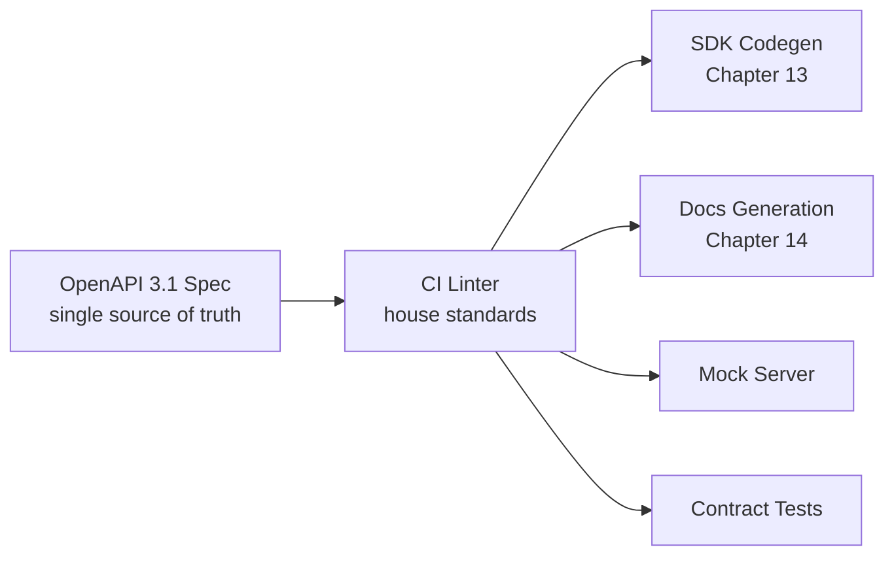

# Volume 10 - OpenAPI Standards

| Field | Value |
|---|---|
| Document ID | WORLD-VOL10-015 |
| Title | OpenAPI Standards |
| Version | 1.0 |
| Status | Approved |
| Classification | Internal |
| Founder | Mahesh Choudhary |

## Purpose

This chapter defines the OpenAPI specification as the single, authoritative, machine-readable contract for the WORLD API, and the standards every specification must meet. Its purpose is to make the contract the source of truth from which servers, clients, documentation, and tests are all derived - so that a change to the API begins as a change to its specification, not as divergent edits across code and prose.

## Scope

Covered: the role of OpenAPI, the mandatory authoring conventions, the spec-driven code-generation model, and how specifications are governed and validated. Excluded: the SDKs generated from the spec (Chapter 13), the documentation portal that renders it (Chapter 14), and the runtime enforcement of the contract at the gateway (Chapter 10), which applies the spec rather than defining it.

## Concept

An API contract must exist in exactly one authoritative form, or it does not truly exist at all. From first principles, if behaviour is defined independently in server code, client libraries, and documentation, those three descriptions will inevitably diverge, and consumers cannot know which is correct. OpenAPI resolves this by expressing the contract in a single machine-readable specification - paths, operations, schemas, parameters, responses, and errors - that both humans and tools can consume. This enables **spec-driven development**: the specification is authored first, reviewed as the contract, and then used to generate server stubs, client SDKs (Chapter 13), reference documentation (Chapter 14), and contract tests. The specification stops being documentation about the system and becomes a producing artifact of the system.

## Application in WORLD

WORLD adopts OpenAPI 3.1 as the mandatory contract format for every public API. Specifications are version-controlled and reviewed as first-class source. WORLD enforces house standards: every operation has an `operationId` (which names generated SDK methods), every schema and field carries a `description` and an `example`, error responses use the shared problem schema, and security schemes reference the platform's authentication (Chapter 08). A CI linter rejects any specification that violates these rules, so quality is mechanical rather than aspirational. The spec then drives generation - SDKs, documentation, mock servers, and contract tests all flow from it - guaranteeing that code, docs, and tests describe one identical contract. A minimal excerpt illustrates the house style:

```yaml
openapi: 3.1.0
info:
  title: WORLD API
  version: "2.4.0"
paths:
  /v2/invoices/{invoiceId}:
    get:
      operationId: getInvoice
      summary: Retrieve a single invoice
      parameters:
        - name: invoiceId
          in: path
          required: true
          schema: { type: string }
      responses:
        "200":
          description: The requested invoice
          content:
            application/json:
              schema: { $ref: "#/components/schemas/Invoice" }
        "429":
          description: Rate limit exceeded
```



### Enterprise Example

A product team adds a `dueDate` field to the invoice resource for `v2.4`. The change starts as a pull request to the OpenAPI spec, where `dueDate` gains a `description` and `example`; the CI linter confirms the standards are met and the review approves the contract. On merge, the codegen pipeline regenerates the four SDKs (Chapter 13) so `dueDate` appears as a typed field, the documentation portal (Chapter 14) shows it automatically, and contract tests assert the running service matches the spec. A backend that forgot to populate `dueDate` fails its contract test before release - the single source of truth caught the divergence, and no consumer ever saw an inconsistent API.

## Key Components

| Component | Responsibility | Detail |
|---|---|---|
| OpenAPI 3.1 Spec | Expresses the contract machine-readably | Single source of truth |
| House Standards Linter | Enforces authoring conventions in CI | operationId, examples, errors |
| Shared Problem Schema | Standardizes error responses | Consistent across endpoints |
| Spec-Driven Codegen | Generates SDKs from the spec | Feeds Chapter 13 |
| Docs & Mock Generation | Produces reference and mock servers | Feeds Chapter 14 |
| Contract Tests | Assert runtime matches the spec | Prevents drift |

## Trade-offs & Considerations

Spec-first development front-loads discipline: teams must author and review the contract before writing code, which feels slower for a single change but prevents the far costlier divergence of parallel definitions. Mandating descriptions, examples, and `operationId`s adds authoring overhead, yet those fields are exactly what makes generated SDKs and docs usable, so the linter enforces them rather than trusting goodwill. OpenAPI is expressive but not infinite - some dynamic behaviours resist static description, and WORLD documents those explicitly rather than encoding them awkwardly. Generation coupling means a malformed spec can break many downstreams at once, so the linter and contract tests act as the guardrail that keeps the source of truth trustworthy.

## Relationship to Other Layers

OpenAPI Standards is the foundation of the developer-tooling section: the SDK Strategy (Chapter 13) and API Documentation (Chapter 14) are both generated projections of the specification, so their fidelity depends on this chapter's rigor. The spec references Authentication (Chapter 08) security schemes and the error and rate-limit contracts enforced at the gateway (Chapter 10, Chapter 12), and it evolves under API Versioning (Chapter 11). As the executable contract, it is the mechanism by which the API-first principle of Volume 08 is made real and verifiable.

## Cross-References

- [SDK Strategy](/docs/blueprint/volume-10-api/section-d-developer-tooling/13-sdk-strategy.md)
- [API Documentation](/docs/blueprint/volume-10-api/section-d-developer-tooling/14-api-documentation.md)
- [Versioning](/docs/blueprint/volume-10-api/section-c-api-security-and-access/11-versioning.md)
- [Volume 08 - Architecture](/docs/blueprint/volume-08-architecture/README.md)

## References

- [Volume 01 - Vision and Philosophy](/docs/blueprint/volume-01-vision-and-philosophy/README.md)
- [Document Standards](/docs/governance/document-standards.md)

## Change Log

| Version | Date | Author | Notes |
|---|---|---|---|
| 1.0 | 2026-07-12 | Lead Software Engineer | Initial approved version. |
