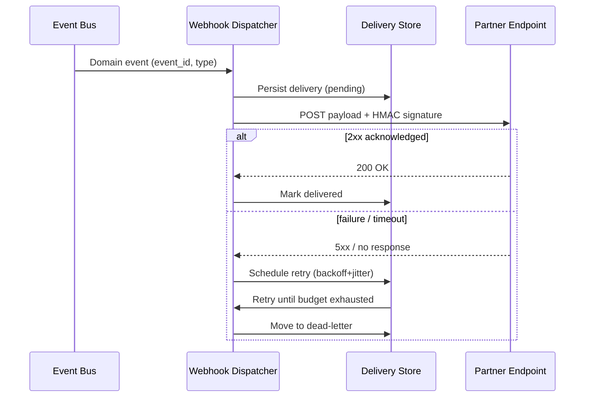

# Volume 10 - Webhook Framework

| Field | Value |
|---|---|
| Document ID | WORLD-VOL10-016 |
| Title | Webhook Framework |
| Version | 1.0 |
| Status | Approved |
| Classification | Internal |
| Founder | Mahesh Choudhary |

## Purpose

This chapter defines how the WORLD API pushes state changes *outward* to external subscribers. Where the request APIs (Chapters 05-07) let callers pull data on demand, the Webhook Framework inverts control: WORLD notifies a partner's endpoint the moment a business event occurs. Its purpose is to give every module one uniform, secure, and reliable way to deliver outbound event notifications, so that partners integrate against a single contract rather than bespoke per-module callbacks. It translates the platform Event-Driven principle (Vol 08, ch 11) into a concrete outbound-HTTP delivery mechanism.

## Scope

Covered: the webhook concept, subscription lifecycle, delivery, retry and backoff, payload signing, and consumer-side idempotency. Excluded: the internal event bus that originates events (Chapter 19), broad integration patterns beyond outbound HTTP (Chapter 17), and authentication of inbound calls (Chapter 08), which webhooks reuse for their management API.

## Concept

A webhook is a reversed API call: instead of the client polling the server, the server calls a client-registered URL when something happens. From first principles this decouples *when an event occurs* from *when a consumer learns of it*, eliminating wasteful polling and reducing notification latency to near-real-time. The framework rests on four guarantees. **Delivery** is an at-least-once HTTP POST to the subscriber's URL. **Retries** with exponential backoff absorb transient consumer or network failure without losing events. **Signing** lets the consumer cryptographically verify that a payload genuinely came from WORLD and was not tampered with. **Idempotency** - via a stable event identifier - lets consumers safely de-duplicate the redeliveries that at-least-once delivery inevitably produces. Together these turn an unreliable outbound HTTP call into a dependable event channel.

## Application in WORLD

WORLD exposes a tenant-scoped subscription API where a partner registers an endpoint URL and selects event types (for example `invoice.paid`, `shipment.dispatched`). Domain events published on the internal Event Bus (Chapter 19) are fanned out to a Webhook Dispatcher, which matches each event against active subscriptions, serializes a versioned JSON payload, and signs it. Every delivery carries an `X-WORLD-Signature` HMAC-SHA256 header over the raw body plus a timestamp, and an `X-WORLD-Event-Id` header that the consumer uses as an idempotency key. A `2xx` response marks the delivery successful; any other outcome enqueues a retry with exponential backoff and jitter. After the retry budget is exhausted, the event moves to a dead-letter store and the endpoint's health score degrades; sustained failure auto-suspends the subscription and raises an operational alert. The AI Business Partner (Vol 03) consumes these same webhooks to react to partner-side events without human polling.

### Enterprise Example

A payments partner subscribes to `invoice.paid`. When a WORLD customer settles an invoice, the Event Bus emits the event; the Dispatcher signs and POSTs it to the partner's `/hooks/world` URL. The partner's load balancer briefly returns `503` during a deploy, so the first two deliveries fail. The Dispatcher retries at roughly 1s, 4s, 16s, then minutes-scale intervals with jitter, and the fourth attempt succeeds. Because all four attempts carried the same `X-WORLD-Event-Id`, the partner - which had actually processed the third attempt just as its ack timed out - detects the duplicate and does not double-credit the merchant. The signature check on every attempt guarantees the partner never acts on a forged `invoice.paid`.

## Key Components

| Component | Responsibility | Mechanism |
|---|---|---|
| Subscription Registry | Stores endpoint URLs, event filters, secrets per tenant | Management API |
| Webhook Dispatcher | Matches events to subscriptions and drives delivery | Event consumer |
| Payload Signer | Proves authenticity and integrity of each payload | HMAC-SHA256 + timestamp |
| Retry Scheduler | Re-attempts failed deliveries without loss | Exponential backoff + jitter |
| Idempotency Key | Lets consumers de-duplicate redeliveries | `X-WORLD-Event-Id` header |
| Dead-Letter Store | Captures exhausted deliveries for replay and audit | Durable queue |

## Trade-offs & Considerations

At-least-once delivery is chosen over exactly-once because true exactly-once across an untrusted network is impractical; the cost is that consumers must be idempotent, which the framework makes explicit via the event-id contract. Aggressive retries improve reliability but can overwhelm a recovering endpoint, so backoff, jitter, and per-endpoint concurrency caps are mandatory. Signing adds negligible CPU but requires disciplined secret rotation, which the Subscription Registry automates. Webhooks favor low latency and low coupling but hand delivery timing to the consumer's availability; for consumers that cannot expose a public endpoint, WORLD offers pull-based event polling (Chapter 04) as the alternative. Ordering is best-effort per subscription, not global - consumers that need strict order rely on event timestamps and sequence numbers rather than arrival order.

## Relationship to Other Layers

The Webhook Framework is the outbound face of the Event Bus (Chapter 19): the bus decides *what* happened, webhooks decide *who outside* hears it. It reuses Authentication (Chapter 08) for its management API and Rate Limiting (Chapter 12) to protect both WORLD and consumer endpoints. It is one delivery style within the broader Integration Framework (Chapter 17) and realizes the Event-Driven architecture of Vol 08 (ch 11) at the network edge, extending WORLD's Cross-Module Integration model (Vol 05, ch 29) beyond the platform boundary to partners.

## Cross-References

- [Event Bus](/docs/blueprint/volume-10-api/section-e-integration-and-messaging/19-event-bus.md)
- [Integration Framework](/docs/blueprint/volume-10-api/section-e-integration-and-messaging/17-integration-framework.md)
- [Volume 08 - Event-Driven Architecture (ch 11)](/docs/blueprint/volume-08-architecture/README.md)
- [Volume 05 - Cross-Module Integration (ch 29)](/docs/blueprint/volume-05-erp-foundation/README.md)

## References

- [Volume 01 - Vision and Philosophy](/docs/blueprint/volume-01-vision-and-philosophy/README.md)
- [Document Standards](/docs/governance/document-standards.md)

## Change Log

| Version | Date | Author | Notes |
|---|---|---|---|
| 1.0 | 2026-07-12 | Lead Software Engineer | Initial approved version. |
