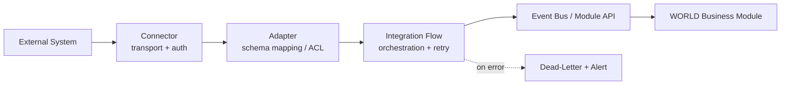

# Volume 10 - Integration Framework

| Field | Value |
|---|---|
| Document ID | WORLD-VOL10-017 |
| Title | Integration Framework |
| Version | 1.0 |
| Status | Approved |
| Classification | Internal |
| Founder | Mahesh Choudhary |

## Purpose

This chapter defines how WORLD connects to the wider ecosystem of external systems - ERPs, banks, tax authorities, logistics carriers, CRMs, and legacy databases - through one coherent framework rather than a sprawl of point-to-point scripts. Its purpose is to give every module and every partner integration a shared vocabulary of connectors, adapters, and integration patterns, so that adding a new external system is a configuration exercise against a known contract, not a bespoke engineering project. It operationalizes WORLD's Cross-Module Integration philosophy (Vol 05, ch 29) at the external boundary.

## Scope

Covered: the integration concept, the connector and adapter model, the supported integration patterns (synchronous request/reply, asynchronous messaging, batch/file, and streaming), transformation and mapping, and error handling. Excluded: the outbound event-notification specifics of webhooks (Chapter 16) and the internal service-to-service transport (Chapter 18), both of which the framework composes.

## Concept

Integration is the disciplined act of making two systems that were designed independently cooperate. From first principles the framework separates three concerns that naive integrations tangle together: **connectivity** (how bytes move - HTTP, SFTP, message queue, database link), **transformation** (how WORLD's canonical model maps to and from a foreign schema), and **orchestration** (the sequence, retries, and compensation that make a multi-step exchange reliable). By isolating these into a connector (transport), an adapter (transformation), and a flow (orchestration), any external system can be onboarded by supplying only the parts that differ, while error handling, observability, security, and idempotency are inherited from the framework. This is the anti-corruption layer principle made concrete: WORLD's internal domain model is never contaminated by an external system's quirks.

## Application in WORLD

WORLD ships an Integration Layer built around a registry of connectors. Each connector encapsulates transport and credentials to one external system; each adapter maps that system's payloads to WORLD canonical events and commands; each integration flow orchestrates the exchange with built-in retry, timeout, and compensation. Four patterns are supported: **synchronous** request/reply for interactive lookups (a real-time tax-rate call), **asynchronous** messaging for decoupled work (posting a journal entry to an external GL via the Event Bus, Chapter 19), **batch/file** for high-volume periodic exchange (nightly bank statement import over SFTP), and **streaming** for continuous feeds (market or carrier-tracking data). All inbound integrations pass through the anti-corruption adapter before touching a business module, and all traffic is authenticated (Chapter 08) and rate-limited (Chapter 12). The AI Business Partner (Vol 03) can propose and configure new connector mappings, since the framework exposes integrations as declarative, inspectable definitions rather than code.

### Enterprise Example

A manufacturing tenant must sync purchase orders with a supplier running a legacy SAP instance. An operator selects the SAP connector (IDoc over a message queue), binds credentials, and maps the supplier's `ORDERS05` IDoc fields to WORLD's canonical `PurchaseOrder` via the adapter's visual mapping. The integration flow validates each inbound document, and on a mapping failure routes it to a dead-letter queue with a typed error rather than corrupting the ledger. When WORLD raises a new PO, the same connector emits an outbound IDoc. No procurement-module code changed: the supplier's schema quirks are fully absorbed by the adapter, and the framework supplied retries, idempotency, and audit automatically.

## Key Components

| Component | Responsibility | Mechanism |
|---|---|---|
| Connector | Transport and credential handling to one external system | HTTP / SFTP / queue / DB |
| Adapter (ACL) | Maps foreign schemas to WORLD canonical model | Declarative field mapping |
| Integration Flow | Orchestrates multi-step exchange with reliability | Retry / timeout / compensation |
| Pattern Library | Reusable sync, async, batch, streaming templates | Configuration |
| Transformation Engine | Structural and semantic data conversion | Mapping + validation rules |
| Error Handler | Isolates and routes failures for replay | Dead-letter + alerting |

## Trade-offs & Considerations

A generic framework trades some raw performance for uniformity: a hand-tuned point integration can be marginally faster, but it forfeits the shared observability, security, and error handling that make a fleet of integrations operable. Canonical mapping adds an indirection layer, yet it is precisely this layer that prevents external schema churn from rippling into business modules. Synchronous patterns are simplest but couple WORLD's availability to the external system's, so asynchronous and batch patterns are preferred for anything non-interactive. Rich transformation logic can drift into hidden business rules, so the framework keeps mappings declarative and versioned, with semantic logic pushed into modules. Onboarding a new connector still demands careful contract testing against the real external system before promotion.

## Relationship to Other Layers

The Integration Framework is the umbrella under which Webhooks (Chapter 16) serve outbound notification and the Event Bus (Chapter 19) serves asynchronous transport. For system-to-system links it may ride the same underlying messaging as Microservice Communication (Chapter 18) but adds the anti-corruption and transformation concerns that external systems demand. It extends the internal Cross-Module Integration model (Vol 05, ch 29) outward and depends on Vol 08's Event-Driven architecture (ch 11) for its asynchronous backbone. Every business module (Vol 06) consumes external data exclusively through this layer.

## Cross-References

- [Webhook Framework](/docs/blueprint/volume-10-api/section-e-integration-and-messaging/16-webhook-framework.md)
- [Microservice Communication](/docs/blueprint/volume-10-api/section-e-integration-and-messaging/18-microservice-communication.md)
- [Volume 05 - Cross-Module Integration (ch 29)](/docs/blueprint/volume-05-erp-foundation/README.md)
- [Volume 08 - Event-Driven Architecture (ch 11)](/docs/blueprint/volume-08-architecture/README.md)

## References

- [Volume 01 - Vision and Philosophy](/docs/blueprint/volume-01-vision-and-philosophy/README.md)
- [Document Standards](/docs/governance/document-standards.md)

## Change Log

| Version | Date | Author | Notes |
|---|---|---|---|
| 1.0 | 2026-07-12 | Lead Software Engineer | Initial approved version. |
