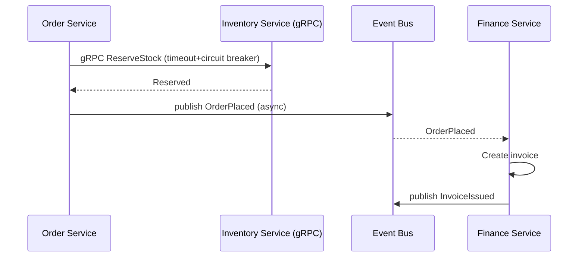

# Volume 10 - Microservice Communication

| Field | Value |
|---|---|
| Document ID | WORLD-VOL10-018 |
| Title | Microservice Communication |
| Version | 1.0 |
| Status | Approved |
| Classification | Internal |
| Founder | Mahesh Choudhary |

## Purpose

This chapter defines how WORLD's internal services talk to one another. Where Chapters 16-17 face outward to partners and external systems, this chapter governs the *inside* of the platform: how the dozens of business-module services, platform services, and the AI Business Partner exchange commands, queries, and events reliably and securely. Its purpose is to establish one consistent communication fabric so that services remain independently deployable yet coherently connected, realizing the Microservices architecture of Vol 08 (ch 08).

## Scope

Covered: the internal communication concept, the choice between synchronous and asynchronous styles, the transport contracts (gRPC, internal REST, and event messaging), service discovery, and resilience patterns (timeout, retry, circuit breaker). Excluded: external integration (Chapter 17), outbound webhooks (Chapter 16), and the event-bus internals themselves (Chapter 19), which this chapter consumes as its asynchronous transport.

## Concept

A microservice architecture buys independent deployability and fault isolation at the price of turning in-process calls into network calls - which can be slow, fail, or arrive out of order. Communication design is the discipline of managing that price. From first principles WORLD divides inter-service interaction into two modes with opposite trade-offs. **Synchronous** call-and-wait (a service asks another and blocks for the answer) is simple and immediately consistent but temporally couples the caller to the callee's availability. **Asynchronous** message-passing (a service emits an event and moves on) is resilient and loosely coupled but eventually consistent and harder to reason about. The guiding rule: use synchronous calls only for genuine query/command dependencies that need an immediate answer, and prefer asynchronous events for everything that propagates state. Every synchronous edge is a potential failure and latency multiplier, so each is wrapped in timeouts, retries, and circuit breakers.

## Application in WORLD

Internal WORLD services communicate over a service mesh that provides discovery, mutual-TLS encryption, and uniform telemetry. For synchronous request/reply between services, WORLD standardizes on **gRPC** with Protocol Buffer contracts for typed, low-latency calls, and internal REST (Chapter 05) where broader compatibility is needed. For anything that represents a state change, services publish domain events to the **Event Bus** (Chapter 19) and react asynchronously, keeping modules decoupled. Service identity is established by mTLS certificates (Chapter 08), and every call carries the propagated `SecurityContext` and a trace identifier for end-to-end observability. Resilience is not optional: the mesh enforces per-call timeouts, bounded retries with backoff on idempotent operations, and circuit breakers that shed load from a failing dependency. The saga pattern coordinates multi-service business transactions through compensating events rather than distributed locks, so no single service blocks the ledger.

### Enterprise Example

A customer places an order. The Order service makes a *synchronous* gRPC call to Inventory to reserve stock, because it needs an immediate yes/no before confirming; that call is guarded by a 200ms timeout and a circuit breaker so an Inventory slowdown degrades gracefully instead of cascading. Once stock is reserved, Order publishes an *asynchronous* `OrderPlaced` event and returns to the customer without waiting on downstream work. Finance, Shipping, and Analytics each consume `OrderPlaced` independently and at their own pace - Finance issues an invoice, Shipping schedules a pick. If Finance is momentarily down, the event waits on the bus and is processed on recovery; the customer's order confirmation was never blocked by it.

## Key Components

| Component | Responsibility | Mechanism |
|---|---|---|
| Service Mesh | Discovery, encryption, telemetry for all calls | Sidecar proxy + mTLS |
| Synchronous Transport | Typed low-latency request/reply | gRPC / internal REST |
| Asynchronous Transport | Decoupled state propagation | Event Bus (Chapter 19) |
| Contract Registry | Versioned service interface definitions | Protobuf / OpenAPI |
| Resilience Layer | Prevents cascading failure | Timeout / retry / circuit breaker |
| Saga Coordinator | Multi-service transactions via compensation | Choreographed events |

## Trade-offs & Considerations

Synchronous gRPC is fast and strongly typed but creates temporal coupling: a chain of synchronous calls has availability equal to the product of its links, so deep call chains are actively discouraged in favor of event choreography. Asynchronous messaging maximizes resilience but forces eventual consistency and demands idempotent, out-of-order-tolerant consumers. A service mesh centralizes cross-cutting concerns cleanly but adds a sidecar hop and operational surface. gRPC's binary contracts give performance and rigor at the cost of human readability, which is why external and public surfaces stay REST/GraphQL. Distributed transactions via sagas avoid global locks but require every step to define a compensating action, shifting complexity from infrastructure into explicit business logic that must be tested.

## Relationship to Other Layers

Microservice Communication is the internal counterpart to the Integration Framework (Chapter 17): the same reliability instincts, applied to trusted in-platform services instead of foreign systems. It consumes the Event Bus (Chapter 19) as its asynchronous backbone and reuses Authentication (Chapter 08) via mTLS for service identity. It is the concrete API-layer expression of the Microservices architecture (Vol 08, ch 08) and its event flows embody the Event-Driven model (Vol 08, ch 11). Every business module (Vol 06) is deployed as one or more services that communicate exclusively through this fabric.

## Cross-References

- [Event Bus](/docs/blueprint/volume-10-api/section-e-integration-and-messaging/19-event-bus.md)
- [Integration Framework](/docs/blueprint/volume-10-api/section-e-integration-and-messaging/17-integration-framework.md)
- [Volume 08 - Microservices Architecture (ch 08)](/docs/blueprint/volume-08-architecture/README.md)
- [Volume 08 - Event-Driven Architecture (ch 11)](/docs/blueprint/volume-08-architecture/README.md)

## References

- [Volume 01 - Vision and Philosophy](/docs/blueprint/volume-01-vision-and-philosophy/README.md)
- [Document Standards](/docs/governance/document-standards.md)

## Change Log

| Version | Date | Author | Notes |
|---|---|---|---|
| 1.0 | 2026-07-12 | Lead Software Engineer | Initial approved version. |
