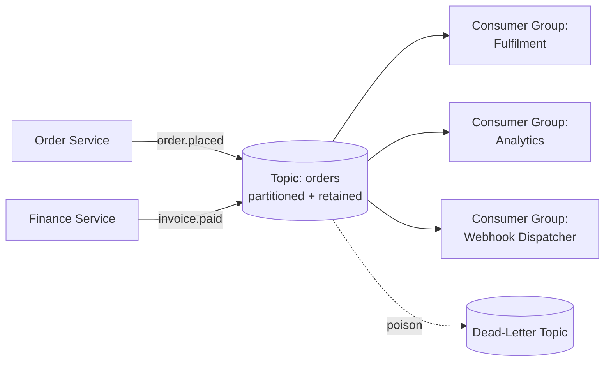

# Volume 10 - Event Bus

| Field | Value |
|---|---|
| Document ID | WORLD-VOL10-019 |
| Title | Event Bus |
| Version | 1.0 |
| Status | Approved |
| Classification | Internal |
| Founder | Mahesh Choudhary |

## Purpose

This chapter defines the Event Bus - the asynchronous nervous system of WORLD through which every state change flows as a durable, published event. Its purpose is to give the whole platform one shared, decoupled channel for propagating facts, so that any service, module, webhook, or the AI Business Partner can react to what happened without the originating service knowing or caring who listens. It is the concrete backbone that realizes the Event-Driven architecture of Vol 08 (ch 11) and underpins Chapters 16-18 of this section.

## Scope

Covered: the event-bus concept, topics and partitioning, the publish/subscribe model, delivery guarantees, ordering, consumer groups, and replay. Excluded: outbound partner notification (Chapter 16), external system integration (Chapter 17), and the synchronous request/reply transport of microservices (Chapter 18), all of which build on this bus.

## Concept

An event bus is a durable, append-only channel that sits between producers and consumers so neither must know the other exists. From first principles it inverts the direction of dependency: instead of a producer calling every interested party (tight coupling, brittle, N-to-N), the producer publishes a single immutable fact to a named **topic**, and any number of consumers subscribe independently. Three properties make this trustworthy. Events are organized into **topics** and partitioned so throughput scales horizontally while related events keep order within a partition. **Publish/subscribe** decouples producers from consumers in both identity and time - a consumer can be offline and still receive events on return. **Delivery guarantees** - WORLD targets at-least-once with ordered partitions - define exactly how much the platform promises, so consumers know they must be idempotent. Because the log is retained, events can be *replayed* to rebuild state or onboard a new consumer.

## Application in WORLD

WORLD runs a partitioned, log-based event bus. Every domain fact - `invoice.paid`, `order.placed`, `employee.hired` - is published to a versioned topic named by domain and event type, keyed (for example by tenant and aggregate id) so all events for one aggregate land on the same partition and preserve order. Consumers join **consumer groups**: each group receives every event once across its members, letting a service scale out horizontally while a second, independent group (say Analytics) consumes the same stream in parallel. The bus persists events for a retention window, enabling replay to rebuild a read model or seed a new module. Delivery is **at-least-once**, so every consumer is idempotent via the event id (the same contract webhooks expose in Chapter 16). Poison messages that repeatedly fail are routed to a dead-letter topic for inspection rather than blocking the partition. The Webhook Dispatcher (Chapter 16), microservices (Chapter 18), and the AI Business Partner (Vol 03) are all just consumers of this one bus.

### Enterprise Example

When a customer pays, the Finance service publishes `invoice.paid` to the `finance` topic, keyed by tenant and invoice id. Three independent consumer groups react without any coordination: Fulfilment releases the goods, Analytics updates revenue dashboards, and the Webhook Dispatcher notifies the tenant's external accounting partner. Weeks later the team ships a new Loyalty module; rather than backfilling by hand, they register a new consumer group and *replay* the retained `finance` topic from the start, so Loyalty computes historical points as if it had always been listening. Because every consumer keys off the event id, the at-least-once redeliveries during a broker failover cause no double-processing.

## Key Components

| Component | Responsibility | Mechanism |
|---|---|---|
| Topic | Named durable channel for one event category | Append-only log |
| Partition | Unit of parallelism and per-key ordering | Keyed hashing |
| Producer | Publishes immutable domain facts | Idempotent publish |
| Consumer Group | Delivers each event once across group members | Offset tracking |
| Delivery Guarantee | Defines the platform's reliability promise | At-least-once + ordered partition |
| Dead-Letter Topic | Isolates repeatedly failing events | Poison-message routing |

## Trade-offs & Considerations

At-least-once delivery is chosen over exactly-once because the latter is prohibitively expensive across distributed consumers; the cost is mandatory consumer idempotency, enforced by the event-id contract. Ordering is guaranteed only within a partition, not globally, so aggregates that require strict order must be keyed onto a single partition - which caps their parallelism, a deliberate throughput-versus-order trade-off. Long retention enables powerful replay and auditability but consumes storage and demands schema evolution discipline, so every event is versioned and consumers tolerate additive change. The bus decouples producers from consumers superbly but makes end-to-end flows harder to trace, which is why every event carries a correlation id for observability (Vol 08). A central bus is a critical dependency, mitigated by replication and the resilience patterns of Volume 11.

## Relationship to Other Layers

The Event Bus is the foundation the rest of Section E stands on: Webhooks (Chapter 16) are its outbound projection to partners, the Integration Framework (Chapter 17) uses it as its asynchronous transport, and Microservice Communication (Chapter 18) uses it for all non-blocking state propagation. It is the direct implementation of Vol 08's Event-Driven architecture (ch 11) and the mechanism behind WORLD's Cross-Module Integration (Vol 05, ch 29), letting modules stay autonomous yet coordinated. Event APIs (Chapter 04) expose selected topics as a subscribable API surface.

## Cross-References

- [Webhook Framework](/docs/blueprint/volume-10-api/section-e-integration-and-messaging/16-webhook-framework.md)
- [Microservice Communication](/docs/blueprint/volume-10-api/section-e-integration-and-messaging/18-microservice-communication.md)
- [Volume 08 - Event-Driven Architecture (ch 11)](/docs/blueprint/volume-08-architecture/README.md)
- [Volume 05 - Cross-Module Integration (ch 29)](/docs/blueprint/volume-05-erp-foundation/README.md)

## References

- [Volume 01 - Vision and Philosophy](/docs/blueprint/volume-01-vision-and-philosophy/README.md)
- [Document Standards](/docs/governance/document-standards.md)

## Change Log

| Version | Date | Author | Notes |
|---|---|---|---|
| 1.0 | 2026-07-12 | Lead Software Engineer | Initial approved version. |
