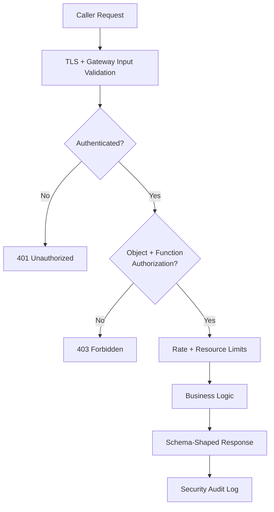

# Volume 10 - API Security

| Field | Value |
|---|---|
| Document ID | WORLD-VOL10-020 |
| Title | API Security |
| Version | 1.0 |
| Status | Approved |
| Classification | Internal |
| Founder | Mahesh Choudhary |

## Purpose

This chapter defines the security posture of the WORLD API as an operational discipline rather than a single feature. Its purpose is to establish a shared, defensible model of the threats an enterprise API faces, to organize WORLD's controls against a recognized threat taxonomy, and to ensure that every endpoint - human-facing or agent-facing - is protected by consistent, verifiable safeguards. Security here is treated as a property of the running system, continuously tested and monitored, not a checklist completed once at design time.

## Scope

Covered: the API-security threat model, WORLD's mapping to the OWASP API Security Top 10 categories, the layered controls that mitigate them, and how security is verified in operation. Excluded: the mechanics of Authentication (Chapter 08) and Authorization (Chapter 09), the enforcement point itself (Chapter 10, API Gateway), platform-wide security architecture (Volume 12), and data-at-rest protection (Volume 09), which this chapter references rather than restates.

## Concept

API security exists because an API is the deliberately exposed surface of the business - it invites callers in, and every invitation is a potential attack vector. From first principles, an attacker seeks to violate one of three guarantees: **confidentiality** (read what they should not), **integrity** (change what they should not), or **availability** (deny service to others). The OWASP API Security Top 10 codifies how these violations recur in practice: broken object-level authorization (accessing another tenant's record by guessing an identifier), broken authentication, excessive data exposure, lack of resource limits, broken function-level authorization, mass assignment, security misconfiguration, injection, improper asset management, and insufficient logging. WORLD does not treat these as trivia; it treats them as a durable enumeration of failure modes that every endpoint must be defended against by design.

## Application in WORLD

WORLD applies defense in depth so that no single control is load-bearing. Authentication (Chapter 08) establishes who is calling; Authorization (Chapter 09) enforces object-level and function-level access on every request, closing the two most damaging OWASP categories. The API Gateway (Chapter 10) enforces TLS, input validation, and schema conformance, blocking injection and mass assignment before requests reach business logic. Rate Limiting (Chapter 12) bounds resource consumption, defending availability. Responses are shaped to a declared schema so that excessive data exposure cannot leak internal fields. Every security-relevant event is logged for API Monitoring (Chapter 21), satisfying the auditability requirement. The AI Business Partner is bound by the identical controls under its delegated identity - an autonomous agent enjoys no privileged bypass.

### Enterprise Example

A penetration test probes `GET /v1/invoices/{id}` by iterating identifiers belonging to a different tenant - a classic broken-object-level-authorization attempt. WORLD's authorization layer evaluates the caller's tenant scope on every read and returns `403 Forbidden` regardless of whether the identifier exists, preventing both data disclosure and existence inference. The tester then sends a malformed payload attempting mass assignment of an `is_admin` field; the gateway rejects it against the declared write schema. Each attempt is logged with principal, resource, and outcome, and API Monitoring raises an anomaly alert on the burst of `403` responses - turning a probing attack into an early detection signal rather than a breach.

## Key Components

| Component | Responsibility | OWASP Category Addressed |
|---|---|---|
| Object-Level Authorization | Verify caller owns the specific resource | Broken Object-Level Authorization |
| Function-Level Authorization | Verify caller may invoke the operation | Broken Function-Level Authorization |
| Schema Validation | Reject malformed and over-scoped payloads | Injection, Mass Assignment |
| Response Shaping | Emit only declared fields | Excessive Data Exposure |
| Resource Limits | Bound consumption per caller | Unrestricted Resource Consumption |
| Security Audit Log | Record every security-relevant event | Insufficient Logging & Monitoring |
| Asset Inventory | Track every live and deprecated endpoint | Improper Inventory Management |

## Trade-offs & Considerations

Defense in depth adds latency and complexity; WORLD accepts this cost because a single missed check on a shared platform is catastrophic, and it mitigates the cost by centralizing controls at the gateway and authorization layers rather than reimplementing them per service. Strict schema validation can reject legitimate but evolving payloads, so it is versioned alongside the API (Chapter 11). Comprehensive logging risks capturing sensitive data, so payloads are redacted and only metadata is retained. Security controls must fail closed - an authorization service outage denies access rather than granting it - which trades availability for safety, a deliberate choice for a system of record.

## Relationship to Other Layers

API Security composes Authentication (Chapter 08) and Authorization (Chapter 09) into an operational posture, enforced at the API Gateway (Chapter 10) and bounded by Rate Limiting (Chapter 12). It emits the signals consumed by API Monitoring (Chapter 21) and is continuously exercised by API Testing (Chapter 22). It realizes the platform security principles of Volume 03 governance and anticipates the deeper controls of Volume 12, keeping the WORLD API trustworthy as its exposed surface grows.

## Cross-References

- [Authentication](/docs/blueprint/volume-10-api/section-c-api-security-and-access/08-authentication.md)
- [Authorization](/docs/blueprint/volume-10-api/section-c-api-security-and-access/09-authorization.md)
- [API Monitoring](/docs/blueprint/volume-10-api/section-f-operations-and-quality/21-api-monitoring.md)
- [Volume 08 - Architecture](/docs/blueprint/volume-08-architecture/README.md)

## References

- [Volume 01 - Vision and Philosophy](/docs/blueprint/volume-01-vision-and-philosophy/README.md)
- [Document Standards](/docs/governance/document-standards.md)

## Change Log

| Version | Date | Author | Notes |
|---|---|---|---|
| 1.0 | 2026-07-12 | Lead Software Engineer | Initial approved version. |
