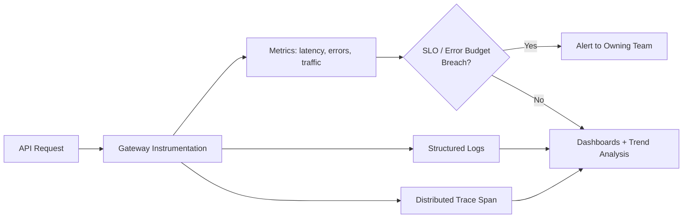

# Volume 10 - API Monitoring

| Field | Value |
|---|---|
| Document ID | WORLD-VOL10-021 |
| Title | API Monitoring |
| Version | 1.0 |
| Status | Approved |
| Classification | Internal |
| Founder | Mahesh Choudhary |

## Purpose

This chapter defines how WORLD observes its API in production so that health, performance, and abuse are known continuously rather than discovered through customer complaints. Its purpose is to make the running API legible - to convert every request into signal, to define the metrics that constitute a service-level contract, and to ensure that degradation is detected, attributed, and acted upon before it becomes an outage. Monitoring is the feedback loop that makes every other operational guarantee enforceable.

## Scope

Covered: the observability concept, the three signal types WORLD captures, the golden metrics tracked per endpoint, service-level objectives, and alerting. Excluded: the platform observability stack and infrastructure telemetry (Volume 08, Chapter 22), log storage and retention mechanics (Volume 11), and the security-event taxonomy itself (Chapter 20), whose signals monitoring consumes rather than defines.

## Concept

Monitoring exists because a distributed system's behavior is emergent and cannot be inferred from its code alone - it must be measured while it runs. From first principles, observability rests on three complementary signal types: **metrics** (cheap, aggregatable numbers such as request rate, error rate, and latency), **logs** (discrete, timestamped records of individual events), and **traces** (the causal path of a single request across services). Metrics tell you *that* something is wrong, traces tell you *where*, and logs tell you *why*. The operational discipline is to track a small set of high-signal indicators - the golden signals of latency, traffic, errors, and saturation - against explicit objectives, so that human attention is spent on genuine deviation rather than noise.

## Application in WORLD

Every request through the API Gateway (Chapter 10) emits a metric (latency, status class), a structured log line (principal, endpoint, outcome - reusing the security audit record of Chapter 20), and a trace span propagated across downstream services. WORLD defines per-endpoint **Service-Level Objectives**: a latency SLO (for example, 99th-percentile under 300ms), an availability SLO, and an error-budget derived from them. When error budget burns faster than allowed, alerts fire to the owning team. Rate-limiting rejections (Chapter 12) and authorization denials (Chapter 20) feed the same pipeline, so abuse and attack patterns surface as anomalies. The AI Business Partner's autonomous traffic is observed under its delegated identity, giving operators a clear view of agent-driven load distinct from human clients.

### Enterprise Example

At 14:00 a downstream billing service slows. WORLD's metrics show the 99th-percentile latency on `POST /v1/invoices` climbing past its 300ms SLO; the error budget for the day begins burning at ten times the sustainable rate, and an alert pages the invoicing team within two minutes - long before any customer files a ticket. The on-call engineer opens a distributed trace for a slow request and sees the latency concentrated in a single database call, then filters structured logs to confirm a lock-contention pattern. Root cause is identified in minutes, not hours, because metrics detected it, traces localized it, and logs explained it - the three signals working together.

## Key Components

| Component | Responsibility | Signal Type |
|---|---|---|
| Metrics Pipeline | Aggregate latency, traffic, errors, saturation | Metrics |
| Structured Logs | Record per-request context and outcome | Logs |
| Distributed Tracing | Reconstruct cross-service request paths | Traces |
| Service-Level Objectives | Define acceptable latency and availability | Target |
| Error Budget | Quantify tolerable failure over a window | Policy |
| Alerting Engine | Notify owners on budget-burn or anomaly | Action |
| Dashboards | Present trends for humans and review | Presentation |

## Trade-offs & Considerations

Full observability is expensive: emitting a metric, log, and trace per request adds overhead and storage cost, so WORLD samples high-volume traces while retaining all error traces, and aggregates metrics at ingestion. Too many alerts cause fatigue and are ignored, so alerts fire on SLO error-budget burn rather than individual errors - deviation from a contract, not every blip. Logs may contain sensitive fields, so payloads are redacted (aligning with Chapter 20). Objectives set too tight generate false alarms; set too loose they hide real harm, so SLOs are calibrated from observed baselines and reviewed as usage evolves.

## Relationship to Other Layers

API Monitoring instruments the API Gateway (Chapter 10), consumes the security signals of API Security (Chapter 20) and the rejection signals of Rate Limiting (Chapter 12), and provides the empirical feedback that tunes both. It is the API-scoped realization of the platform observability discipline in Volume 08 (Chapter 22) and supplies the evidence base for API Lifecycle (Chapter 23) decisions - which endpoints are used, healthy, or safe to deprecate. Monitoring is what makes the WORLD API operable rather than merely deployed.

## Cross-References

- [API Security](/docs/blueprint/volume-10-api/section-f-operations-and-quality/20-api-security.md)
- [Rate Limiting](/docs/blueprint/volume-10-api/section-c-api-security-and-access/12-rate-limiting.md)
- [API Lifecycle](/docs/blueprint/volume-10-api/section-g-lifecycle-and-evolution/23-api-lifecycle.md)
- [Volume 08 - Architecture](/docs/blueprint/volume-08-architecture/README.md)

## References

- [Volume 01 - Vision and Philosophy](/docs/blueprint/volume-01-vision-and-philosophy/README.md)
- [Document Standards](/docs/governance/document-standards.md)

## Change Log

| Version | Date | Author | Notes |
|---|---|---|---|
| 1.0 | 2026-07-12 | Lead Software Engineer | Initial approved version. |
