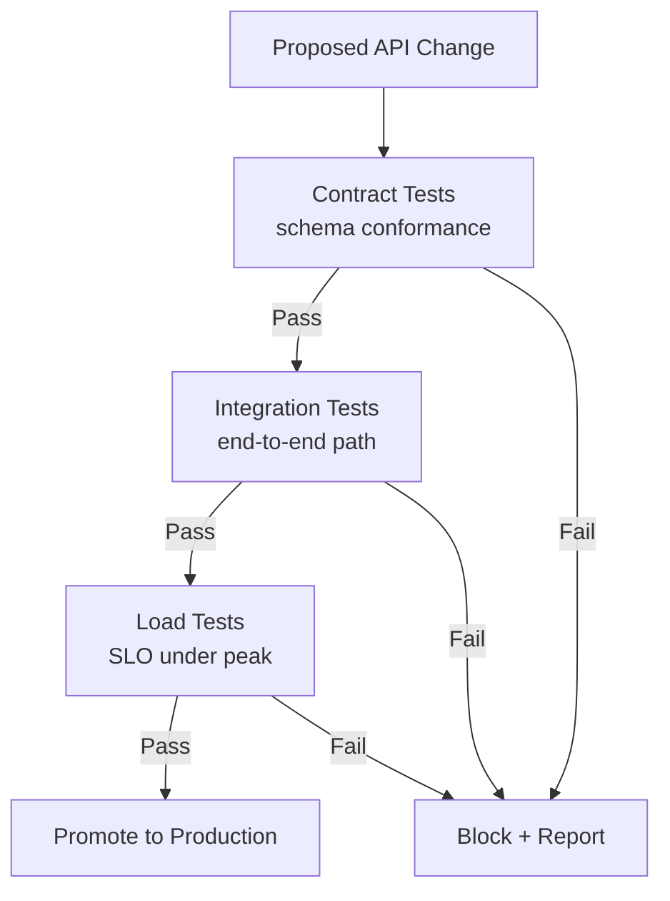

# Volume 10 - API Testing

| Field | Value |
|---|---|
| Document ID | WORLD-VOL10-022 |
| Title | API Testing |
| Version | 1.0 |
| Status | Approved |
| Classification | Internal |
| Founder | Mahesh Choudhary |

## Purpose

This chapter defines how WORLD proves that its API behaves as specified before and after every change. Its purpose is to establish a layered testing strategy that catches defects early, guarantees that published contracts are honored, and verifies that the API withstands realistic load - so that changes ship with confidence and consumers, including autonomous agents, can depend on stable behavior. Testing is treated as the mechanism that turns the API's specification into an enforceable promise.

## Scope

Covered: the testing philosophy, the layers of contract, integration, and load testing, and how they gate delivery. Excluded: unit testing of internal business logic (Volume 08), the CI/CD pipeline mechanics that execute these tests (Volume 11), and security penetration testing (Chapter 20), which this chapter complements rather than duplicates.

## Concept

Testing exists because confidence in software must be earned empirically, not assumed. From first principles, the cost of a defect rises sharply the later it is caught, so tests are layered to catch each class of failure at the cheapest possible stage. Three layers matter most for an API. **Contract testing** verifies that the API's actual behavior matches its published specification - the request and response schemas both sides agreed to - so that a provider change cannot silently break a consumer. **Integration testing** verifies that the API works correctly end to end against real dependencies - datastores, downstream services, authorization - catching wiring and interaction defects. **Load testing** verifies that the API meets its latency and availability objectives under realistic and peak traffic, exposing saturation and contention before customers do. Each layer answers a different question, and none substitutes for the others.

## Application in WORLD

WORLD encodes every endpoint's contract from its OpenAPI/schema definition and runs **contract tests** on every change, failing the build if a response deviates from the declared schema or a breaking change is introduced without a version bump (Chapter 11). **Integration tests** exercise the full request path - gateway, authentication, authorization, business logic, datastore - in an isolated environment, asserting correct behavior including negative cases such as `403` on cross-tenant access (Chapter 20). **Load tests** replay production-shaped traffic against the SLOs defined in API Monitoring (Chapter 21), verifying that latency budgets hold at peak. These layers gate the delivery pipeline, so no change reaches production without passing all three. Contract tests also protect the AI Business Partner, whose reliability depends on the API meaning exactly what its schema declares.

### Enterprise Example

An engineer refactors the invoice service and inadvertently renames a response field from `total_amount` to `amount`. The contract test comparing the live response against the published schema fails immediately in the pipeline, blocking the change before any consumer is affected - a breaking change that would otherwise have surfaced as a partner outage. In a later release, integration tests catch a missing tenant filter that returned another tenant's records, and a load test reveals that a new join pushes 99th-percentile latency on `GET /v1/invoices` to 480ms, breaching the 300ms SLO. All three defects are caught pre-production, each by the layer designed for it.

## Key Components

| Component | Responsibility | Question Answered |
|---|---|---|
| Contract Tests | Verify responses match the published schema | Do we honor our promise? |
| Integration Tests | Verify end-to-end behavior with real dependencies | Does the whole path work? |
| Load Tests | Verify SLOs under realistic and peak traffic | Does it hold under pressure? |
| Test Data Fixtures | Provide realistic, isolated tenant data | Are tests representative? |
| Pipeline Gates | Block promotion on any failing layer | Is this change safe to ship? |
| Negative-Case Suite | Assert correct rejection of invalid access | Do our guardrails hold? |

## Trade-offs & Considerations

Comprehensive testing slows delivery and demands maintenance as the API evolves; WORLD accepts this because undetected breakage on a shared platform is far costlier, and it manages the burden by generating contract tests from the schema rather than hand-writing them. Integration tests are slower and more brittle than contract tests, so they focus on critical paths and negative cases rather than exhaustive permutations. Load tests require realistic data and traffic shapes to be meaningful, so they are driven from anonymized production patterns. Over-mocking dependencies makes tests pass while production fails, so integration tests run against real components wherever feasible.

## Relationship to Other Layers

API Testing enforces the schemas and version rules of Versioning (Chapter 11), verifies the controls of API Security (Chapter 20), and validates against the SLOs of API Monitoring (Chapter 21). It is the gate that protects the transitions defined in API Lifecycle (Chapter 23) and underpins the trust that Developer Experience (Chapter 24) promises to consumers. Testing is how the WORLD API's specification becomes a dependable contract rather than an aspiration.

## Cross-References

- [Versioning](/docs/blueprint/volume-10-api/section-c-api-security-and-access/11-versioning.md)
- [API Security](/docs/blueprint/volume-10-api/section-f-operations-and-quality/20-api-security.md)
- [API Monitoring](/docs/blueprint/volume-10-api/section-f-operations-and-quality/21-api-monitoring.md)
- [API Lifecycle](/docs/blueprint/volume-10-api/section-g-lifecycle-and-evolution/23-api-lifecycle.md)

## References

- [Volume 01 - Vision and Philosophy](/docs/blueprint/volume-01-vision-and-philosophy/README.md)
- [Document Standards](/docs/governance/document-standards.md)

## Change Log

| Version | Date | Author | Notes |
|---|---|---|---|
| 1.0 | 2026-07-12 | Lead Software Engineer | Initial approved version. |
