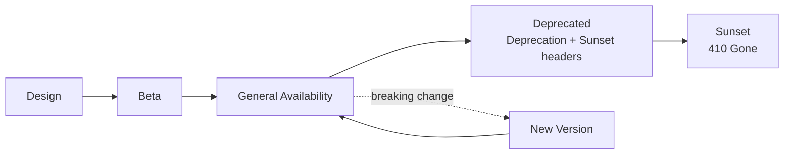

# Volume 10 - API Lifecycle

| Field | Value |
|---|---|
| Document ID | WORLD-VOL10-023 |
| Title | API Lifecycle |
| Version | 1.0 |
| Status | Approved |
| Classification | Internal |
| Founder | Mahesh Choudhary |

## Purpose

This chapter defines the managed journey of every WORLD API from conception to retirement. Its purpose is to make change safe and predictable by giving each endpoint an explicit lifecycle stage, clear promotion and deprecation criteria, and a humane sunset process that respects consumers. It ensures the platform can evolve continuously without breaking the integrations - human and autonomous - that depend on it, honoring the principle that a published API is a long-lived promise.

## Scope

Covered: the lifecycle-stage model, the transitions from design through deprecation to sunset, the governance that authorizes each transition, and consumer communication. Excluded: the technical mechanics of version identifiers (Chapter 11), the tests that gate transitions (Chapter 22), and the organizational change-management process (Volume 03), which this chapter operationalizes for APIs specifically.

## Concept

An API lifecycle exists because an API is simultaneously a product and a contract: it must improve, yet consumers built durable dependencies on its current shape. From first principles, uncontrolled change breaks consumers, while frozen APIs strangle the platform - so evolution must be staged and signaled. Every endpoint moves through explicit stages: **Design** (specification and review, no consumers yet), **Beta** (available to early adopters, may change), **General Availability** (stable, backward-compatibility guaranteed), **Deprecated** (still functional but scheduled for removal, no new adoption), and **Sunset** (withdrawn). The essential discipline is that transitions are deliberate and announced, and that a deprecated API keeps working for a defined migration window - deprecation is a signal to move, not an immediate break.

## Application in WORLD

WORLD assigns every endpoint a lifecycle stage recorded in the API catalog and exposed to consumers. Promotion from Beta to GA requires passing the full test suite (Chapter 22), meeting SLOs under load (Chapter 21), and governance sign-off. Backward-incompatible change on a GA endpoint is forbidden in place; it requires a new version (Chapter 11), after which the prior version enters Deprecated with a published sunset date and a minimum migration window. During deprecation, responses carry a `Deprecation` header and a `Sunset` date, and API Monitoring (Chapter 21) tracks residual traffic so owners know who still depends on the endpoint. Only when usage falls to zero or the window closes does the endpoint reach Sunset and return `410 Gone`. The AI Business Partner reads lifecycle metadata directly, so it can prefer GA endpoints and migrate itself off deprecated ones.

### Enterprise Example

WORLD needs to restructure the invoice payload, a backward-incompatible change. Rather than mutate `v1`, the team ships `GET /v2/invoices` and promotes it to GA after tests and load pass. `v1` immediately enters Deprecated: every `v1` response now carries `Deprecation: true` and `Sunset: 2027-01-31`, and the developer portal (Chapter 24) shows a migration guide. Monitoring reveals three partners still calling `v1`; their account teams are notified directly. Over the six-month window their traffic drains to zero, and only then is `v1` sunset to `410 Gone`. No consumer is broken by surprise - the change was staged, signaled, and observed to completion.

## Key Components

| Component | Responsibility | Stage |
|---|---|---|
| API Catalog | Records the lifecycle stage of every endpoint | All |
| Promotion Gate | Requires tests, SLOs, and sign-off to reach GA | Beta to GA |
| Backward-Compatibility Rule | Forbids breaking change in place on GA | GA |
| Deprecation Signals | `Deprecation` and `Sunset` headers plus portal notice | Deprecated |
| Migration Window | Guarantees minimum time to move off an endpoint | Deprecated |
| Residual-Traffic Monitor | Tracks who still depends on a deprecated endpoint | Deprecated |
| Sunset Enforcement | Returns `410 Gone` after withdrawal | Sunset |

## Trade-offs & Considerations

Maintaining multiple versions during a migration window doubles operational surface and cost; WORLD accepts this as the price of not breaking consumers, and bounds it with a firm sunset date so old versions cannot accumulate indefinitely. A generous migration window is kind to consumers but slows the platform's ability to shed legacy - so windows are sized by consumer count and integration criticality, not a fixed default. Deprecation signals only work if consumers observe them, which is why WORLD emits them both in-band (headers) and out-of-band (portal, direct notice). Sunsetting an endpoint with lingering traffic risks an outage, so zero residual traffic or explicit consumer acknowledgement is required before withdrawal.

## Relationship to Other Layers

API Lifecycle governs the versions defined by Versioning (Chapter 11), is gated by API Testing (Chapter 22), and is informed by the usage evidence from API Monitoring (Chapter 21). It drives the migration guidance surfaced through Developer Experience (Chapter 24) and enacts, for APIs, the change-governance principles of Volume 03. Lifecycle management is what lets the WORLD API stay both stable for its consumers and free to evolve.

## Cross-References

- [Versioning](/docs/blueprint/volume-10-api/section-c-api-security-and-access/11-versioning.md)
- [API Testing](/docs/blueprint/volume-10-api/section-f-operations-and-quality/22-api-testing.md)
- [Developer Experience](/docs/blueprint/volume-10-api/section-g-lifecycle-and-evolution/24-developer-experience.md)
- [Volume 08 - Architecture](/docs/blueprint/volume-08-architecture/README.md)

## References

- [Volume 01 - Vision and Philosophy](/docs/blueprint/volume-01-vision-and-philosophy/README.md)
- [Document Standards](/docs/governance/document-standards.md)

## Change Log

| Version | Date | Author | Notes |
|---|---|---|---|
| 1.0 | 2026-07-12 | Lead Software Engineer | Initial approved version. |
