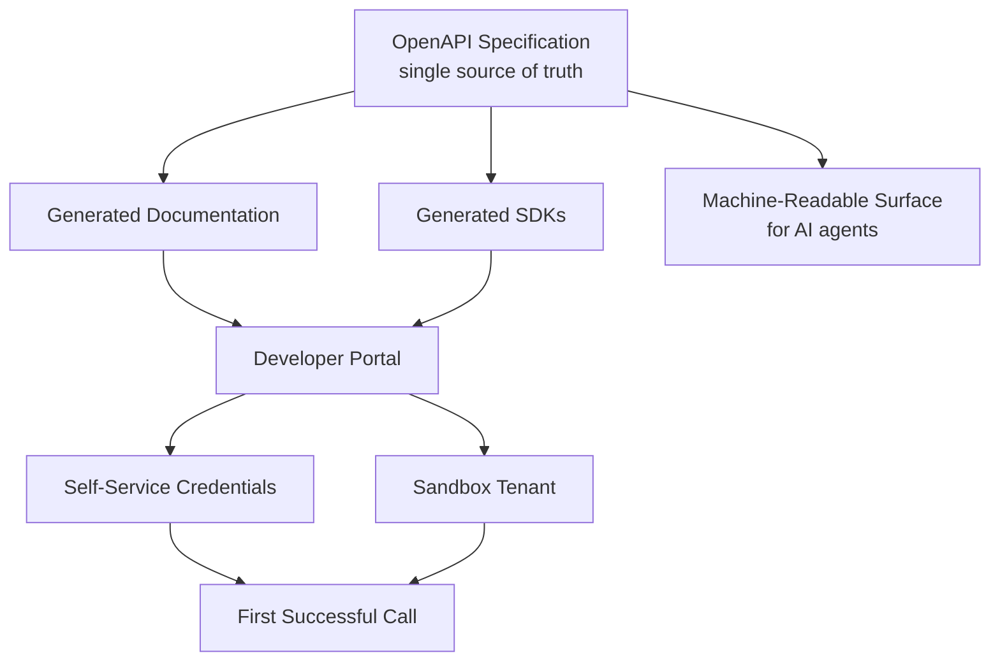

# Volume 10 - Developer Experience

| Field | Value |
|---|---|
| Document ID | WORLD-VOL10-024 |
| Title | Developer Experience |
| Version | 1.0 |
| Status | Approved |
| Classification | Internal |
| Founder | Mahesh Choudhary |

## Purpose

This chapter defines how WORLD makes its API easy, fast, and pleasant to adopt - for human developers and autonomous agents alike. Its purpose is to treat developer experience (DX) as a first-class product concern, minimizing the time and friction between a developer's intent and a working integration. Because the value of the WORLD platform is unlocked through its API, the quality of that experience directly determines adoption, integration velocity, and the trust the ecosystem places in the platform.

## Scope

Covered: the DX concept, the developer portal, documentation, self-service onboarding, SDKs, and the machine-readable surface that serves AI agents. Excluded: the API's internal design principles (Section A), the security controls behind credentials (Chapters 08, 20), and marketing or commercial terms, which sit outside the technical blueprint.

## Concept

Developer experience exists because an API only creates value when someone successfully integrates it, and every point of friction between intent and success is lost value. From first principles, DX minimizes **time to first call** and **time to production** by reducing the number of things a developer must know, guess, or ask a human to obtain. The essential ingredients are accurate documentation generated from the same source of truth as the API, self-service credentials, a safe sandbox to experiment in, working code samples, and predictable, consistent behavior across endpoints. Consistency compounds: once a developer learns the pattern for one WORLD resource, every other resource should feel familiar, so knowledge transfers instead of resetting at each endpoint.

## Application in WORLD

WORLD publishes a developer portal driven by the same OpenAPI specification that defines and tests the API (Chapter 22), so documentation can never drift from behavior. Developers self-serve credentials scoped by Authorization (Chapter 09), issue calls against a sandbox tenant with realistic data, and copy working samples in multiple languages. Generated SDKs wrap authentication, retries, and pagination so integrators do not reimplement them. The portal surfaces each endpoint's lifecycle stage (Chapter 23), rate limits (Chapter 12), and error semantics. Crucially, the entire surface is machine-readable: the OpenAPI document, error schemas, and lifecycle metadata are consumable by the AI Business Partner and third-party agents, letting them discover and invoke capabilities without bespoke human-written glue. Errors are consistent and actionable, returning a stable code, a human-readable message, and a documentation link.

### Enterprise Example

A partner's engineer needs to push invoices into WORLD. She signs up on the portal, generates a scoped sandbox key without contacting anyone, and within ten minutes makes her first successful `POST /v1/invoices` by copying a language-specific sample. When she omits a required field, the API returns `422` with `error.code = invalid_field`, a clear message, and a link to the exact schema section - so she fixes it without opening a support ticket. She installs the generated SDK, which handles auth and pagination, and reaches production in two days instead of two weeks. In parallel, the partner's AI agent ingests the same OpenAPI document and begins invoking the endpoint autonomously - no separate integration effort required.

## Key Components

| Component | Responsibility | Beneficiary |
|---|---|---|
| Developer Portal | Central hub for docs, keys, and status | Humans |
| Generated Documentation | Always-accurate reference from the spec | Humans |
| Self-Service Credentials | Scoped keys without human gatekeeping | Humans |
| Sandbox Tenant | Safe environment with realistic data | Humans |
| Generated SDKs | Encapsulate auth, retries, pagination | Humans |
| Machine-Readable Surface | OpenAPI, errors, lifecycle metadata | AI agents |
| Consistent Error Contract | Stable codes, messages, and doc links | Both |

## Trade-offs & Considerations

A polished portal, SDKs, and sandbox demand ongoing investment; WORLD justifies this because DX is a direct multiplier on platform adoption, and it contains the cost by generating documentation and SDKs from the specification rather than maintaining them by hand. A realistic sandbox risks diverging from production, so it runs the same code path with isolated data. Rich error detail aids developers but must not leak internals, so messages are helpful yet safe (aligning with Chapter 20). Optimizing purely for human developers would neglect agents; WORLD deliberately treats the machine-readable surface as a co-equal audience, since agent-driven integration is a core platform bet.

## Relationship to Other Layers

Developer Experience surfaces the lifecycle stages of API Lifecycle (Chapter 23), the limits of Rate Limiting (Chapter 12), and the credentials of Authorization (Chapter 09), all from the specification exercised by API Testing (Chapter 22). Its machine-readable surface is the foundation on which the Future API Roadmap (Chapter 25) builds agent-native capabilities. DX is where the WORLD API meets its consumers and where the platform's promise of accessibility is kept.

## Cross-References

- [Authorization](/docs/blueprint/volume-10-api/section-c-api-security-and-access/09-authorization.md)
- [API Lifecycle](/docs/blueprint/volume-10-api/section-g-lifecycle-and-evolution/23-api-lifecycle.md)
- [Future API Roadmap](/docs/blueprint/volume-10-api/section-g-lifecycle-and-evolution/25-future-api-roadmap.md)
- [Volume 08 - Architecture](/docs/blueprint/volume-08-architecture/README.md)

## References

- [Volume 01 - Vision and Philosophy](/docs/blueprint/volume-01-vision-and-philosophy/README.md)
- [Document Standards](/docs/governance/document-standards.md)

## Change Log

| Version | Date | Author | Notes |
|---|---|---|---|
| 1.0 | 2026-07-12 | Lead Software Engineer | Initial approved version. |
