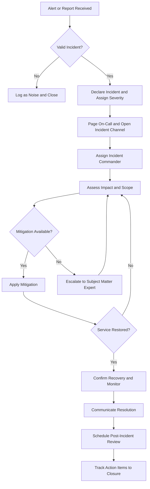

# Volume 11 - Runbook Templates

| Field | Value |
|---|---|
| Document ID | WORLD-VOL11-A4 |
| Title | Runbook Templates |
| Version | 1.0 |
| Status | Approved |
| Classification | Internal |
| Founder | Mahesh Choudhary |

## Purpose

This appendix provides reusable operational runbook templates for Project WORLD. Its purpose is to make operational response repeatable, teachable, and fast: rather than improvising under pressure, an operator follows a known procedure with clear steps, roles, and exit criteria. Standardized runbooks reduce mean time to recovery, lower the cognitive load during incidents, and preserve institutional knowledge that would otherwise live only in individual memory.

## Scope

The templates cover the most common recurring operational procedures: incident response, deployment, rollback, failover, and on-call handover. Each template is written to be copied and specialized per service, with placeholders where service-specific detail belongs. The templates define structure and required steps; they do not prescribe a specific ticketing or paging tool. Every WORLD service is expected to maintain concrete runbooks derived from these templates and to keep them current.

## Incident Response Flow

## Template 1: Incident Response

| Field | Value |
|---|---|
| Runbook | Incident Response |
| Owner | On-call for the affected service |
| Trigger | Paging alert, SLO breach, or credible incident report |
| Severity | SEV1 (critical) to SEV4 (minor), assigned at declaration |

**Steps**

1. Acknowledge the alert and confirm a real incident exists.
2. Declare the incident and assign an initial severity.
3. Open the incident channel and page the on-call rotation.
4. Appoint an Incident Commander who coordinates but does not fix.
5. Establish impact: affected services, users, and data.
6. Communicate an initial status to stakeholders.
7. Identify and apply the fastest safe mitigation to restore service.
8. Escalate to subject-matter experts if mitigation is not evident.
9. Confirm recovery against health checks and key SLOs.
10. Declare resolution and communicate the all-clear.
11. Capture the timeline and schedule a blameless post-incident review.

## Template 2: Deployment

| Field | Value |
|---|---|
| Runbook | Deployment |
| Owner | Release engineer |
| Trigger | Approved promotion of a release candidate |
| Pre-Condition | All gates green in Staging; change approved |

**Steps**

1. Confirm the release version and its approval record.
2. Verify the target environment is healthy and not in a freeze.
3. Announce the deployment window in the operations channel.
4. Take or confirm a current backup or restore point.
5. Execute the deployment via the pipeline; do not deploy manually.
6. Watch progressive rollout (canary or blue-green) health signals.
7. Run smoke tests and confirm key SLOs remain within target.
8. Promote to full traffic once the canary is healthy.
9. Announce completion and record the deployment.
10. Enter a heightened-observation period before closing the window.

## Template 3: Rollback

| Field | Value |
|---|---|
| Runbook | Rollback |
| Owner | Release engineer or on-call |
| Trigger | Failed deployment, SLO breach, or critical regression |
| Pre-Condition | Previous known-good version identified |

**Steps**

1. Declare intent to roll back and notify stakeholders.
2. Halt any in-progress rollout immediately.
3. Identify the last known-good version and its artifact.
4. Execute the rollback through the pipeline, not by hand.
5. Reconcile configuration and, if needed, reverse data migrations per plan.
6. Verify health checks and SLOs return to normal.
7. Confirm consumer-facing behavior is restored.
8. Record the rollback and link it to the originating change.
9. Raise a follow-up to root-cause the failed release.

## Template 4: Failover

| Field | Value |
|---|---|
| Runbook | Failover |
| Owner | On-call for the affected service |
| Trigger | Zone or region degradation, or dependency failure |
| Pre-Condition | Standby target verified and reachable |

**Steps**

1. Confirm the primary is genuinely unhealthy, not a false signal.
2. Declare a failover and notify stakeholders.
3. Verify the standby target is healthy and current.
4. Redirect traffic to the standby (DNS, load balancer, or mesh policy).
5. Confirm the standby is serving and SLOs hold.
6. Monitor data replication and consistency during the switch.
7. Communicate the new active location.
8. Plan and schedule the controlled failback once the primary recovers.

## Template 5: On-Call Handover

| Field | Value |
|---|---|
| Runbook | On-Call Handover |
| Owner | Outgoing on-call |
| Trigger | End of an on-call shift |
| Pre-Condition | Handover checklist prepared |

**Steps**

1. Summarize open and recently closed incidents.
2. Hand over any active or watched alerts and their context.
3. Note any deployments, freezes, or maintenance in progress.
4. Flag fragile systems or known risks for the window.
5. Confirm paging, access, and tooling work for the incoming on-call.
6. Transfer ownership of any pending action items.
7. Confirm the incoming on-call explicitly accepts the handover.

## Cross-References

- [Alerting](/docs/blueprint/volume-11-infrastructure/section-e-observability/18-alerting.md)
- [Disaster Recovery](/docs/blueprint/volume-11-infrastructure/section-f-cicd-and-resilience/21-disaster-recovery.md)
- [Deployment Checklist](/docs/blueprint/volume-11-infrastructure/appendices/deployment-checklist.md)

## References

- [Volume 01 - Vision and Philosophy](/docs/blueprint/volume-01-vision-and-philosophy/README.md)
- [Document Standards](/docs/governance/document-standards.md)

## Change Log

| Version | Date | Author | Notes |
|---|---|---|---|
| 1.0 | 2026-07-12 | Lead Software Engineer | Initial approved version. |
