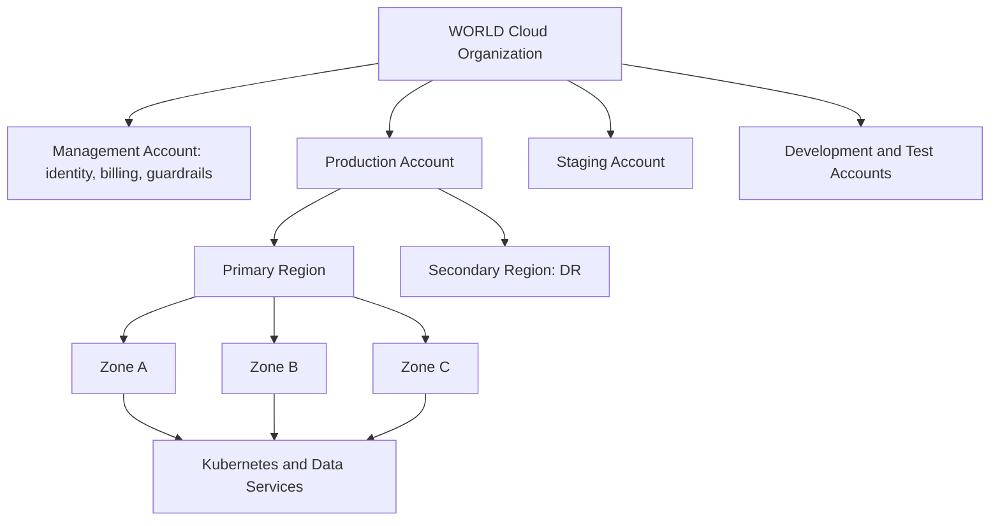

# Volume 11 - Cloud Strategy

| Field | Value |
|---|---|
| Document ID | WORLD-VOL11-001 |
| Title | Cloud Strategy |
| Version | 1.0 |
| Status | Approved |
| Classification | Internal |
| Founder | Mahesh Choudhary |

## Purpose

This chapter establishes how Project WORLD acquires, organizes, and governs the compute, storage, and network capacity on which the entire platform runs. The cloud is the physical ground beneath the architecture (Volume 08), the databases (Volume 09), and the APIs (Volume 10); every guarantee those layers make - availability, latency, isolation, cost - is ultimately a guarantee the cloud must keep. This chapter fixes the durable, vendor-neutral principles that decide where WORLD runs, how it is partitioned, and what criteria bind any provider before a single workload is placed.

## Scope

The chapter defines WORLD's cloud model: the operating principles, the account and region topology, the shared-responsibility boundary, and the selection criteria a provider must satisfy. It is deliberately criteria-based and does not hard-commit to a named cloud product; it governs any public, private, or hybrid substrate that meets the bar. It realizes the cloud-native direction of Volume 08 (Chapter 25) and supplies the ground on which Deployment Strategy (Chapter 02) and Container Strategy (Chapter 03) build.

## Concept

A cloud strategy is a first-principles answer to a single question asked before any workload is placed: on what terms will the enterprise rent capacity, and how will it retain control while doing so. WORLD treats the cloud as leased infrastructure defined by software, not as a data center it happens not to own. Three convictions follow. First, **infrastructure is code**: every account, network, and cluster is declared in version-controlled definitions, never hand-built, so the estate is reproducible and auditable. Second, **portability is a property, not an afterthought**: WORLD depends on commodity primitives - compute, block and object storage, managed Kubernetes, managed relational engines - and isolates proprietary services behind interfaces so a provider can be replaced without rewriting the platform. Third, **isolation is structural**: tenants, environments, and blast radii are separated by account and network boundaries rather than by convention, making a breach or a mistake containable by construction.

## Application in WORLD

WORLD organizes its estate as a hierarchy of accounts and regions rather than one large shared space. A management account holds identity, billing, and guardrails; workload accounts are split per environment (development, testing, staging, production) so that a failure or a compromised credential cannot cross a boundary. Within each account, workloads run across multiple availability zones in a primary region, with a designated secondary region held ready for disaster recovery (Chapter 21).

Every box in this topology is provisioned from infrastructure-as-code modules (Appendix E), reviewed like application code, and applied through the CI/CD pipeline (Chapter 20). No engineer clicks a console to create production capacity.

## Key Components

| Component | Role | WORLD Standard |
|---|---|---|
| Account Hierarchy | Isolation and billing boundary | One account per environment, plus a management account |
| Region Strategy | Latency and data residency | Primary region per major geography; paired secondary for DR |
| Availability Zones | Fault isolation within a region | Minimum three zones for all production workloads |
| Landing Zone | Baseline guardrails, network, identity | Codified, applied to every new account automatically |
| Shared Responsibility | Security boundary with provider | Provider owns the substrate; WORLD owns configuration and data |
| Selection Criteria | Provider qualification | Managed Kubernetes, multi-AZ, encryption, compliance certifications, exit path |

**Enterprise example:** WORLD onboards an enterprise customer in a regulated European market that requires data residency inside the EU. Because region strategy is criteria-based, the platform provisions a new production workload account pinned to an EU primary region and an EU secondary region for DR, applying the same landing zone used everywhere else. No application code changes; the AI Business Partner, ERP Foundation, and APIs deploy unchanged because they depend on commodity primitives, not region-specific services. The customer's data never leaves the jurisdiction, and the isolation is enforced by the account and region boundary rather than by a runtime check.

## Trade-offs & Considerations

The strategy trades convenience for control. A strict account-per-environment hierarchy multiplies the number of accounts to govern and complicates cross-account access, repaid by hard isolation that convention can never guarantee. Insisting on portable, commodity primitives forecloses some of the fastest-moving proprietary managed services, a deliberate cost paid to preserve an exit path and avoid strategic lock-in; where a proprietary service is genuinely superior, it is adopted only behind an interface and only through a recorded Architecture Decision Record. Multi-region readiness raises baseline cost even when the secondary region is idle, justified by the recovery objectives set in Chapter 21. Infrastructure-as-code slows the first provisioning but is the only way to keep a large estate reproducible and auditable.

## Relationship to Other Layers

The cloud is the foundation every other layer stands on. The architecture of Volume 08 defines the cloud-native patterns this chapter grounds in real accounts and regions. The Database tier (Volume 09) places its managed engines and replicas across the zones and regions defined here. The API tier (Volume 10) is exposed through the networking this chapter provisions. Deployment Strategy (Chapter 02) decides how new versions move across this ground, and Container Strategy (Chapter 03) decides how workloads are packaged to run on it.

## Cross-References

- [Deployment Strategy](/docs/blueprint/volume-11-infrastructure/section-a-cloud-and-deployment/02-deployment-strategy.md)
- [Container Strategy](/docs/blueprint/volume-11-infrastructure/section-a-cloud-and-deployment/03-container-strategy.md)
- [Volume 08 - Architecture](/docs/blueprint/volume-08-architecture/README.md)
- [Volume 09 - Database](/docs/blueprint/volume-09-database/README.md)

## References

- [Volume 01 - Vision and Philosophy](/docs/blueprint/volume-01-vision-and-philosophy/README.md)
- [Document Standards](/docs/governance/document-standards.md)

## Change Log

| Version | Date | Author | Notes |
|---|---|---|---|
| 1.0 | 2026-07-12 | Lead Software Engineer | Initial approved version. |
