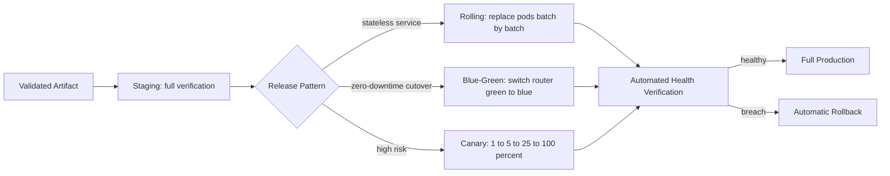

# Volume 11 - Deployment Strategy

| Field | Value |
|---|---|
| Document ID | WORLD-VOL11-002 |
| Title | Deployment Strategy |
| Version | 1.0 |
| Status | Approved |
| Classification | Internal |
| Founder | Mahesh Choudhary |

## Purpose

This chapter defines how a new version of any WORLD service moves from a validated artifact into production without interrupting the businesses that depend on it. Deployment is the moment of highest risk in the life of a change: correct code can still cause an outage if it is released carelessly. This chapter fixes the durable principles and the concrete release patterns - rolling, blue-green, and canary - that let WORLD ship continuously while keeping the platform available, and that give every change a fast, deterministic path back to safety.

## Scope

The chapter defines WORLD's deployment model: its guiding principles, the three release patterns and when each applies, the promotion path across environments, and the rollback and verification controls that bound risk. It is vendor-neutral and pattern-based; it does not mandate a specific delivery tool. It builds directly on Cloud Strategy (Chapter 01) and Container Strategy (Chapter 03), realizes the deployment direction of Volume 08 (Chapter 26), and is operationalized by the CD Infrastructure of Chapter 20.

## Concept

A deployment strategy is a first-principles answer to how change reaches users while the system stays running. WORLD treats every deployment as reversible, observed, and progressive. Three convictions follow. First, **deployments are progressive, not instantaneous**: a new version earns traffic gradually and under observation rather than replacing the old version in one irreversible step. Second, **rollback is a first-class path, not an emergency**: the previous version remains ready to receive traffic instantly, so recovery is a routing decision measured in seconds, not a rebuild. Third, **health is measured, not assumed**: automated checks on error rate, latency, and business signals decide whether a rollout proceeds, so promotion is gated by evidence rather than by hope. Together these make deployment a controlled, observable transition rather than a leap.

## Application in WORLD

WORLD selects a release pattern by the risk and statefulness of the service. Stateless API and module workloads default to **rolling** updates; user-facing surfaces where a bad version must be invisible use **blue-green**; and high-blast-radius or behaviorally uncertain changes - especially anything touching the AI Business Partner or shared platform services - use **canary** with automated analysis.

Every pattern ends at the same gate: automated health verification. If error budgets, latency thresholds, or business metrics degrade, the pipeline halts and reverts without waiting for a human.

## Key Components

| Pattern | How It Works | Best For | Cost / Trade-off |
|---|---|---|---|
| Rolling | Replace instances in small batches, old and new coexist briefly | Stateless services tolerant of mixed versions | Cheap; slow rollback; mixed versions during rollout |
| Blue-Green | Run two full environments, switch router from blue to green in one step | Zero-downtime cutovers, instant rollback needs | Double capacity during release; fast, clean rollback |
| Canary | Route a small traffic slice to the new version, widen as it proves healthy | High-risk or behaviorally uncertain changes | Complex routing and analysis; safest exposure |
| Health Verification | Automated checks on errors, latency, business signals gate promotion | All deployments | Requires strong observability (Section E) |
| Rollback Path | Previous version kept warm and routable | All deployments | Standing capacity cost; recovery in seconds |

**Enterprise example:** WORLD ships a change to the AI Business Partner's recommendation logic that affects thousands of tenants. The pipeline promotes the artifact to staging, then begins a **canary**: one percent of production traffic is routed to the new version while automated analysis compares its error rate and recommendation-acceptance metric against the incumbent. The metric holds, so traffic widens to five, then twenty-five, then one hundred percent over an hour. Had acceptance dropped past its threshold at any step, the router would have withdrawn the canary automatically and paged no one, because the previous version never stopped serving. A change that could have degraded every tenant instead affected at most one percent for minutes.

## Trade-offs & Considerations

Each pattern buys safety with a different currency. Rolling updates are the cheapest but accept a window in which two versions serve simultaneously, which demands backward-compatible contracts and database migrations (Volume 09). Blue-green gives the cleanest, fastest rollback but doubles capacity for the duration of the release and requires that state - sessions, in-flight work, schema - be compatible across both environments. Canary is the safest for uncertain changes but is the most complex to operate: it needs fine-grained traffic control and trustworthy metrics, and a poorly chosen success metric can pass a bad release. Across all three, rollback safety depends on forward-and-backward-compatible schema changes; a migration that cannot be reversed breaks the guarantee this chapter makes, so migrations are decoupled from code deploys and rolled out in expand-then-contract steps.

## Relationship to Other Layers

Deployment strategy sits between the artifact and the running platform. It consumes the container images defined by Container Strategy (Chapter 03) and Docker (Chapter 04), and it drives the workload primitives of Kubernetes (Chapter 05) that make progressive rollout and instant rollback mechanical. It depends on the observability of Section E to know whether a release is healthy, and it is executed by the CD Infrastructure of Chapter 20. Its safety guarantees ultimately protect the APIs of Volume 10 and the businesses that consume them.

## Cross-References

- [Cloud Strategy](/docs/blueprint/volume-11-infrastructure/section-a-cloud-and-deployment/01-cloud-strategy.md)
- [Container Strategy](/docs/blueprint/volume-11-infrastructure/section-a-cloud-and-deployment/03-container-strategy.md)
- [Kubernetes](/docs/blueprint/volume-11-infrastructure/section-b-containers-and-orchestration/05-kubernetes.md)
- [Volume 08 - Architecture](/docs/blueprint/volume-08-architecture/README.md)

## References

- [Volume 01 - Vision and Philosophy](/docs/blueprint/volume-01-vision-and-philosophy/README.md)
- [Document Standards](/docs/governance/document-standards.md)

## Change Log

| Version | Date | Author | Notes |
|---|---|---|---|
| 1.0 | 2026-07-12 | Lead Software Engineer | Initial approved version. |
