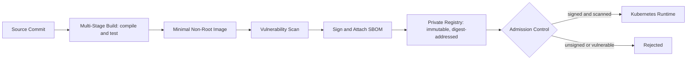

# Volume 11 - Container Strategy

| Field | Value |
|---|---|
| Document ID | WORLD-VOL11-003 |
| Title | Container Strategy |
| Version | 1.0 |
| Status | Approved |
| Classification | Internal |
| Founder | Mahesh Choudhary |

## Purpose

This chapter defines how Project WORLD packages every unit of software so that it runs identically on an engineer's laptop, in a test environment, and in production. The container is the atom of deployment in WORLD: the immutable, self-contained artifact that Deployment Strategy (Chapter 02) moves and Kubernetes (Chapter 05) schedules. This chapter fixes the durable principles that make that artifact reproducible, secure, and portable, so that "it works on my machine" ceases to be a meaningful sentence and every environment runs the exact same bits.

## Scope

The chapter defines WORLD's container model: the principles that govern how software is built into images, the standards those images must meet, the registry and supply-chain controls that protect them, and the runtime posture they run under. It is standards-based and runtime-neutral - it assumes an OCI-compliant toolchain but names no single build product. It sits between Cloud Strategy (Chapter 01) and Deployment Strategy (Chapter 02), and is realized concretely by Docker (Chapter 04) and orchestrated by Kubernetes (Chapter 05).

## Concept

A container strategy is a first-principles answer to how a unit of software should be bounded so it behaves the same everywhere. WORLD treats containers as immutable, minimal, and traceable. Three convictions follow. First, **the image is immutable**: once built, an artifact is never modified in place; a change means a new image with a new digest, which makes every deployment reproducible and every rollback exact. Second, **the image is minimal**: it contains only the application and its direct dependencies, on the smallest viable base, because everything absent cannot break, bloat, or be exploited. Third, **the image is traceable**: every artifact is signed, scanned, and linked back to the exact source commit and build, so provenance is provable rather than assumed. Together these turn a container from a convenience into a governed supply-chain artifact.

## Application in WORLD

Every WORLD service - the AI Business Partner, ERP modules, API services, and background workers - is built into an OCI image by a standardized, multi-stage pipeline. The build stage compiles and tests; the final stage copies only the resulting binary and its runtime onto a minimal, non-root base. Images are scanned for vulnerabilities, signed, and pushed to a private registry from which only signed, scanned images may be pulled into production.

At the cluster boundary, admission control (Chapter 05) refuses any image that is unsigned, unscanned, or references a mutable tag rather than an immutable digest. The supply chain is enforced by the platform, not by discipline.

## Key Components

| Component | Role | WORLD Standard |
|---|---|---|
| Base Image | Foundation layer | Minimal, regularly patched, organization-approved only |
| Multi-Stage Build | Separate build tools from runtime | Mandatory; final image carries no compilers or build deps |
| Non-Root Runtime | Least privilege at runtime | Containers run as an unprivileged user, read-only filesystem |
| Image Registry | Storage and distribution | Private, digest-addressed, immutable tags |
| Vulnerability Scanning | Supply-chain hygiene | Every image scanned; critical findings block promotion |
| Signing and SBOM | Provenance and integrity | Every image signed; software bill of materials attached |
| Admission Control | Runtime enforcement | Only signed, scanned, digest-pinned images admitted |

**Enterprise example:** A critical vulnerability is disclosed in a widely used library. Because every WORLD image ships with a software bill of materials, the platform team queries the registry and identifies in minutes exactly which of the hundreds of service images include the affected library - no guesswork, no per-service investigation. The base image is patched, the affected services are rebuilt into new immutable images, scanned, signed, and rolled out through the canary path of Chapter 02. Services that never used the library are provably unaffected. What could have been a week of manual auditing becomes a targeted, evidence-driven response measured in hours.

## Trade-offs & Considerations

The strategy trades build-time rigor for run-time safety. Multi-stage builds and minimal bases make images harder to author and debug - a stripped image has no shell to exec into - but they shrink the attack surface and speed every pull and start; WORLD accepts the debugging friction and provides ephemeral debug tooling rather than fattening production images. Immutability forbids the convenient habit of patching a running container, forcing a rebuild for every change, which is precisely what makes rollbacks exact. Mandatory scanning and signing add pipeline steps and can block a release on a newly disclosed vulnerability, an intentional friction that keeps unvetted code out of production. Digest-pinning sacrifices the convenience of floating tags for the certainty of knowing exactly what runs.

## Relationship to Other Layers

Container strategy is the packaging contract for the whole platform. It stands on Cloud Strategy (Chapter 01), which provides the substrate, and it feeds Deployment Strategy (Chapter 02), which moves the images it produces. It is implemented in detail by Docker (Chapter 04) and scheduled by Kubernetes (Chapter 05), which enforces the admission and runtime posture defined here. By guaranteeing that every service is an identical, traceable artifact, it upholds the reproducibility on which the entire architecture (Volume 08) and its APIs (Volume 10) depend.

## Cross-References

- [Cloud Strategy](/docs/blueprint/volume-11-infrastructure/section-a-cloud-and-deployment/01-cloud-strategy.md)
- [Deployment Strategy](/docs/blueprint/volume-11-infrastructure/section-a-cloud-and-deployment/02-deployment-strategy.md)
- [Docker](/docs/blueprint/volume-11-infrastructure/section-b-containers-and-orchestration/04-docker.md)
- [Kubernetes](/docs/blueprint/volume-11-infrastructure/section-b-containers-and-orchestration/05-kubernetes.md)

## References

- [Volume 01 - Vision and Philosophy](/docs/blueprint/volume-01-vision-and-philosophy/README.md)
- [Document Standards](/docs/governance/document-standards.md)

## Change Log

| Version | Date | Author | Notes |
|---|---|---|---|
| 1.0 | 2026-07-12 | Lead Software Engineer | Initial approved version. |
