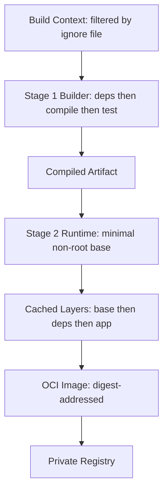

# Volume 11 - Docker

| Field | Value |
|---|---|
| Document ID | WORLD-VOL11-004 |
| Title | Docker |
| Version | 1.0 |
| Status | Approved |
| Classification | Internal |
| Founder | Mahesh Choudhary |

## Purpose

This chapter defines how Project WORLD builds and standardizes container images in practice - the concrete realization of the Container Strategy (Chapter 03). Where that chapter fixed the principles, this one fixes the mechanics: how a Dockerfile is structured, how layers are ordered for cache efficiency and security, how build context is controlled, and what a compliant WORLD image looks like. Docker (and any OCI-compatible build tool) is the workshop in which every deployable artifact is forged, and this chapter makes that workshop uniform across every team and service.

## Scope

The chapter defines WORLD's image-build standard: Dockerfile structure, multi-stage build layout, base-image and layer discipline, build-context hygiene, and local development composition. It is OCI-oriented and portable across compatible build engines; it does not depend on any single proprietary daemon. It implements Container Strategy (Chapter 03) and produces the immutable artifacts that Deployment Strategy (Chapter 02) promotes and Kubernetes (Chapter 05) runs.

## Concept

At its core Docker is a way to describe, in a declarative file, the exact filesystem and entrypoint a process needs, and to build that description into a layered, content-addressed image. The power is in the layering: each instruction produces a cached layer, so a well-ordered build rebuilds only what changed. WORLD reduces this to three working rules. First, **order layers from least to most volatile**: dependencies that rarely change go early so they stay cached, while application code that changes constantly goes last. Second, **separate build from runtime**: a build stage carries compilers and toolchains; a final stage inherits only the artifact, so the shipped image is lean and defensible. Third, **declare the context precisely**: only the files that belong in an image are sent to the build, keeping images small and secrets out. These rules turn image building from an ad hoc craft into a repeatable engineering discipline.

## Application in WORLD

Every WORLD service ships with a standardized multi-stage Dockerfile that follows the same shape regardless of language. A builder stage installs dependencies and compiles; a final stage starts from a minimal, non-root base and copies only the built artifact. A companion ignore file excludes source control, local secrets, and test fixtures from the build context.

Because the layer order is standardized, a code-only change reuses the cached dependency layers and rebuilds in seconds, while the final image never carries a compiler, a package manager, or the source tree.

## Key Components

| Component | Role | WORLD Standard |
|---|---|---|
| Dockerfile | Declarative build recipe | Multi-stage, one standard shape per language |
| Base Image | Runtime foundation | Minimal, approved, pinned by digest, non-root |
| Layer Ordering | Cache efficiency | Least-volatile first (base, deps), app code last |
| Build Stage | Compilation and test | Carries toolchain; discarded from final image |
| Ignore File | Context hygiene | Excludes VCS, secrets, fixtures, local artifacts |
| Local Compose | Multi-service dev environment | Declares service dependencies for parity with production |
| Healthcheck | Liveness signal | Every image declares a healthcheck the orchestrator reads |

**Enterprise example:** A WORLD module team makes a one-line fix to their service. Because the Dockerfile orders the immutable dependency installation before the application copy, the rebuild reuses every cached dependency layer and produces a new image in under thirty seconds, differing from the previous image by a single small layer. The registry stores only that delta, and the rollout via Chapter 02 pulls only the changed layer to each node. Contrast the naive alternative - a single-stage build that reinstalls dependencies on every change - which would rebuild for minutes, ship a bloated image containing the full toolchain, and push hundreds of megabytes to every node. The standard turns a routine fix into a cheap, fast, minimal-surface deployment.

## Trade-offs & Considerations

Disciplined image building costs authoring effort up front. Multi-stage Dockerfiles are more verbose than a single naive stage, and minimal bases remove the shells and utilities that make interactive debugging easy; WORLD accepts this and supplies ephemeral debug containers rather than shipping tools into production images. Aggressive layer caching speeds builds but can mask stale dependencies if cache keys are not tied to lock files, so WORLD pins dependency manifests and busts the cache deliberately. Pinning base images by digest sacrifices automatic upstream patches for reproducibility, which is why base-image updates are a governed, scheduled activity rather than an implicit floating tag. Local Compose gives developer-production parity but can drift from the real orchestrator; WORLD treats Compose as a convenience for local loops only, never as the production runtime, which is Kubernetes.

## Relationship to Other Layers

Docker is the concrete implementation of Container Strategy (Chapter 03) and the entry point of the supply chain that Chapter 03 governs - its output is the signed, scanned, digest-addressed image the registry stores. Those images are promoted by Deployment Strategy (Chapter 02) and scheduled by Kubernetes (Chapter 05), which consumes the healthchecks and non-root posture declared here. By guaranteeing that every service is built to one standard, this chapter makes the reproducibility and portability promised across Volume 08 and Volume 10 real at the level of individual bytes.

## Cross-References

- [Container Strategy](/docs/blueprint/volume-11-infrastructure/section-a-cloud-and-deployment/03-container-strategy.md)
- [Kubernetes](/docs/blueprint/volume-11-infrastructure/section-b-containers-and-orchestration/05-kubernetes.md)
- [Deployment Strategy](/docs/blueprint/volume-11-infrastructure/section-a-cloud-and-deployment/02-deployment-strategy.md)
- [Volume 08 - Architecture](/docs/blueprint/volume-08-architecture/README.md)

## References

- [Volume 01 - Vision and Philosophy](/docs/blueprint/volume-01-vision-and-philosophy/README.md)
- [Document Standards](/docs/governance/document-standards.md)

## Change Log

| Version | Date | Author | Notes |
|---|---|---|---|
| 1.0 | 2026-07-12 | Lead Software Engineer | Initial approved version. |
