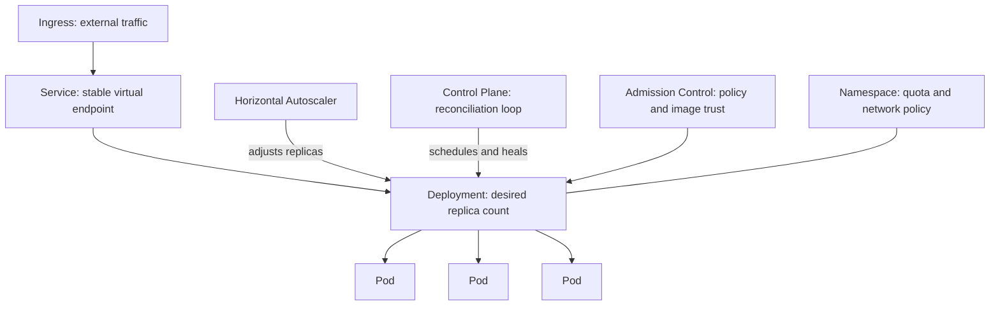

# Volume 11 - Kubernetes

| Field | Value |
|---|---|
| Document ID | WORLD-VOL11-005 |
| Title | Kubernetes |
| Version | 1.0 |
| Status | Approved |
| Classification | Internal |
| Founder | Mahesh Choudhary |

## Purpose

This chapter defines how Project WORLD runs its containers at scale: how they are scheduled, kept alive, connected, and governed across a fleet of machines. If Docker (Chapter 04) forges the artifact and Deployment Strategy (Chapter 02) decides how it advances, Kubernetes is the operating system of the cluster that actually runs it - reconciling declared intent against reality, second by second. This chapter fixes the durable principles and the concrete cluster architecture that make WORLD's workloads self-healing, horizontally scalable, and uniformly governed across every environment.

## Scope

The chapter defines WORLD's orchestration model: the declarative and reconciliation principles, the cluster and namespace topology, the core workload and networking objects, and the guardrails that govern them. It assumes a conformant, managed Kubernetes distribution but names no single provider, consistent with Cloud Strategy (Chapter 01). It orchestrates the images produced by Docker (Chapter 04) and executes the release patterns of Deployment Strategy (Chapter 02); scaling and availability are deepened in Section G.

## Concept

Kubernetes is fundamentally a control loop over declared state. An operator declares the desired world - how many replicas, how much memory, which network exposure - and the controllers continuously act to make the observed world match. WORLD builds on three convictions this enables. First, **the system is declarative**: intent is described as version-controlled objects, and the cluster converges to them, so there is no drift between what was asked for and what runs. Second, **the system is self-healing**: because reconciliation never stops, a failed container, a lost node, or a deleted pod is detected and replaced automatically without human action. Third, **the system is governed by policy**: quotas, admission rules, and network policies are declared once and enforced on every workload, so isolation and limits are structural rather than reviewed case by case. Orchestration thus turns a fleet of machines into a single, self-correcting platform.

## Application in WORLD

WORLD runs a managed cluster per environment, aligned to the account hierarchy of Chapter 01. Within a cluster, each tenant-facing domain and platform service is isolated in its own namespace with resource quotas and network policies. Workloads are declared as Deployments (for stateless services) or StatefulSets (for stateful ones), fronted by Services and exposed through an Ingress. A horizontal autoscaler adjusts replica counts against observed load.

Every object shown is declared in version-controlled manifests, applied by the CD pipeline (Chapter 20), and continuously reconciled by the control plane. Admission control enforces the image-trust rules of Chapter 03 at the moment of scheduling.

## Key Components

| Component | Role | WORLD Standard |
|---|---|---|
| Control Plane | Reconciles desired vs actual state | Managed, multi-zone, highly available |
| Namespace | Isolation and quota boundary | One per domain or platform service; quota enforced |
| Deployment | Manages stateless replica sets | Default for services; rolling update built in |
| StatefulSet | Manages stateful, identity-stable pods | For workloads needing stable storage and identity |
| Service | Stable virtual endpoint for pods | Internal by default; load-balances across replicas |
| Ingress | Governed external entry point | TLS-terminated; routes to internal Services |
| Horizontal Autoscaler | Scales replicas to load | Targets CPU, memory, or custom metrics |
| Admission Control | Policy enforcement at schedule time | Blocks untrusted images and non-compliant specs |

**Enterprise example:** During a regional retail promotion, load on WORLD's order-processing service triples within minutes. The horizontal autoscaler observes CPU crossing its target and instructs the Deployment to scale from six replicas to eighteen; the scheduler places the new pods across three availability zones. Moments later a node fails outright, taking four pods with it. The control plane detects the loss and reschedules those pods onto healthy nodes automatically, while the Service seamlessly stops routing to the dead endpoints. No engineer is paged, no request is dropped beyond in-flight retries, and when the promotion ends the autoscaler quietly returns the service to six replicas. Declared intent - capacity matched to load, replicas kept alive - was upheld by the platform without human intervention.

## Trade-offs & Considerations

Kubernetes buys resilience and uniformity at the price of operational complexity. Its declarative, reconciling model is powerful but has a steep learning curve, and a misconfigured manifest can cause subtle, cluster-wide problems; WORLD contains this with standardized templates, policy-as-code guardrails, and admission control that rejects non-compliant specs. Running stateful workloads is possible via StatefulSets but harder than stateless ones, so WORLD keeps durable state in the managed data services of Volume 09 wherever practical and reserves in-cluster state for cases that truly need it. Aggressive autoscaling improves availability but can amplify cost if limits are unbounded, so quotas and maximum replica counts are mandatory. Finally, the platform's flexibility invites sprawl; WORLD counters it by treating every cluster object as reviewed, version-controlled code rather than an imperative command.

## Relationship to Other Layers

Kubernetes is where the infrastructure stack converges into a running system. It schedules the images built by Docker (Chapter 04) under the supply-chain rules of Container Strategy (Chapter 03), and it provides the primitives - replica sets, services, traffic routing - that make the rolling, blue-green, and canary patterns of Deployment Strategy (Chapter 02) mechanical. It runs on the accounts and regions of Cloud Strategy (Chapter 01), hosts the API services of Volume 10, and connects to the databases of Volume 09. Its scaling and availability behavior is extended in Section G, and its networking is detailed in Section C.

## Cross-References

- [Container Strategy](/docs/blueprint/volume-11-infrastructure/section-a-cloud-and-deployment/03-container-strategy.md)
- [Docker](/docs/blueprint/volume-11-infrastructure/section-b-containers-and-orchestration/04-docker.md)
- [Deployment Strategy](/docs/blueprint/volume-11-infrastructure/section-a-cloud-and-deployment/02-deployment-strategy.md)
- [Volume 08 - Architecture](/docs/blueprint/volume-08-architecture/README.md)

## References

- [Volume 01 - Vision and Philosophy](/docs/blueprint/volume-01-vision-and-philosophy/README.md)
- [Document Standards](/docs/governance/document-standards.md)

## Change Log

| Version | Date | Author | Notes |
|---|---|---|---|
| 1.0 | 2026-07-12 | Lead Software Engineer | Initial approved version. |
