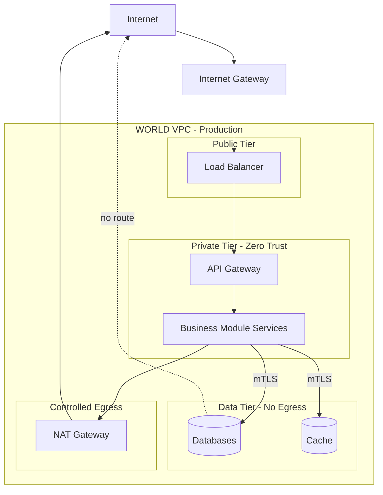

# Volume 11 - Networking

| Field | Value |
|---|---|
| Document ID | WORLD-VOL11-006 |
| Title | Networking |
| Version | 1.0 |
| Status | Approved |
| Classification | Internal |
| Founder | Mahesh Choudhary |

## Purpose

This chapter defines the network foundation of Project WORLD: the private cloud fabric on which every container, database, and API runs. Networking is not a background utility; it is the first line of defense and the substrate that determines how traffic reaches the API tier (Volume 10) and how services in the architecture (Volume 08) reach one another. This chapter fixes the durable network model - topology, segmentation, and trust - that the load balancing, reverse proxy, and DNS chapters that follow build upon, and that the security volume relies on. Where a later infrastructure decision conflicts with the trust boundaries defined here, this chapter prevails unless a recorded Architecture Decision Record supersedes it.

## Scope

The chapter covers the logical network design of WORLD: the virtual private cloud (VPC), subnet tiers, network segmentation, routing and egress control, and the zero-trust posture applied to service-to-service traffic. It is cloud-provider-independent and does not mandate a specific vendor primitive or CIDR plan. It governs how workloads are placed, isolated, and permitted to communicate. Physical data-center wiring is out of scope; application-level authorization is defined in Volume 10 (Section C) and the security volume.

## Concept

A network for an AI-native operating system exists to do two opposing things well: connect what must communicate and isolate everything else. WORLD resolves this with a **virtual private cloud** - a software-defined, logically isolated network in which every WORLD workload lives, invisible and unreachable from the public internet except through explicitly published doors. Inside the VPC, address space is divided into **subnets** arranged in tiers, each mapped to a trust level: a public tier that terminates inbound internet traffic, a private tier for application workloads, and a data tier for databases and stateful stores. Traffic flows downward through controlled hops and never skips a tier.

The organizing principle is **defense in depth through segmentation**. Rather than a single hard shell around a soft interior, WORLD partitions the network so that a compromise in one segment cannot laterally reach another. This is reinforced by a **zero-trust** posture: no workload is trusted merely because it sits inside the VPC. Every service-to-service call authenticates its peer, encrypts the connection, and is authorized against an explicit policy. The network location of a caller grants it nothing; identity does.

## Application in WORLD

WORLD runs a multi-tier VPC per environment (development, staging, production are isolated networks that never peer). Inbound traffic enters only through the public tier, is inspected and load balanced, and is proxied to application workloads in the private tier. Application workloads reach databases only in the data tier, which has no route to the internet at all.

East-west traffic between services in the private tier is governed by a service mesh that enforces mutual TLS and per-service authorization, realizing zero trust in practice. Outbound traffic from private workloads to third-party APIs is funneled through a NAT gateway so that egress is auditable and source addresses are stable for partner allow-lists.

## Key Components

| # | Component | Role | Trust Level |
|---|---|---|---|
| 1 | Virtual Private Cloud | Logically isolated network per environment | Perimeter |
| 2 | Public Subnet Tier | Terminates inbound internet traffic at the load balancer | Untrusted ingress |
| 3 | Private Subnet Tier | Hosts API gateway and business module services | Zero trust |
| 4 | Data Subnet Tier | Hosts databases and caches; no internet route | Highest |
| 5 | Security Groups / Network Policies | Stateful allow-lists on ports and peers | Segmentation |
| 6 | NAT Gateway | Controlled, audited outbound egress | Egress control |
| 7 | Service Mesh (mTLS) | Authenticates and encrypts service-to-service calls | Identity-based |

**Enterprise example:** A payroll processing service in the private tier must write to the payroll database and call an external tax-filing API. The database write travels over mutual TLS to the data tier, which the service mesh permits only for the payroll service's identity - the adjacent inventory service cannot open that connection even though it shares the subnet. The outbound tax-filing call leaves through the NAT gateway, presenting a fixed egress IP the tax authority has allow-listed, and is logged for audit. If the payroll service is compromised, segmentation confines the blast radius: it cannot reach the customer database, which sits behind a separate network policy keyed to a different identity.

## Trade-offs & Considerations

Segmentation and zero trust impose cost. Multi-tier subnets and per-service policies add operational complexity and can slow delivery when a new service needs a new path opened; WORLD accepts this in exchange for a bounded blast radius. Mutual TLS on every internal call consumes CPU for handshakes and encryption, mitigated by session resumption and mesh sidecars that offload the work. A single NAT gateway is a potential egress bottleneck and single point of failure, so WORLD deploys one per availability zone. The strongest temptation - trusting internal traffic because it is "inside" - is precisely what zero trust forbids; network position must never substitute for authenticated identity.

## Relationship to Other Layers

The network is the floor on which the rest of the infrastructure stands. Load balancing (Chapter 07) operates in the public tier; reverse proxies (Chapter 08) sit between the public and private tiers; DNS (Chapter 09) resolves the names that route traffic across these tiers. The API tier of Volume 10 depends on the only-door property this network enforces, and the architecture of Volume 08 assumes the service-to-service isolation defined here. Kubernetes (Chapter 05) network policies implement the private-tier segmentation, and the security volume builds its controls on this zero-trust foundation.

## Cross-References

- [Load Balancing](/docs/blueprint/volume-11-infrastructure/section-c-networking/07-load-balancing.md)
- [Reverse Proxy](/docs/blueprint/volume-11-infrastructure/section-c-networking/08-reverse-proxy.md)
- [Volume 08 - Architecture](/docs/blueprint/volume-08-architecture/README.md)
- [Volume 10 - API](/docs/blueprint/volume-10-api/README.md)

## References

- [Volume 01 - Vision and Philosophy](/docs/blueprint/volume-01-vision-and-philosophy/README.md)
- [Document Standards](/docs/governance/document-standards.md)

## Change Log

| Version | Date | Author | Notes |
|---|---|---|---|
| 1.0 | 2026-07-12 | Lead Software Engineer | Initial approved version. |
