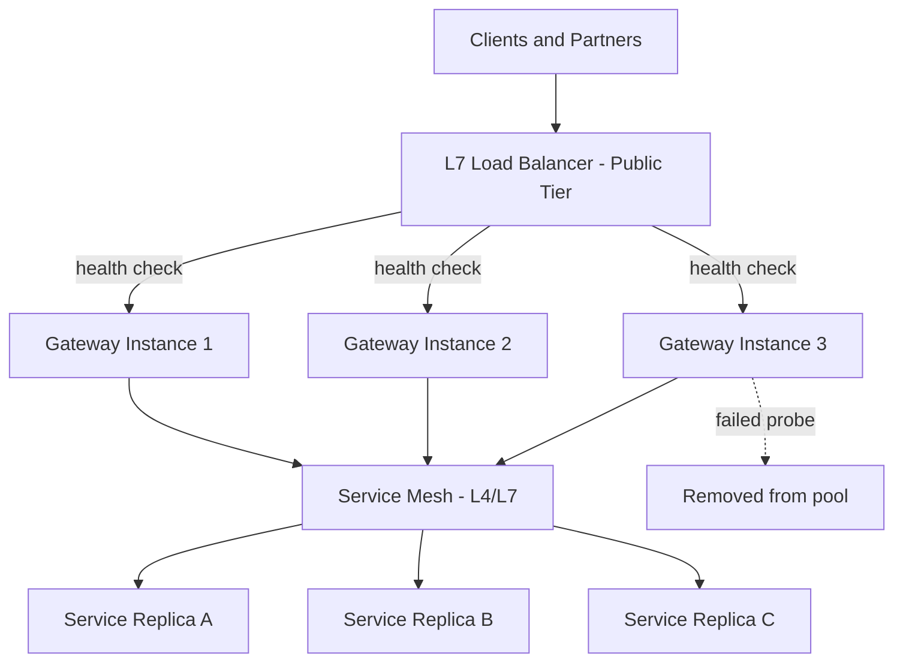

# Volume 11 - Load Balancing

| Field | Value |
|---|---|
| Document ID | WORLD-VOL11-007 |
| Title | Load Balancing |
| Version | 1.0 |
| Status | Approved |
| Classification | Internal |
| Founder | Mahesh Choudhary |

## Purpose

This chapter defines how Project WORLD distributes incoming traffic across many instances of a service so that no single instance is overwhelmed and no request is sent to an unhealthy target. Load balancing is the mechanism that turns a set of identical, disposable containers (Chapter 03) into a single, highly available endpoint. It is the entry point through which all client and partner traffic reaches the API tier (Volume 10) and is foundational to the high availability and scaling guarantees defined later in this volume. This chapter fixes WORLD's load balancing model: the layers at which it operates, the algorithms it uses, and the health checks that make it safe.

## Scope

The chapter covers layer-4 (transport) and layer-7 (application) load balancing, distribution algorithms, health checking, session handling, and the placement of load balancers within the network tiers of Chapter 06. It is vendor-neutral and does not mandate a specific product. It governs both north-south traffic (clients to WORLD) and east-west traffic (service to service). Application routing rules and TLS termination detail are elaborated in the reverse proxy chapter (Chapter 08); autoscaling policy lives in Section G.

## Concept

A load balancer is a device or service that accepts connections on behalf of a pool of backend instances and forwards each connection to a chosen member of that pool. Its value is threefold: it spreads load so capacity scales horizontally, it removes failed instances from rotation so failures are invisible to clients, and it presents one stable address for a fleet that is constantly changing as containers are created and destroyed.

Load balancers operate at two layers. A **layer-4 balancer** works at the transport level (TCP/UDP): it forwards packets based on IP and port without inspecting their contents. It is fast, protocol-agnostic, and ideal for raw throughput. A **layer-7 balancer** works at the application level (HTTP): it can read the request path, headers, and cookies, and therefore route intelligently - sending `/payroll` to one service and `/inventory` to another, terminating TLS, and applying per-route policy. WORLD uses L4 where speed and protocol independence matter and L7 where content-aware routing is required.

The balancer's second duty is **health checking**. It continuously probes each backend and forwards traffic only to those that pass. A probe that is too shallow (a TCP connect) may keep sending traffic to a process that is up but broken; a probe that is too deep may flap under load. WORLD standardizes on a lightweight application health endpoint that reflects real readiness.

## Application in WORLD

WORLD terminates inbound internet traffic on an L7 load balancer in the public tier. It inspects the request, terminates TLS, and routes by host and path to the API gateway, which fronts the business modules. Internal service-to-service traffic is balanced by the service mesh, which performs L4/L7 balancing close to the caller.

When a gateway instance fails its health probe, the balancer removes it from the pool within seconds and clients never see the failure. When traffic rises, autoscaling adds instances and the balancer folds them into rotation automatically once they pass their first health check.

## Key Components

| Layer / Aspect | Choice | When Used | Trade-off |
|---|---|---|---|
| Layer 4 (TCP/UDP) | Connection-level forwarding | High-throughput, non-HTTP, internal mesh | Fast but content-blind |
| Layer 7 (HTTP) | Content-aware routing, TLS termination | Public ingress, path/host routing | Richer but higher CPU cost |
| Round Robin | Even rotation across pool | Homogeneous instances | Ignores instance load |
| Least Connections | Sends to least-busy instance | Long-lived or uneven requests | Needs connection tracking |
| Weighted | Distributes by assigned weight | Canary releases, mixed sizes | Requires tuning |
| IP Hash / Sticky | Pins a client to one instance | Session affinity needs | Weakens even distribution |
| Health Check | Application readiness probe | All pools, continuously | Interval vs. detection speed |

**Enterprise example:** During a month-end close, thousands of finance users hit the reporting service simultaneously. The L7 balancer distributes their requests across twelve reporting replicas using least-connections, so a replica running a heavy multi-page report is not handed new work while it is saturated. Mid-surge, one replica exhausts memory and stops responding; its health endpoint fails two consecutive probes and the balancer evicts it, rerouting in-flight retries to healthy peers. Autoscaling launches three more replicas; each is added to rotation only after passing a readiness probe confirming it has warmed its cache and can serve a real report. Users experience a steady service throughout, unaware that the fleet changed shape beneath them.

## Trade-offs & Considerations

Layer-7 routing is powerful but costs CPU per request and requires terminating TLS at the balancer, concentrating certificate management there; WORLD accepts this for the routing intelligence it buys. Sticky sessions simplify stateful workloads but undermine even distribution and complicate scaling, so WORLD prefers stateless services (state lives in the data tier) and reserves stickiness for narrow cases. Health checks trade detection speed against stability: aggressive probes catch failures fast but risk evicting healthy instances under transient load, so WORLD tunes probe interval, timeout, and unhealthy threshold per service. A load balancer is itself a critical path, so it is always deployed redundantly across availability zones.

## Relationship to Other Layers

The load balancer sits in the public tier of the network defined in Chapter 06 and hands traffic to the reverse proxy and API gateway (Chapter 08, Volume 10 Chapter 10). It depends on DNS (Chapter 09) to advertise its stable address and on health signals from Kubernetes readiness probes (Chapter 05). It is the enabling mechanism for the high availability and horizontal scaling policies of Section G, and it upholds the only-door principle by ensuring all ingress converges on a governed, observable entry point.

## Cross-References

- [Networking](/docs/blueprint/volume-11-infrastructure/section-c-networking/06-networking.md)
- [Reverse Proxy](/docs/blueprint/volume-11-infrastructure/section-c-networking/08-reverse-proxy.md)
- [DNS](/docs/blueprint/volume-11-infrastructure/section-c-networking/09-dns.md)
- [Volume 10 - API](/docs/blueprint/volume-10-api/README.md)

## References

- [Volume 01 - Vision and Philosophy](/docs/blueprint/volume-01-vision-and-philosophy/README.md)
- [Document Standards](/docs/governance/document-standards.md)

## Change Log

| Version | Date | Author | Notes |
|---|---|---|---|
| 1.0 | 2026-07-12 | Lead Software Engineer | Initial approved version. |
