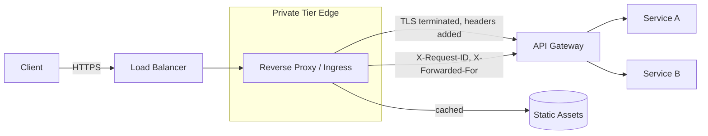

# Volume 11 - Reverse Proxy

| Field | Value |
|---|---|
| Document ID | WORLD-VOL11-008 |
| Title | Reverse Proxy |
| Version | 1.0 |
| Status | Approved |
| Classification | Internal |
| Founder | Mahesh Choudhary |

## Purpose

This chapter defines the reverse proxy layer of Project WORLD: the intermediary that stands in front of application workloads, accepting client requests and forwarding them to the correct backend on the client's behalf. The reverse proxy is where WORLD terminates TLS, enforces the network boundary between the public and private tiers, and applies cross-cutting request handling before traffic reaches the API gateway (Volume 10, Chapter 10). This chapter fixes the reverse proxy's role, its responsibilities, and its relationship to load balancing and the gateway, so that these adjacent concerns are cleanly separated rather than conflated.

## Scope

The chapter covers the reverse proxy pattern: TLS termination, request routing, header manipulation, connection management, response buffering, static content handling, and its placement between the network tiers of Chapter 06. It clarifies the boundary between the reverse proxy, the load balancer (Chapter 07), and the API gateway (Volume 10). It does not define application authorization or business routing rules, which belong to the gateway; it defines the infrastructure-level proxy that hosts them.

## Concept

A reverse proxy is a server that receives requests from clients and forwards them to one or more backend servers, then returns the backend's response to the client as if the proxy itself had produced it. The client never learns the identity or address of the backend; it sees only the proxy. This inversion - the proxy acting *for* the servers rather than *for* the clients, as a forward proxy would - gives WORLD a single, controlled chokepoint in front of its workloads.

The reverse proxy earns its place by consolidating concerns that would otherwise be duplicated in every service. It **terminates TLS** so backends can speak plain HTTP inside the trusted private tier and certificate management lives in one place. It **routes** by host and path so a single public address can front many services. It **rewrites headers** to preserve the true client address, inject request identifiers for tracing, and strip sensitive internal detail. It **buffers** slow clients so a backend is not held hostage by a client on a poor connection, and it can **serve or cache** static assets without waking a backend at all.

Crucially, the reverse proxy is a layer, not a duplicate of the gateway. The proxy handles transport and connection concerns - TLS, buffering, compression, raw routing. The API gateway, which sits behind it, handles application concerns - authentication, authorization, rate limiting, and API versioning. Keeping these separate keeps each simple.

## Application in WORLD

WORLD deploys the reverse proxy as the ingress controller of its Kubernetes clusters (Chapter 05), positioned at the edge of the private tier immediately behind the public-tier load balancer. Every inbound request follows one path: load balancer, reverse proxy, API gateway, service.

The proxy terminates TLS using centrally managed certificates, attaches an `X-Request-ID` that flows through every downstream hop for distributed tracing, sets `X-Forwarded-For` so services see the real client address despite the intervening hops, and compresses responses. Static documentation and SDK assets (Volume 10, Section D) are served or cached directly at the proxy, sparing the gateway and services entirely.

## Key Components

| # | Responsibility | Behavior | Benefit |
|---|---|---|---|
| 1 | TLS Termination | Decrypts HTTPS at the edge; backends speak HTTP internally | Central certificate management |
| 2 | Request Routing | Routes by host and path to gateway or service | One address fronts many services |
| 3 | Header Manipulation | Adds request ID, forwarded-for; strips internal headers | Traceability and hygiene |
| 4 | Connection Buffering | Absorbs slow clients before engaging backends | Protects backend concurrency |
| 5 | Compression | Gzip/Brotli on responses | Lower bandwidth, faster clients |
| 6 | Static / Cache Serving | Serves cacheable assets without backend calls | Offloads services |
| 7 | Backend Abstraction | Hides backend identity and topology | Security and free re-deployment |

**Enterprise example:** A partner's integration server, on a high-latency link, uploads a large batch of invoices. The reverse proxy accepts and buffers the slow upload in full before opening a single fast connection to the API gateway, so an invoice-processing worker is engaged for milliseconds rather than held open for the duration of the slow transfer. The proxy has already terminated TLS, stamped the request with a correlation ID that will appear in every log line across the gateway and the finance service, and set the forwarded client address so audit records show the true origin. When the partner later requests the published OpenAPI document, the proxy serves it straight from cache, and no gateway or service instance is touched at all.

## Trade-offs & Considerations

Inserting a proxy adds a network hop and a place where misconfiguration - a wrong route, an expired certificate - can take down all ingress; WORLD mitigates this with redundant proxy instances, automated certificate renewal, and configuration under version control. Terminating TLS at the proxy means traffic between proxy and backend is unencrypted unless re-encrypted; inside the zero-trust private tier WORLD re-establishes mutual TLS via the service mesh so the plaintext gap does not exist in practice. Buffering large uploads consumes proxy memory, tuned with size limits. The strongest temptation is to let the reverse proxy grow into an application gateway by accreting auth and business logic; WORLD resists this, keeping transport concerns in the proxy and application concerns in the gateway.

## Relationship to Other Layers

The reverse proxy sits between the load balancer (Chapter 07) in the public tier and the API gateway (Volume 10, Chapter 10) in the private tier, occupying the boundary defined in Chapter 06. It relies on DNS (Chapter 09) for the names it routes and on the service mesh for re-encrypted, authenticated backend connections. It feeds the observability layer (Section E) with the request identifiers and access logs that make distributed tracing possible, and it upholds the only-door principle by ensuring no request reaches a service except through this governed edge.

## Cross-References

- [Networking](/docs/blueprint/volume-11-infrastructure/section-c-networking/06-networking.md)
- [Load Balancing](/docs/blueprint/volume-11-infrastructure/section-c-networking/07-load-balancing.md)
- [DNS](/docs/blueprint/volume-11-infrastructure/section-c-networking/09-dns.md)
- [Volume 10 - API](/docs/blueprint/volume-10-api/README.md)

## References

- [Volume 01 - Vision and Philosophy](/docs/blueprint/volume-01-vision-and-philosophy/README.md)
- [Document Standards](/docs/governance/document-standards.md)

## Change Log

| Version | Date | Author | Notes |
|---|---|---|---|
| 1.0 | 2026-07-12 | Lead Software Engineer | Initial approved version. |
