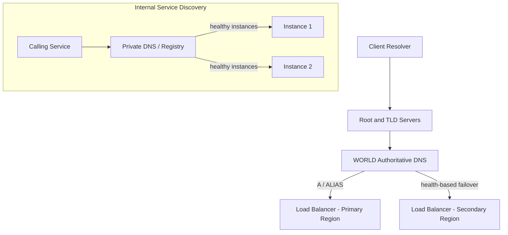

# Volume 11 - DNS

| Field | Value |
|---|---|
| Document ID | WORLD-VOL11-009 |
| Title | DNS |
| Version | 1.0 |
| Status | Approved |
| Classification | Internal |
| Founder | Mahesh Choudhary |

## Purpose

This chapter defines how Project WORLD names and resolves the addresses of its services. The Domain Name System (DNS) is the directory that turns stable, human-meaningful names into the changing network addresses of load balancers, proxies, and service instances. Without it, every client and every service would have to know brittle IP addresses that change on each deployment. This chapter fixes WORLD's DNS model - how public and internal names are structured, resolved, and used for routing and failover - so that the network (Chapter 06), load balancers (Chapter 07), and reverse proxies (Chapter 08) can be reached by name rather than by address.

## Scope

The chapter covers public (external) DNS, internal (service discovery) DNS, record types and hierarchy, resolution flow, time-to-live and caching, and DNS-based traffic management such as failover and geographic routing. It is provider-neutral. It governs how names are assigned and resolved across environments. Certificate issuance that depends on DNS validation is referenced but detailed in the security volume; in-cluster service discovery mechanics are shared with Kubernetes (Chapter 05).

## Concept

DNS is a hierarchical, distributed directory that maps names to records. A client asking for `api.world.example` does not contact one central server; it walks a delegation chain - root, then top-level domain, then WORLD's authoritative servers - each answering for the portion of the name it owns, until an authoritative server returns the address. Answers are cached along the way for a duration set by each record's **time-to-live (TTL)**, which trades freshness against query volume: a short TTL lets changes propagate quickly but multiplies lookups; a long TTL is efficient but slow to reflect change.

WORLD uses DNS in two distinct planes. **Public DNS** publishes the names by which clients, partners, and the AI Business Partner reach WORLD from the internet; these resolve to the public-tier load balancers. **Internal DNS** provides service discovery inside the VPC: services find one another by logical name (for example, `payroll.svc.world.internal`) that resolves to the current set of healthy instances, updated automatically as containers come and go. This is what lets services in the zero-trust private tier address stable names while the instances behind them are constantly replaced.

Because resolution can be steered, DNS is also a **traffic-management** tool. By returning different answers based on health, geography, or weighting, WORLD uses DNS for failover between regions and for latency-based routing, layered above the load balancing of Chapter 07.

## Application in WORLD

WORLD operates a public hosted zone for internet-facing names and a private zone resolvable only inside each VPC. Public names resolve to load balancers; internal names resolve through the platform's service registry to healthy pods.

Public records use short TTLs on entries that participate in failover so a regional outage reroutes traffic to the secondary region within a bounded window, and longer TTLs on stable records to reduce query load. Internal resolution is continuously reconciled with instance health so a caller never receives the address of a terminated container.

## Key Components

| Record / Feature | Purpose | WORLD Usage |
|---|---|---|
| A / AAAA | Maps a name to an IPv4 / IPv6 address | Direct address records where needed |
| ALIAS / CNAME | Maps a name to another name | Point public names at load balancers |
| TXT | Arbitrary text / verification | Domain and certificate validation |
| MX | Mail routing | Transactional email domains |
| SRV | Service location with port | Legacy service discovery |
| Private Zone | VPC-internal resolution | Service discovery in the private tier |
| TTL | Cache lifetime of a record | Short for failover, long for stable names |
| Health-based Routing | Answer by target health | Cross-region failover |

**Enterprise example:** A regional cloud outage takes the primary region's load balancer offline during business hours. WORLD's authoritative DNS has been health-checking that endpoint; on detecting failure it stops returning the primary address and returns the secondary region's load balancer instead. Because the failover record carries a sixty-second TTL, client resolvers refresh quickly and traffic shifts to the healthy region with minimal disruption - no human intervention and no application change. Meanwhile, inside the surviving region, a deployment replaces every instance of the invoicing service; callers keep addressing `invoicing.svc.world.internal`, and internal DNS silently repoints the name to the new, healthy pods as the old ones drain. The names stayed constant while every address behind them changed.

## Trade-offs & Considerations

TTL is the central tension: short TTLs enable fast failover but increase query load and cost and can be defeated by resolvers that ignore them; long TTLs are efficient but slow to react, so WORLD sets TTL per record according to how quickly that name must be able to move. DNS-based failover is coarse - it operates at the granularity of a whole endpoint and depends on client caching behavior - so WORLD pairs it with load-balancer health checks for fine-grained, immediate rerouting within a region. Split-horizon DNS (different answers inside and outside the VPC) is powerful but must be configured carefully to avoid internal names leaking publicly or resolving inconsistently. DNS is also a security surface: WORLD protects zones with strict change control and uses DNS-based validation for certificate issuance under audit.

## Relationship to Other Layers

DNS is the naming layer beneath the entire network. It resolves the public names that reach the load balancers (Chapter 07) and reverse proxies (Chapter 08) sitting in the tiers of Chapter 06, and it provides the internal service discovery that lets zero-trust services address one another by stable name. It underpins the high availability and disaster-recovery strategies of Sections F and G by enabling cross-region failover, and it serves the API tier (Volume 10) by giving clients and the AI Business Partner durable, memorable endpoints that survive every redeployment beneath them.

## Cross-References

- [Networking](/docs/blueprint/volume-11-infrastructure/section-c-networking/06-networking.md)
- [Load Balancing](/docs/blueprint/volume-11-infrastructure/section-c-networking/07-load-balancing.md)
- [Reverse Proxy](/docs/blueprint/volume-11-infrastructure/section-c-networking/08-reverse-proxy.md)
- [Volume 10 - API](/docs/blueprint/volume-10-api/README.md)

## References

- [Volume 01 - Vision and Philosophy](/docs/blueprint/volume-01-vision-and-philosophy/README.md)
- [Document Standards](/docs/governance/document-standards.md)

## Change Log

| Version | Date | Author | Notes |
|---|---|---|---|
| 1.0 | 2026-07-12 | Lead Software Engineer | Initial approved version. |
