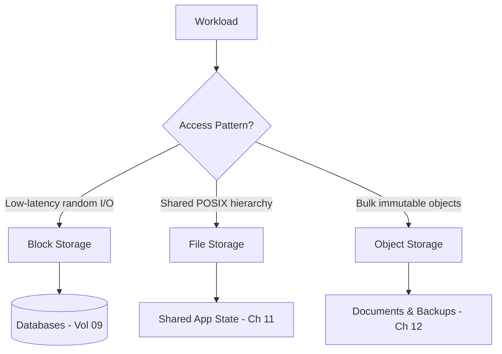

# Volume 11 - Storage

| Field | Value |
|---|---|
| Document ID | WORLD-VOL11-010 |
| Title | Storage |
| Version | 1.0 |
| Status | Approved |
| Classification | Internal |
| Founder | Mahesh Choudhary |

## Purpose

This chapter defines WORLD's storage strategy at the infrastructure layer: the durable media beneath every stateful component of the platform. Its purpose is to give each workload the correct storage primitive - block, file, or object - so that databases (Volume 09), documents (Volume 06), configuration data (Volume 05), and application binaries each rest on media whose durability, latency, and cost characteristics match their access pattern, rather than forcing one storage shape onto every need.

## Scope

Covered: the storage concept, the three canonical primitives and their selection, WORLD's storage tiers, durability and encryption posture, and how storage is provisioned in the orchestrated platform. Excluded: the POSIX file-system semantics of Chapter 11, the object-storage service detailed in Chapter 12, and the logical data models of Volume 09. This chapter is the decision framework that routes each workload to the right primitive; the following chapters specify each primitive in depth.

## Concept

All persistent data ultimately rests on one of three storage abstractions, distinguished by the unit the storage exposes and the interface used to reach it. Block storage presents raw fixed-size blocks addressed by offset, like a virtual disk; the consumer imposes its own structure and it delivers the lowest latency, making it the substrate for databases. File storage presents a hierarchical namespace of directories and files with shared read-write access over a network protocol, ideal for workloads that expect POSIX semantics and concurrent mounts. Object storage presents flat, immutable objects addressed by key over HTTP, with effectively unbounded capacity and rich metadata, ideal for large unstructured artifacts. From first principles, choosing correctly means matching the access pattern - random small writes, shared hierarchical access, or write-once bulk retrieval - to the primitive engineered for it.

## Application in WORLD

WORLD assigns each workload a storage primitive by policy, not by convenience. Transactional and analytical databases from Volume 09 sit on block volumes provisioned for guaranteed IOPS and attached to a single node at a time. Components that require a shared, mountable hierarchy - build caches, shared import staging, and legacy integration drop zones - use file storage. The bulk of the platform's data by volume - documents from Volume 06, database backups, logs, and media - lands in object storage, where capacity is elastic and cost per gigabyte is lowest. Every volume is encrypted at rest, tagged with its owning tenant, and provisioned declaratively so that storage is reproducible across environments rather than hand-configured.

### Enterprise Example

A manufacturing tenant runs WORLD's ERP core, uploads millions of scanned delivery notes, and retains seven years of audit backups for compliance. Their live transactional data sits on high-IOPS block volumes so order posting stays within latency budget. The scanned delivery notes - write-once, read-rarely, but legally retained - flow to object storage under a tenant-scoped prefix with lifecycle rules that transition older scans to a colder, cheaper tier. Nightly database backups are also written as objects with immutability locks. When auditors request three-year-old records, WORLD retrieves them from the cold object tier without ever touching the latency-sensitive block volumes serving live operations - each data class on the medium engineered for it.

## Key Components

| Component | Primitive | Role | Typical WORLD Use |
|---|---|---|---|
| Block Volume | Block | Low-latency single-attach disk | Database data and write-ahead logs |
| File Share | File | Shared POSIX namespace | Build caches, staging, integration drops |
| Object Bucket | Object | Elastic key-addressed store | Documents, backups, logs, media |
| Storage Class Policy | Control | Maps workloads to primitives and tiers | Declarative provisioning and lifecycle |
| Encryption & Key Binding | Control | At-rest protection per tenant | Applies across all three primitives |

## Trade-offs & Considerations

The three primitives trade latency, sharing, and cost against one another, and no single choice is universally right. Block storage delivers the lowest latency but attaches to one node and scales only vertically, so it is reserved for data that genuinely needs it. File storage enables concurrent access and familiar semantics but its network protocol and locking add overhead and a scaling ceiling, so WORLD uses it sparingly and never as a database substitute. Object storage scales without limit at the lowest cost but trades away random-write and rename semantics and adds request latency, so it is wrong for hot transactional paths. Over-provisioning high-performance block storage wastes money; under-provisioning starves the database. WORLD therefore treats primitive selection as an explicit, reviewed decision, encoded in storage-class policy rather than left to each team.

## Relationship to Other Layers

Storage is the durable foundation beneath the stateful tiers of WORLD. It carries the databases specified in Volume 09, the documents and content of Volume 06, and the configuration data of Volume 05, giving each the medium its access pattern demands. It is provisioned through the orchestration layer (Chapter 05 - Kubernetes) via storage classes and persistent volumes, and it feeds the backup and disaster-recovery flows of Section F. The following three chapters decompose this framework: File System (Chapter 11) details shared POSIX storage, Object Storage (Chapter 12) details the object tier, and together they realize the routing decisions this chapter establishes.

## Cross-References

- [File System](/docs/blueprint/volume-11-infrastructure/section-d-storage-and-configuration/11-file-system.md)
- [Object Storage](/docs/blueprint/volume-11-infrastructure/section-d-storage-and-configuration/12-object-storage.md)
- [Volume 09 - Database](/docs/blueprint/volume-09-database/README.md)
- [Volume 06 - Business Modules](/docs/blueprint/volume-06-business-modules/README.md)

## References

- [Volume 01 - Vision and Philosophy](/docs/blueprint/volume-01-vision-and-philosophy/README.md)
- [Document Standards](/docs/governance/document-standards.md)

## Change Log

| Version | Date | Author | Notes |
|---|---|---|---|
| 1.0 | 2026-07-12 | Lead Software Engineer | Initial approved version. |
