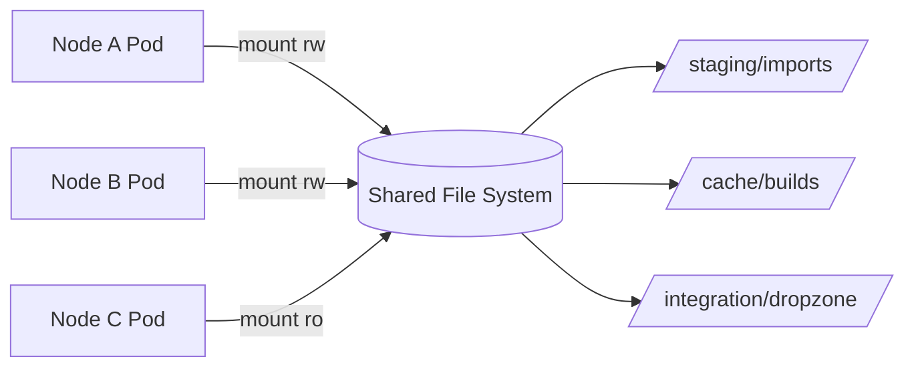

# Volume 11 - File System

| Field | Value |
|---|---|
| Document ID | WORLD-VOL11-011 |
| Title | File System |
| Version | 1.0 |
| Status | Approved |
| Classification | Internal |
| Founder | Mahesh Choudhary |

## Purpose

This chapter defines how WORLD uses file-system storage: the hierarchical, POSIX-compliant namespace that presents data as directories and files with concurrent, mountable access. Its purpose is to specify the narrow but real set of workloads that legitimately need shared file semantics - and to keep them narrow - so that the platform gains the convenience of a mountable hierarchy where it helps without letting file storage creep into roles that block or object storage serve better.

## Scope

Covered: the file-system concept, POSIX semantics, WORLD's use of network-attached shared file storage, the difference between ephemeral container file systems and durable shared volumes, and access-control posture. Excluded: block storage for databases and object storage for bulk data, both covered in Chapters 10 and 12. This chapter concerns the shared, hierarchical file abstraction only; a container's own local writable layer is treated as ephemeral scratch, not durable storage.

## Concept

A file system organizes data into a tree of named directories and files, each with metadata - owner, permissions, timestamps - and supports the POSIX operations application code assumes: open, seek, partial write, rename, lock, and directory listing. Its defining strengths are a human-navigable hierarchy and the ability for many clients to mount the same namespace and read and write concurrently. From first principles, this makes it the right primitive when software was written to expect a mounted disk and when multiple compute nodes must share mutable files. Its cost is that maintaining POSIX consistency across a network requires locking and coordination that limit how far a single shared file system can scale, both in throughput and in the number of concurrent clients.

## Application in WORLD

WORLD confines shared file storage to workloads that genuinely need concurrent POSIX access. Integration drop zones where partner systems deposit batch files, shared build and dependency caches, and import-staging directories that several worker pods process together are mounted as durable network file shares. Each share is tenant-scoped and mounted with least-privilege permissions - read-only wherever a workload only consumes. Inside containers, the local writable layer is treated as ephemeral: anything that must survive a restart is written either to a mounted shared volume or, for durable artifacts, promoted to object storage. This keeps compute stateless and disposable, in line with the platform's container principles.

### Enterprise Example

A logistics tenant integrates with a legacy carrier that can only export nightly CSV manifests to a network share - it cannot call an API. WORLD provisions a tenant-scoped file share as the carrier's drop zone. The carrier writes manifests into `/integration/dropzone/carrier-x/`; a fleet of import-worker pods mounts the same share read-write, each claiming and processing files with POSIX advisory locks so no manifest is handled twice. Once a manifest is parsed into ERP records, the raw file is moved to object storage for long-term retention and deleted from the share. The file system here bridges a legacy system that speaks only files into WORLD's event-driven core, without becoming a permanent home for the data.

## Key Components

| Component | Role | Notes |
|---|---|---|
| Shared File Share | Network-mounted POSIX namespace | Concurrent multi-node read-write access |
| Mount Policy | Binds shares to pods with permissions | Read-only by default, read-write by exception |
| Advisory Locking | Coordinates concurrent writers | Prevents double-processing of staged files |
| Ephemeral Container Layer | Per-container scratch space | Non-durable; lost on restart by design |
| Tenant Scoping | Isolates shares per tenant | One namespace boundary per tenant |

## Trade-offs & Considerations

File storage buys convenience and compatibility at the cost of scale and operational weight. Its POSIX semantics let existing software run unchanged and let many nodes share mutable state, but the locking and metadata coordination that preserve those semantics cap throughput and concurrent-client counts far below what object storage sustains. Shared writable file systems also invite contention, stale locks, and permission sprawl if left ungoverned. WORLD therefore treats a shared file share as a deliberate exception, justified by a real POSIX or concurrency need, never as a default dumping ground. Durable, high-volume, or write-once data belongs in object storage; hot transactional data belongs on block volumes. The discipline is to keep the file tier small, tenant-scoped, and least-privileged.

## Relationship to Other Layers

The file system is one of the three storage primitives introduced in Storage (Chapter 10) and sits between block storage for databases and object storage for bulk artifacts. It is provisioned through the orchestration layer as persistent volumes and mounted into pods, so it depends directly on Kubernetes (Chapter 05) for its lifecycle. It frequently feeds object storage (Chapter 12), which becomes the durable resting place once staged files are processed. It also underpins parts of the document handling described in Volume 06 where interim files are staged before being committed to durable content storage.

## Cross-References

- [Storage](/docs/blueprint/volume-11-infrastructure/section-d-storage-and-configuration/10-storage.md)
- [Object Storage](/docs/blueprint/volume-11-infrastructure/section-d-storage-and-configuration/12-object-storage.md)
- [Volume 06 - Documents](/docs/blueprint/volume-06-business-modules/README.md)
- [Volume 09 - Database](/docs/blueprint/volume-09-database/README.md)

## References

- [Volume 01 - Vision and Philosophy](/docs/blueprint/volume-01-vision-and-philosophy/README.md)
- [Document Standards](/docs/governance/document-standards.md)

## Change Log

| Version | Date | Author | Notes |
|---|---|---|---|
| 1.0 | 2026-07-12 | Lead Software Engineer | Initial approved version. |
