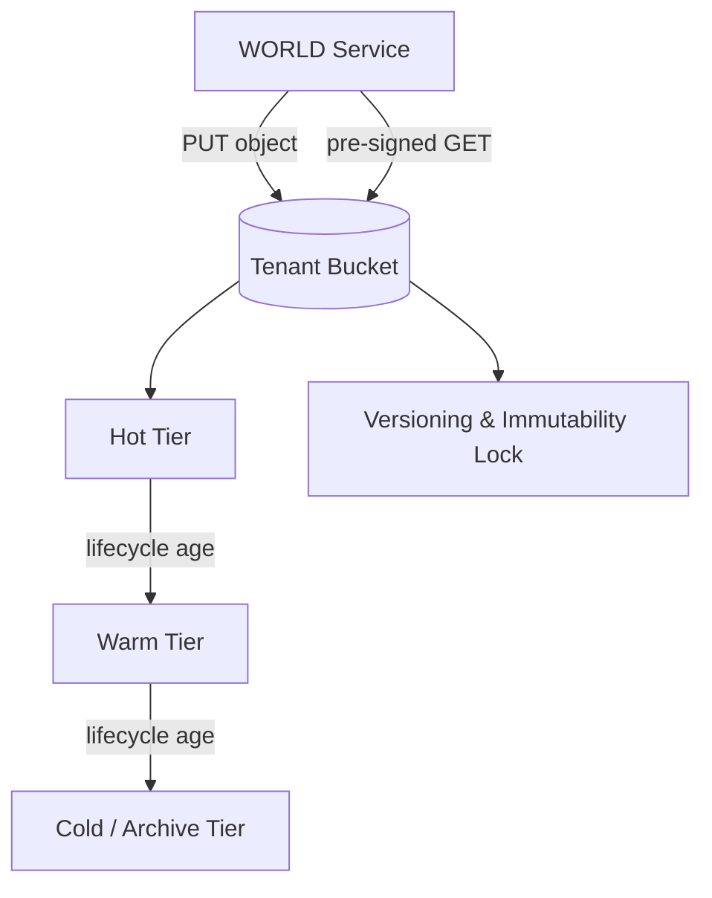

# Volume 11 - Object Storage

| Field | Value |
|---|---|
| Document ID | WORLD-VOL11-012 |
| Title | Object Storage |
| Version | 1.0 |
| Status | Approved |
| Classification | Internal |
| Founder | Mahesh Choudhary |

## Purpose

This chapter defines WORLD's object-storage strategy: the flat, key-addressed, HTTP-accessed store that holds the bulk of the platform's data by volume. Its purpose is to give WORLD an effectively unbounded, low-cost, durable home for unstructured and write-once data - documents, backups, logs, media, and exports - with rich metadata, lifecycle automation, and tenant isolation, so that these artifacts never compete for the scarce, expensive capacity that databases and file shares require.

## Scope

Covered: the object-storage concept, buckets and keys, immutability and versioning, storage tiers and lifecycle policies, access control via pre-signed URLs and scoped credentials, and WORLD's use of object storage for documents and backups. Excluded: block and file primitives (Chapters 10 and 11) and the logical document model of Volume 06. This chapter specifies the object tier as infrastructure; how business modules organize document metadata is defined in their own volumes.

## Concept

Object storage manages data as discrete objects, each a blob of bytes plus metadata, stored in a flat namespace called a bucket and retrieved by a unique key over an HTTP API. It abandons the hierarchy and partial-write semantics of file systems in exchange for three properties that matter at scale: effectively unbounded capacity, very high durability achieved by replicating each object across many devices and locations, and the lowest cost per gigabyte of the three primitives. Objects are typically immutable - updates write a new version rather than editing in place - which makes the model a natural fit for write-once, read-many data. From first principles, object storage is the right primitive whenever data is large, unstructured, and does not need in-place random writes.

## Application in WORLD

WORLD routes its highest-volume data to object storage. Documents from Volume 06 - invoices, contracts, scanned records, generated reports - are stored as objects under tenant-scoped key prefixes, with the object key referenced from the relational metadata in Volume 09. Database backups, application logs, data exports, and media all live here too. Access is never via shared long-lived credentials: services obtain short-lived pre-signed URLs scoped to a single object and operation, so a browser can upload or download directly without the object bytes flowing through application servers. Lifecycle policies automatically transition ageing objects from hot to warm to cold tiers, and immutability locks protect backups and compliance records from deletion within their retention window.

### Enterprise Example

A financial-services tenant must retain every generated statement for ten years and prove it was never altered. When WORLD generates a monthly statement, it writes the PDF as an object under `tenant-4471/statements/2026/`, enables versioning, and applies an immutability lock for the ten-year retention period - no one, including administrators, can overwrite or delete it until the window expires. The customer downloads their statement through a pre-signed URL valid for minutes, so the file streams directly from object storage without passing through WORLD's servers. After one year, a lifecycle rule moves the statement to a cold archive tier, cutting storage cost by an order of magnitude while preserving instant auditability. Ten years on, expired objects age out automatically.

## Key Components

| Component | Role | Notes |
|---|---|---|
| Bucket | Top-level object container | One or more per tenant, isolated |
| Object Key | Unique address within a bucket | Tenant-prefixed, referenced from Vol 09 metadata |
| Versioning | Retains prior object versions | Enables immutability and rollback |
| Immutability Lock | Blocks deletion for a retention period | Compliance and backup protection |
| Lifecycle Policy | Auto-transitions and expires objects | Hot to warm to cold tiering |
| Pre-signed URL | Time-limited scoped access grant | Direct client I/O, no shared credentials |

## Trade-offs & Considerations

Object storage wins on capacity, durability, and cost but concedes latency and semantics. Each access is an HTTP round trip, so it is far slower per request than a local block volume and wholly unsuitable for hot transactional paths. There are no partial writes, renames, or directory operations, so software expecting a file system cannot use it directly. Listing very large buckets is expensive, which forces disciplined key design and reliance on the relational index in Volume 09 to locate objects. Consistency and lifecycle transitions must be understood so that a policy does not archive data still in active use. WORLD manages these trade-offs by using object storage strictly for large, unstructured, write-once data, indexing objects from the database, and encoding retention and tiering as reviewed policy rather than ad hoc action.

## Relationship to Other Layers

Object storage is the highest-capacity primitive introduced in Storage (Chapter 10) and the durable destination for artifacts staged on the file system (Chapter 11). It is the physical home of the documents modeled in Volume 06 and the exports and backups that flow from the databases of Volume 09, whose relational rows hold the object keys that make each object findable. It underpins the backup and disaster-recovery flows of Section F, whose recovery objectives depend on object durability and immutability. Its access model integrates with the platform's identity and secrets layers so that pre-signed URLs and scoped credentials are issued, not embedded.

## Cross-References

- [Storage](/docs/blueprint/volume-11-infrastructure/section-d-storage-and-configuration/10-storage.md)
- [File System](/docs/blueprint/volume-11-infrastructure/section-d-storage-and-configuration/11-file-system.md)
- [Secrets Management](/docs/blueprint/volume-11-infrastructure/section-d-storage-and-configuration/13-secrets-management.md)
- [Volume 06 - Documents](/docs/blueprint/volume-06-business-modules/README.md)

## References

- [Volume 01 - Vision and Philosophy](/docs/blueprint/volume-01-vision-and-philosophy/README.md)
- [Document Standards](/docs/governance/document-standards.md)

## Change Log

| Version | Date | Author | Notes |
|---|---|---|---|
| 1.0 | 2026-07-12 | Lead Software Engineer | Initial approved version. |
