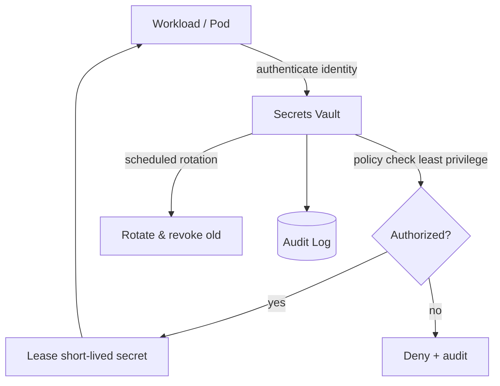

# Volume 11 - Secrets Management

| Field | Value |
|---|---|
| Document ID | WORLD-VOL11-013 |
| Title | Secrets Management |
| Version | 1.0 |
| Status | Approved |
| Classification | Internal |
| Founder | Mahesh Choudhary |

## Purpose

This chapter defines how WORLD stores, distributes, and rotates secrets - the credentials, keys, tokens, and certificates that grant access to systems and data. Its purpose is to ensure that no secret is ever hard-coded, checked into source control, or embedded in an image; that every secret is held in a central vault, delivered to workloads just in time under least privilege, and rotated on a schedule; and that every access is audited, in line with the security posture set out in Volume 08 (Chapter 20).

## Scope

Covered: the secrets-management concept, the central vault, dynamic and static secrets, rotation, least-privilege access, and injection into workloads. Excluded: application-level authorization and identity for end users, which belong to Volume 08 security and Volume 05, and the broader encryption-at-rest posture of the storage chapters. This chapter concerns machine and service secrets and the infrastructure that governs them, not human end-user login.

## Concept

A secret is any datum whose disclosure grants unauthorized access - a database password, an API token, a private key, a signing certificate. The failure of naive practice is that such values get scattered: pasted into config files, baked into container images, committed to Git, or shared over chat, where they persist indefinitely and cannot be revoked cleanly. Secrets management corrects this by centralizing every secret in a hardened vault that is the single source of truth, encrypting it at rest, and releasing it only to authenticated, authorized callers for a bounded time. Two principles make this robust: least privilege, so each identity can read only the specific secrets it needs, and rotation, so secrets are short-lived and a leaked value expires quickly. From first principles, the goal is to shrink both the blast radius and the lifetime of any exposure.

## Application in WORLD

In WORLD every secret lives in a central vault and nowhere else. Workloads authenticate to the vault using their orchestration identity - a Kubernetes service account, not a pre-shared password - and receive only the secrets their policy permits, leased for a short lifetime. Database credentials are dynamic: the vault generates a unique, short-lived username and password per workload on demand and revokes them when the lease ends, so no long-lived database password exists to leak. Static secrets that cannot be dynamic, such as third-party API keys, are stored encrypted and rotated on a schedule. Secrets are injected into pods at runtime as in-memory files or environment values, never written into images or Git. Every read, write, and rotation is recorded in an immutable audit log.

### Enterprise Example

WORLD integrates a tenant's ERP with an external tax-filing service that issues a long-lived API key. Rather than placing that key in a config file, an operator stores it once in the vault under a path readable only by the tax-integration service's identity. When the integration pod starts, it authenticates with its service account, leases the key into memory, and calls the tax service; the key never touches disk or the container image. A rotation policy re-issues the key every ninety days and revokes the prior one. Months later a developer accidentally logs a request object, but because the key was injected in memory and access is audited, security detects the exposure, rotates the key immediately through the vault, and confirms from the audit trail exactly which identities ever read it - closing the incident in minutes rather than days.

## Key Components

| Component | Role | Notes |
|---|---|---|
| Central Vault | Single encrypted source of truth | All secrets stored and served from here |
| Workload Identity | Authenticates callers | Service-account based, no shared passwords |
| Access Policy | Enforces least privilege | Each identity reads only its own secrets |
| Dynamic Secrets Engine | Generates short-lived credentials | Per-workload database and cloud creds |
| Rotation Scheduler | Re-issues and revokes secrets | Bounds secret lifetime |
| Audit Log | Immutable record of all access | Detection and forensic reconstruction |

## Trade-offs & Considerations

Centralizing secrets makes the vault a critical dependency and a high-value target, so it must be highly available, replicated, and itself protected with strong root-key management and break-glass procedures - if the vault is down, workloads cannot obtain fresh leases. Dynamic short-lived secrets dramatically reduce exposure but add operational moving parts: leases must be renewed, and clocks and revocation must work correctly. Aggressive rotation improves security but can break workloads that cache credentials, so rotation and graceful reload must be designed together. Least privilege requires disciplined policy authoring; overly broad policies quietly erode the whole model. WORLD accepts this operational cost as non-negotiable, because the alternative - scattered, long-lived, unauditable secrets - carries a far higher and less controllable risk.

## Relationship to Other Layers

Secrets management realizes at the infrastructure layer the security principles defined in Volume 08 (Chapter 20), giving concrete machinery to least privilege and credential hygiene. It authenticates workloads through the orchestration layer's identity (Chapter 05 - Kubernetes) and issues the scoped credentials that object storage (Chapter 12) and databases (Volume 09) require. It is closely bound to Configuration Management (Chapter 14): secrets are the strict subset of configuration that must never be stored in plain config or Git, so the two chapters together define a complete picture of how a running workload obtains everything it needs to operate.

## Cross-References

- [Configuration Management](/docs/blueprint/volume-11-infrastructure/section-d-storage-and-configuration/14-configuration-management.md)
- [Object Storage](/docs/blueprint/volume-11-infrastructure/section-d-storage-and-configuration/12-object-storage.md)
- [Volume 08 - Security Architecture](/docs/blueprint/volume-08-architecture/README.md)
- [Volume 09 - Database](/docs/blueprint/volume-09-database/README.md)

## References

- [Volume 01 - Vision and Philosophy](/docs/blueprint/volume-01-vision-and-philosophy/README.md)
- [Document Standards](/docs/governance/document-standards.md)

## Change Log

| Version | Date | Author | Notes |
|---|---|---|---|
| 1.0 | 2026-07-12 | Lead Software Engineer | Initial approved version. |
