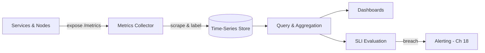

# Volume 11 - Monitoring

| Field | Value |
|---|---|
| Document ID | WORLD-VOL11-015 |
| Title | Monitoring |
| Version | 1.0 |
| Status | Approved |
| Classification | Internal |
| Founder | Mahesh Choudhary |

## Purpose

This chapter defines how WORLD observes the health and behaviour of its infrastructure and services through metrics - the numeric, time-series signals that describe a system's state. Its purpose is to establish monitoring as the first of the three pillars of observability, alongside logging (Chapter 16) and tracing (Chapter 17), so that operators can answer, at any moment and for any tenant, whether the platform is healthy, how it is trending, and where degradation is emerging before it becomes an outage. It grounds the platform-level metrics discipline of Volume 08 (Chapter 22) in concrete infrastructure machinery.

## Scope

Covered: the monitoring concept, metric types, collection and aggregation, dashboards, service-level indicators derived from metrics, and the golden signals of latency, traffic, errors, and saturation. Excluded: the raising and routing of alerts, which belong to Alerting (Chapter 18); event-level detail, which belongs to Logging (Chapter 16); and request-path causality, which belongs to Tracing (Chapter 17). This chapter concerns the numeric time-series layer, not the narrative or causal layers of observability.

## Concept

A metric is a measurement of one property of a system, captured repeatedly over time and stored as a series of timestamped numbers. From first principles, metrics exist because a running system is otherwise opaque: without measurement, operators reason by anecdote and discover failure only when users complain. Metrics make the invisible legible - request rate, error count, queue depth, CPU saturation - at a cost per data point low enough to retain for months. Their power is aggregation: because a metric is just a number with labels, it can be summed, averaged, and percentiled across thousands of instances into a single trend line. Their limit is that a metric records that something happened, not why; a rising error rate tells you to look, but logs and traces tell you where. Monitoring is therefore the cheap, always-on, whole-system pulse that frames every deeper investigation.

## Application in WORLD

In WORLD every service, container, and node exposes metrics in an open, standard format aligned with the OpenTelemetry metrics model. A central collector scrapes these endpoints on a fixed interval, attaches labels for tenant, service, region, and version, and writes them into a time-series store optimized for high-cardinality queries. From this store, WORLD renders the four golden signals per service - latency, traffic, errors, and saturation - onto standing dashboards, and computes service-level indicators such as the fraction of requests served under the target latency. Because metrics are labelled by tenant, the platform can distinguish a single tenant's degradation from a systemic one. Collection is pull-based and instrumented at the framework layer, so a new service inherits monitoring by default rather than by developer effort.

### Enterprise Example

A tenant runs month-end financial consolidation across the ERP module. At 21:00 the consolidation queue depth - a saturation metric - begins climbing while request latency at the ninety-fifth percentile drifts from 200ms toward 900ms. No errors are firing and no user has complained, but the standing dashboard shows the trend, and the latency SLI for the ledger service is approaching its threshold. An on-call engineer sees saturation rising on one worker pool, correlates it with a spike in traffic from that tenant, and scales the pool horizontally before the SLI is breached. The consolidation completes on time. The incident never became an outage because a cheap, continuously collected metric surfaced the drift while there was still headroom to act - the essence of monitoring as an early-warning system.

## Key Components

| Component | Role | Notes |
|---|---|---|
| Instrumentation | Emits metrics from code and runtime | OpenTelemetry-aligned, framework-default |
| Metrics Collector | Scrapes and labels metric endpoints | Pull-based on a fixed interval |
| Time-Series Store | Persists labelled metric series | Optimized for high-cardinality queries |
| Query & Aggregation | Computes trends and percentiles | Sum, rate, and quantile across instances |
| Dashboards | Visualize golden signals | Standing views per service and tenant |
| SLI Evaluation | Derives indicators from metrics | Feeds SLOs and alert thresholds |

## Trade-offs & Considerations

Metrics are cheap per point but costly in cardinality: every distinct label combination is a new series, so unbounded labels such as raw user IDs can explode storage and slow queries. WORLD constrains labels to a curated, bounded set and pushes fine-grained detail into logs and traces instead. Pull-based collection is simple and self-healing but can miss short-lived jobs that finish between scrapes, so batch and ephemeral work also pushes metrics to a gateway. Aggregation hides outliers - an average latency looks healthy while a percentile suffers - so WORLD monitors percentiles, not means. Finally, a metric is a leading indicator, not an explanation; monitoring must be designed to hand off cleanly to logging and tracing rather than to answer every question itself.

## Relationship to Other Layers

Monitoring is the first pillar of the observability section and the entry point to the other two: a metric anomaly prompts a log search (Chapter 16) and a trace inspection (Chapter 17). It supplies the numeric signals - SLIs - that Alerting (Chapter 18) evaluates against objectives to decide when to page a human. It draws its raw data from the orchestration layer (Chapter 05 - Kubernetes) and the networking layer, and it realizes at the infrastructure tier the monitoring principles defined at the platform tier in Volume 08 (Chapter 22) and the API-specific monitoring of Volume 10 (Chapter 21).

## Cross-References

- [Logging](/docs/blueprint/volume-11-infrastructure/section-e-observability/16-logging.md)
- [Tracing](/docs/blueprint/volume-11-infrastructure/section-e-observability/17-tracing.md)
- [Alerting](/docs/blueprint/volume-11-infrastructure/section-e-observability/18-alerting.md)
- [Volume 08 - Monitoring](/docs/blueprint/volume-08-architecture/README.md)

## References

- [Volume 01 - Vision and Philosophy](/docs/blueprint/volume-01-vision-and-philosophy/README.md)
- [Document Standards](/docs/governance/document-standards.md)

## Change Log

| Version | Date | Author | Notes |
|---|---|---|---|
| 1.0 | 2026-07-12 | Lead Software Engineer | Initial approved version. |
