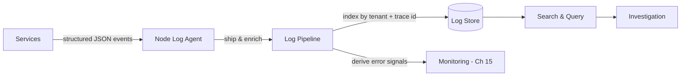

# Volume 11 - Logging

| Field | Value |
|---|---|
| Document ID | WORLD-VOL11-016 |
| Title | Logging |
| Version | 1.0 |
| Status | Approved |
| Classification | Internal |
| Founder | Mahesh Choudhary |

## Purpose

This chapter defines how WORLD captures, ships, stores, and queries logs - the timestamped, structured records of discrete events that describe what a system actually did. Its purpose is to establish logging as the second pillar of observability, complementing the numeric view of Monitoring (Chapter 15) and the causal view of Tracing (Chapter 17), so that when a metric signals that something is wrong, operators have a searchable, authoritative account of the individual events behind it. It grounds the platform logging discipline of Volume 08 (Chapter 21) in concrete infrastructure machinery.

## Scope

Covered: the logging concept, structured versus unstructured logs, log levels, centralized aggregation, correlation identifiers, retention, and query. Excluded: numeric trends and SLIs, which belong to Monitoring (Chapter 15); request-span causality, which belongs to Tracing (Chapter 17); and alert routing, which belongs to Alerting (Chapter 18). This chapter concerns the event-record layer of observability - the narrative of what happened, event by event - not the aggregate or the trace.

## Concept

A log is a record of one event: a timestamp, a severity, a message, and context. From first principles, logs exist because metrics compress away the particulars - a metric says the error rate rose, a log says which request failed, for which tenant, with which stack trace. The historical failure of logging is that logs were unstructured free text scattered across machines, greppable only by hand and lost when a container died. WORLD corrects this with two disciplines: logs are structured as machine-readable key-value records rather than prose, and they are shipped off the node immediately to a central store rather than written to local disk. Structure makes logs queryable at scale; centralization makes them survive the ephemeral workloads that produce them. Severity levels let operators filter signal from routine noise, and a correlation identifier stitched into every record links a log line to the request and trace it belongs to.

## Application in WORLD

In WORLD services emit logs as structured JSON events - never as opaque strings - with fields for tenant, service, version, severity, message, and a trace identifier aligned with the OpenTelemetry context model. A lightweight agent on each node tails these streams, enriches them with orchestration metadata, and ships them through a pipeline into a central, indexed log store. Because every record carries a tenant label, operators can scope a search to one tenant without leaking data across the multi-tenant boundary; because every record carries a trace identifier, a log line links directly to its distributed trace (Chapter 17). Log levels are set per environment - verbose in staging, disciplined in production - and retention is tiered so recent logs are hot and searchable while older logs move to cheaper archival storage under the platform's retention policy.

### Enterprise Example

Monitoring shows a tenant's invoice-approval API returning a rising rate of 500 errors. An engineer opens the central log store, filters to that tenant, that service, and severity error over the last fifteen minutes, and immediately sees a cluster of records carrying the same message - a downstream tax-service timeout - each tagged with a trace identifier. Selecting one record's trace identifier pivots straight into the distributed trace, revealing that the timeout originates in a single slow dependency, not in WORLD's own code. Because the logs were structured, centralized, and correlated, the engineer moves from symptom to root cause in minutes without ever logging into a node - and confirms the blast radius is confined to one tenant's integration, not the platform.

## Key Components

| Component | Role | Notes |
|---|---|---|
| Structured Emitter | Produces machine-readable events | JSON key-value, not free text |
| Node Log Agent | Collects and ships logs off-node | Enriches with orchestration metadata |
| Log Pipeline | Buffers, filters, and routes | Handles backpressure and parsing |
| Log Store | Indexes logs for search | Tenant- and trace-aware indexing |
| Correlation ID | Links logs to requests and traces | Aligned with OpenTelemetry context |
| Retention Tiers | Balances cost and availability | Hot recent, archived long-term |

## Trade-offs & Considerations

Logs are the most detailed and therefore most voluminous observability signal; verbose logging in production can overwhelm the pipeline and inflate cost, so WORLD tunes levels deliberately and treats debug logging as an environment choice, not a default. Structured logging imposes discipline on developers but pays for itself in queryability. Centralization creates a dependency on the pipeline: if it stalls, logs buffer and may drop, so the pipeline must handle backpressure gracefully. Logs frequently contain sensitive data, so WORLD enforces redaction of secrets and personal data at emission and honours tenant isolation in the store. Retention must balance forensic value against storage cost and data-minimization obligations, which is why old logs are archived rather than kept hot indefinitely.

## Relationship to Other Layers

Logging is the second pillar of observability, sitting between Monitoring (Chapter 15), which tells operators to look, and Tracing (Chapter 17), into which a correlated log pivots to explain a request's path. It feeds derived error signals back to monitoring and supplies the evidence that Alerting (Chapter 18) runbooks direct responders to gather. It depends on the orchestration layer (Chapter 05 - Kubernetes) for the ephemeral workloads it captures and on Storage (Chapter 10) for its archival tiers, and it realizes at the infrastructure tier the logging principles set out at the platform tier in Volume 08 (Chapter 21).

## Cross-References

- [Monitoring](/docs/blueprint/volume-11-infrastructure/section-e-observability/15-monitoring.md)
- [Tracing](/docs/blueprint/volume-11-infrastructure/section-e-observability/17-tracing.md)
- [Alerting](/docs/blueprint/volume-11-infrastructure/section-e-observability/18-alerting.md)
- [Volume 08 - Logging](/docs/blueprint/volume-08-architecture/README.md)

## References

- [Volume 01 - Vision and Philosophy](/docs/blueprint/volume-01-vision-and-philosophy/README.md)
- [Document Standards](/docs/governance/document-standards.md)

## Change Log

| Version | Date | Author | Notes |
|---|---|---|---|
| 1.0 | 2026-07-12 | Lead Software Engineer | Initial approved version. |
