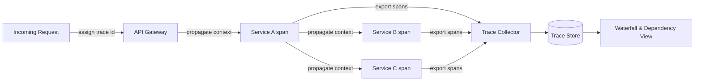

# Volume 11 - Tracing

| Field | Value |
|---|---|
| Document ID | WORLD-VOL11-017 |
| Title | Tracing |
| Version | 1.0 |
| Status | Approved |
| Classification | Internal |
| Founder | Mahesh Choudhary |

## Purpose

This chapter defines how WORLD follows a single request as it travels across many services through distributed tracing - the third pillar of observability. Its purpose is to give operators end-to-end causal visibility: where metrics (Chapter 15) show that latency rose and logs (Chapter 16) show which events failed, traces show precisely where in a multi-service request the time was spent or the error occurred. In a system of independently deployed services, tracing is what turns a distributed, opaque call path into a single readable timeline.

## Scope

Covered: the tracing concept, traces and spans, context propagation, sampling, latency breakdown, and dependency mapping. Excluded: aggregate numeric trends, which belong to Monitoring (Chapter 15); discrete event records, which belong to Logging (Chapter 16); and alert routing, which belongs to Alerting (Chapter 18). This chapter concerns the causal, request-scoped layer of observability - the path and timing of one request across services - not the aggregate pulse or the event narrative.

## Concept

A trace is the complete record of one request's journey through a distributed system, composed of spans - individual units of work, each with a start time, a duration, and a parent. From first principles, tracing exists because in a microservice architecture no single log or metric can explain a slow request: the work is spread across many services, and the latency a user feels is the sum of hops the user cannot see. A trace reconstructs that hidden path. The mechanism is context propagation: when a request enters the system it is assigned a trace identifier, and every service passes that identifier - plus the current span - to the next through request headers, so the fragments can later be assembled into one tree. Because tracing every request at full fidelity is expensive, sampling decides which traces to keep. The result is a waterfall view that makes the critical path, the slow dependency, and the failing hop immediately visible.

## Application in WORLD

In WORLD tracing is instrumented at the framework and gateway layers using the OpenTelemetry tracing model, so every request that enters the platform is assigned a trace identifier at the edge and that context is propagated automatically across every internal call. Each service emits spans describing its own work - a database query, an external API call, a queue publish - and exports them to a central collector that assembles them into complete traces in a trace store. The same trace identifier is written into every log record (Chapter 16), so operators pivot losslessly between a log line and its full trace. WORLD applies tail-based sampling weighted toward slow and errored requests, so the traces most worth keeping are retained while routine fast requests are sampled down. Traces are labelled by tenant, preserving the multi-tenant isolation boundary during investigation.

### Enterprise Example

A tenant reports that submitting a large purchase order occasionally takes eight seconds. Metrics confirm elevated tail latency on the procurement API but cannot say why, and logs show no errors. An engineer opens a retained slow trace for that endpoint and sees the waterfall: the gateway span is 8.1 seconds, of which 7.6 seconds sits inside a single span - a synchronous call to an external supplier-catalog service - while WORLD's own procurement, ledger, and notification spans total under half a second. The trace proves the latency is entirely in a third-party dependency on the critical path. The team moves that call off the synchronous path into an asynchronous prefetch, and the next traces show sub-second gateway spans. Without tracing, the slow dependency would have been invisible among healthy metrics and silent logs.

## Key Components

| Component | Role | Notes |
|---|---|---|
| Trace Context | Identifies one request end-to-end | Assigned at the edge, propagated onward |
| Span | A single timed unit of work | Has parent, start, and duration |
| Context Propagation | Carries trace id across services | Via headers, OpenTelemetry-aligned |
| Trace Collector | Assembles spans into traces | Central export target for all services |
| Sampling | Selects which traces to retain | Tail-based, weighted to slow and errored |
| Trace Store | Persists and renders traces | Waterfall and dependency views |

## Trade-offs & Considerations

Tracing is the most expensive pillar to run at full fidelity, so sampling is unavoidable - but head-based sampling can discard the very slow requests worth studying, which is why WORLD prefers tail-based sampling that decides after seeing a request's outcome, at the cost of buffering. Instrumentation must be pervasive and consistent; a single un-instrumented service creates a gap in the trace that hides latency. Context propagation depends on every service forwarding headers faithfully, including across asynchronous queue boundaries, which requires care. Traces can carry sensitive attributes, so span data is subject to the same redaction and tenant-isolation rules as logs. Finally, tracing complements rather than replaces the other pillars: it explains one request superbly but is not the tool for aggregate trends.

## Relationship to Other Layers

Tracing is the third pillar of observability and the deepest: investigations typically flow from a metric anomaly (Chapter 15) to a correlated log (Chapter 16) to the full trace here. It shares the trace identifier with logging, making the two pillars a single navigable fabric, and its dependency maps inform the API and integration design of Volume 10. It depends on the networking and gateway layers to originate and carry context and on the orchestration layer (Chapter 05 - Kubernetes) to run its collector. It supplies the causal evidence that Alerting (Chapter 18) runbooks direct responders toward during incident diagnosis.

## Cross-References

- [Monitoring](/docs/blueprint/volume-11-infrastructure/section-e-observability/15-monitoring.md)
- [Logging](/docs/blueprint/volume-11-infrastructure/section-e-observability/16-logging.md)
- [Alerting](/docs/blueprint/volume-11-infrastructure/section-e-observability/18-alerting.md)
- [Volume 10 - API Monitoring](/docs/blueprint/volume-10-api/README.md)

## References

- [Volume 01 - Vision and Philosophy](/docs/blueprint/volume-01-vision-and-philosophy/README.md)
- [Document Standards](/docs/governance/document-standards.md)

## Change Log

| Version | Date | Author | Notes |
|---|---|---|---|
| 1.0 | 2026-07-12 | Lead Software Engineer | Initial approved version. |
